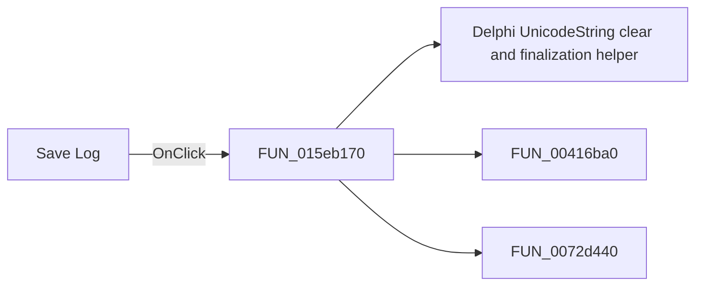

# Save Log

> Analysis status: Pending individual source review.

## Control

| Property | Recovered value |
| --- | --- |
| Form | TextWindow |
| Component path | TextWindow.Panel1.sbSave |
| Control class | TSpeedButton |
| Caption | Not present in the recovered resource. |
| Hint | Save Log |
| Text | Not present in the recovered resource. |
| Handler name | sbSaveClick |
| Handler address | 015eb170 |
| Graph node | `resource:dfm:TextWindow/TextWindow.Panel1.sbSave` |
| Handler node | `function:015eb170` |
| Graph layer | UI |

## What happens when clicked

Pending individual analysis. An agent must read the recovered handler source and its relevant callees before it replaces this text.

## Click flow

## Handler evidence

- Source: [DecompiledSources/Tina16/functions/00000000015EB170__FUN_015eb170.c](../../../DecompiledSources/Tina16/functions/00000000015EB170__FUN_015eb170.c)
- Recovered role: Not present in the recovered resource.
- Current graph summary: Handles 1 Delphi UI event: TextWindow.Panel1.sbSave.OnClick.
- Current graph behavior: Not present in the recovered resource.
- Current graph evidence: Not present in the recovered resource.
- Complexity: complex
- Distinct outgoing calls: 3

## Direct calls

- `function:00414480` — Delphi UnicodeString clear and finalization helper
- `function:00416ba0` — FUN_00416ba0
- `function:0072d440` — FUN_0072d440

## Resource evidence

- Kind: Not present in the recovered resource.
- Modal result: Not present in the recovered resource.
- Checked state: Not present in the recovered resource.
- List items: Not present in the recovered resource.
- Image reference: Not present in the recovered resource.
- Extracted glyph: [`0487_TextWindow_TextWindow_Panel1_sbSave_Glyph_Data.png`](../../../glyph/0487_TextWindow_TextWindow_Panel1_sbSave_Glyph_Data.png)

## Nearby label candidates

Nearby labels are layout candidates only. They are not proof of behavior.

- Rank 1: There are errors at distance 554.

## Analysis limits

- Do not infer behavior from the control class, caption, hint, glyph, or nearby label alone.
- Do not replace the pending status until the handler source and relevant call path provide enough evidence.
