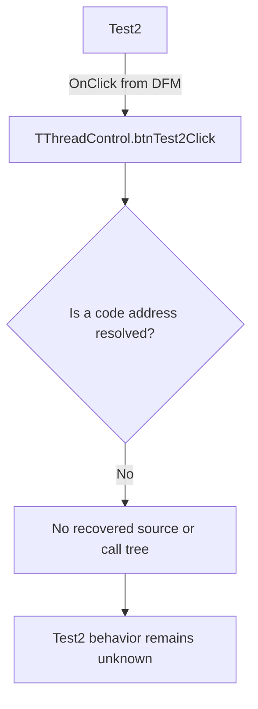

# Test2

> Analysis status: Blocked by an unresolved event-handler address.

## Control

| Property | Recovered value |
| --- | --- |
| Form | ThreadControl |
| Component path | ThreadControl.pcMain.tsAutomatic.btnTest2 |
| Control class | TButton |
| Caption | Test2 |
| Hint | Not present in the recovered resource. |
| Text | Not present in the recovered resource. |
| Handler name | btnTest2Click |
| Handler address | Not present in the recovered resource. |
| Graph node | `resource:dfm:ThreadControl/ThreadControl.pcMain.tsAutomatic.btnTest2` |
| Handler node | `concept:dfm-handler:TThreadControl/btnTest2Click` |
| Graph layer | tina.exe |

## What happens when clicked

The recovered DFM stream binds this button to `TThreadControl.btnTest2Click`. The extractor did not resolve a code address for the published method. The graph therefore contains an unresolved handler concept and no function source or call tree.

The generic `Test2` caption and its position on the `Automatic` page do not identify a test target or operation. No hint, action, glyph, list item, or nearby label adds specific evidence. Inputs, decisions, state changes, outputs, errors, and no-op behavior remain unknown.

## Click flow

## Handler evidence

- Source: [DecompiledSources/Tina16/resources/dfm/ui-evidence.json](../../../DecompiledSources/Tina16/resources/dfm/ui-evidence.json)
- Extractor: [analysis/undelphi/TiaraUiEvidence.rs](../../../analysis/undelphi/TiaraUiEvidence.rs)
- Recovered role: Unknown because no handler function was resolved.
- Current graph summary: Unresolved Delphi event handler TThreadControl.btnTest2Click, referenced by 1 UI event.
- Current graph behavior: Unknown.
- Current graph evidence: The trigger edge preserves the DFM method name, but its handler address is null.
- Complexity: simple
- Distinct outgoing calls: None. The handler node is an unresolved concept.

## Direct calls

- No direct call edge is present. A call tree cannot start without a recovered handler address.

## Resource evidence

- Kind: Not present in the recovered resource.
- Modal result: Not present in the recovered resource.
- Checked state: Not present in the recovered resource.
- List items: Not present in the recovered resource.
- Image reference: Not present in the recovered resource.
- Extracted glyph: None.

## Nearby label candidates

Nearby labels are layout candidates only. They are not proof of behavior.

- No same-parent label candidate is available.

## Analysis limits

- The DFM provides the handler name but no code address. RTTI and VMT resolution did not produce a function in the recovered range.
- A manual scan of the rebuilt image and the live minidump found `TThreadControl` and `btnTest2Click` only in the DFM stream. It found no `TThreadControl` VMT, published-method record, or mapped code pointer for this handler.
- A repository-wide search found no recovered `TThreadControl` or `btnTest2Click` implementation outside the resource evidence.
- The generic caption supplies no specific behavior evidence.
- A recovered address or an independent runtime trace is required before this control can receive a function annotation or a behavior claim.
