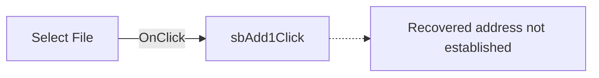

# Select File

> Analysis status: Pending individual source review.

## Control

| Property | Recovered value |
| --- | --- |
| Form | ThreadControl |
| Component path | ThreadControl.pcMain.tsManual.sbAdd1 |
| Control class | TSpeedButton |
| Caption | Not present in the recovered resource. |
| Hint | Select File |
| Text | Not present in the recovered resource. |
| Handler name | sbAdd1Click |
| Handler address | Not present in the recovered resource. |
| Graph node | `resource:dfm:ThreadControl/ThreadControl.pcMain.tsManual.sbAdd1` |
| Handler node | `concept:dfm-handler:TThreadControl/sbAdd1Click` |
| Graph layer | tina.exe |

## What happens when clicked

Pending individual analysis. An agent must read the recovered handler source and its relevant callees before it replaces this text.

## Click flow

## Handler evidence

- Source: [DecompiledSources/Tina16/resources/dfm/ui-evidence.json](../../../DecompiledSources/Tina16/resources/dfm/ui-evidence.json)
- Recovered role: Not present in the recovered resource.
- Current graph summary: Unresolved Delphi event handler TThreadControl.sbAdd1Click, referenced by 1 UI event.
- Current graph behavior: Not present in the recovered resource.
- Current graph evidence: Not present in the recovered resource.
- Complexity: simple
- Distinct outgoing calls: Not present in the recovered resource.

## Direct calls

- No direct call edge is present in the recovered graph.

## Resource evidence

- Kind: Not present in the recovered resource.
- Modal result: Not present in the recovered resource.
- Checked state: Not present in the recovered resource.
- List items: Not present in the recovered resource.
- Image reference: Not present in the recovered resource.
- Extracted glyph: [`0488_ThreadControl_ThreadControl_pcMain_tsManual_sbAdd1_Glyph_Data.png`](../../../glyph/0488_ThreadControl_ThreadControl_pcMain_tsManual_sbAdd1_Glyph_Data.png)

## Nearby label candidates

Nearby labels are layout candidates only. They are not proof of behavior.

- No same-parent label candidate is available.

## Analysis limits

- Do not infer behavior from the control class, caption, hint, glyph, or nearby label alone.
- Do not replace the pending status until the handler source and relevant call path provide enough evidence.
