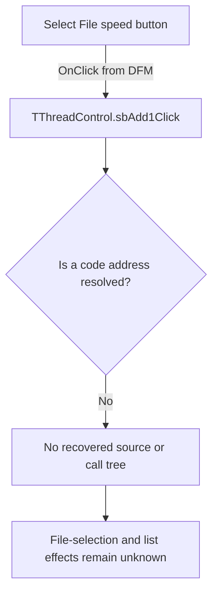

# Select File

> Analysis status: Blocked by an unresolved event-handler address.

## Control

| Property | Recovered value |
| --- | --- |
| Form | ThreadControl |
| Component path | ThreadControl.pcMain.tsManual.sbAdd1 |
| Control class | TSpeedButton |
| Caption | Not present in the recovered resource. |
| Hint | Select File |
| Text | Not present in the recovered resource. |
| Handler name | sbAdd1Click |
| Handler address | Not present in the recovered resource. |
| Graph node | `resource:dfm:ThreadControl/ThreadControl.pcMain.tsManual.sbAdd1` |
| Handler node | `concept:dfm-handler:TThreadControl/sbAdd1Click` |
| Graph layer | tina.exe |

## What happens when clicked

The recovered DFM stream binds this speed button to `TThreadControl.sbAdd1Click`. The extractor did not resolve a code address for the published method. The graph therefore contains an unresolved handler concept and no function source or call tree.

The `Select File` hint, the inspected file-style glyph, the `lbManualList` list box, and the `TOpenDialog` component provide a consistent file-selection context. They do not prove that the handler opens the dialog, which file types it accepts, whether it adds one or several entries, how it handles duplicates, or what happens when the user cancels. Inputs, decisions, state changes, outputs, and error behavior remain unknown.

## Click flow

## Handler evidence

- Source: [DecompiledSources/Tina16/resources/dfm/ui-evidence.json](../../../DecompiledSources/Tina16/resources/dfm/ui-evidence.json)
- Extractor: [analysis/undelphi/TiaraUiEvidence.rs](../../../analysis/undelphi/TiaraUiEvidence.rs)
- Recovered role: Unknown because no handler function was resolved.
- Current graph summary: Unresolved Delphi event handler TThreadControl.sbAdd1Click, referenced by 1 UI event.
- Current graph behavior: Unknown.
- Current graph evidence: The trigger edge preserves the DFM method name, but its handler address is null.
- Complexity: simple
- Distinct outgoing calls: None. The handler node is an unresolved concept.

## Direct calls

- No direct call edge is present. A call tree cannot start without a recovered handler address.

## Resource evidence

- Kind: Not present in the recovered resource.
- Modal result: Not present in the recovered resource.
- Checked state: Not present in the recovered resource.
- List items: Not present in the recovered resource.
- Image reference: Not present in the recovered resource.
- Extracted glyph: [`0488_ThreadControl_ThreadControl_pcMain_tsManual_sbAdd1_Glyph_Data.png`](../../../glyph/0488_ThreadControl_ThreadControl_pcMain_tsManual_sbAdd1_Glyph_Data.png)

## Nearby label candidates

Nearby labels are layout candidates only. They are not proof of behavior.

- No same-parent label candidate is available.

## Analysis limits

- The DFM provides the handler name but no code address. RTTI and VMT resolution did not produce a function in the recovered range.
- A manual scan of the rebuilt image and the live minidump found `TThreadControl` and `sbAdd1Click` only in the DFM stream. It found no `TThreadControl` VMT, published-method record, or mapped code pointer for this handler.
- A repository-wide search found no recovered `TThreadControl` or `sbAdd1Click` implementation outside the resource and glyph evidence.
- The hint, file-style glyph, list box, and open-dialog component support presentation context only. They do not establish runtime behavior.
- A recovered address or an independent runtime trace is required before this control can receive a function annotation or a behavior claim.
