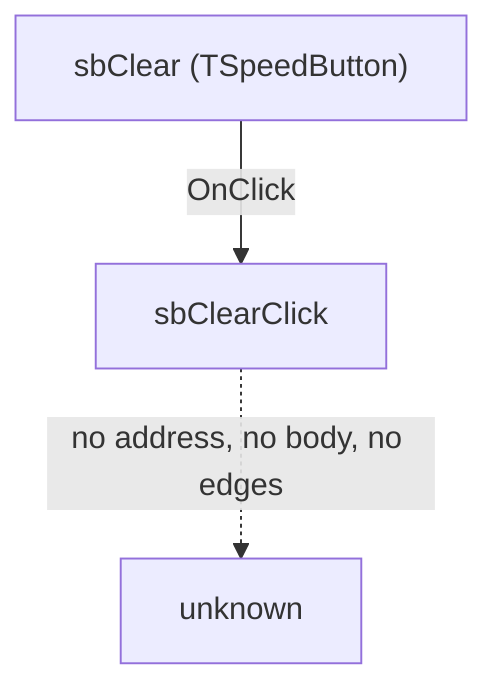

# sbClear

> Analysis status: Recovered as far as the image allows; the custom handler is inside a class the protector kept.

## Control

| Property | Recovered value |
| --- | --- |
| Form | ThreadControl |
| Component path | ThreadControl.pcMain.tsManual.sbClear |
| Control class | TSpeedButton |
| Caption | Not present in the recovered resource. |
| Hint | Clear |
| Kind | Not present in the recovered resource. |
| Handler name | sbClearClick |
| Handler address | Not in the image - see below. |
| Graph node | `resource:dfm:ThreadControl/ThreadControl.pcMain.tsManual.sbClear` |
| Handler node | `concept:dfm-handler:TThreadControl/sbClearClick` |
| Graph layer | UI |

## What happens when clicked

`sbClear` sits on ThreadControl - a test harness: one tab runs whole suites - analog circuits, digital circuits, the design tool - and the other drives single runs by hand. No menu command in the Schematic Editor opens it.

The resource binds its `OnClick` to `sbClearClick`. That binding is all the image holds: `sbClearClick` has no address, no body and no call edges, so what the click does beyond reaching the handler is not recovered.

## Click flow

## Inputs

- Whatever `sbClearClick` reads from the form. Not known: the handler is not in the image.

## Decisions

- Not known. No decision can be attributed to a handler that is not in the image, and the caption is not evidence of one.

## State changes

- Not not known. Nothing in the image says what `sbClearClick` writes.

## Outputs

- Not known.

## Errors and no-op behaviour

- Not known. Whether `sbClearClick` can fail, and what it does when there is nothing to do, is not in the image.

## Why the handler is not in the image

`TThreadControl` is one of 26 form classes in this image whose event bindings resolve to nothing at all. Across the whole resource, 320 forms carry at least one binding: 293 resolve every one of theirs, 26 resolve none of theirs, and one resolves some. This form is in the second group - 9 bindings, 0 resolved.

The cause is known and is not a gap in the analysis. A Delphi event binding is followed by finding the class's published method table, which hangs off its VMT. For these 26 classes the image holds the class name only inside the DFM stream: there is no second instance of it to anchor a VMT, so no published method table can be found and no handler name can be turned into an address. The pages that would hold them are the ones the protector left encrypted. No further static work on this image will recover them.

## Evidence

- Resource: [DecompiledSources/Tina16/resources/dfm/ui-evidence.json](../../../DecompiledSources/Tina16/resources/dfm/ui-evidence.json)
- The other controls on this form that do something: `ThreadControl` (ThreadControl), `bDesignToolTest` (DesignTool Test), `bDigitalCircuitsTest` (Digital Circuits Test), `bAnalogCircuitsTest` (Analog Circuits Test), `btnTest1` (Test1), `btnTest2` (Test2), `sbAdd1` (TSpeedButton), `sbStart1` (TSpeedButton).
- No extracted glyph is associated with this control.

## Analysis limits

- The caption, the hint, the control class and the labels near it are not evidence of behaviour and none of them was used as such here.
- Recovering `sbClearClick` needs the class table, which needs the protected pages. Watching the running program would settle what the control does without settling how, and for this form not attempted, the form not being reachable from the Schematic Editor menus.
