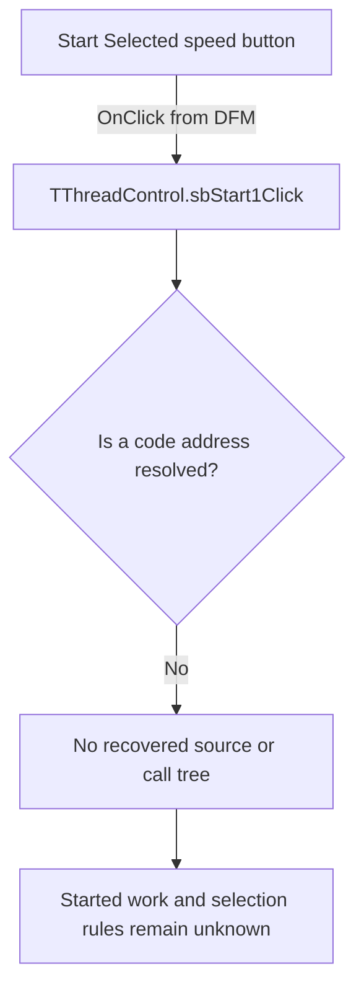

# Start Selected

> Analysis status: Blocked by an unresolved event-handler address.

## Control

| Property | Recovered value |
| --- | --- |
| Form | ThreadControl |
| Component path | ThreadControl.pcMain.tsManual.sbStart1 |
| Control class | TSpeedButton |
| Caption | Not present in the recovered resource. |
| Hint | Start Selected |
| Text | Not present in the recovered resource. |
| Handler name | sbStart1Click |
| Handler address | Not present in the recovered resource. |
| Graph node | `resource:dfm:ThreadControl/ThreadControl.pcMain.tsManual.sbStart1` |
| Handler node | `concept:dfm-handler:TThreadControl/sbStart1Click` |
| Graph layer | tina.exe |

## What happens when clicked

The recovered DFM stream binds this speed button to `TThreadControl.sbStart1Click`. The extractor did not resolve a code address for the published method. The graph therefore contains an unresolved handler concept and no function source or call tree.

The `Start Selected` hint, the inspected start-style two-state glyph, and the `lbManualList` list box support a selected-entry start context. They do not prove what work starts, whether one or several items are used, whether a worker thread is created, how an empty selection is handled, or where progress and errors appear. Inputs, decisions, state changes, outputs, errors, and no-op behavior remain unknown.

## Click flow

## Handler evidence

- Source: [DecompiledSources/Tina16/resources/dfm/ui-evidence.json](../../../DecompiledSources/Tina16/resources/dfm/ui-evidence.json)
- Extractor: [analysis/undelphi/TiaraUiEvidence.rs](../../../analysis/undelphi/TiaraUiEvidence.rs)
- Recovered role: Unknown because no handler function was resolved.
- Current graph summary: Unresolved Delphi event handler TThreadControl.sbStart1Click, referenced by 1 UI event.
- Current graph behavior: Unknown.
- Current graph evidence: The trigger edge preserves the DFM method name, but its handler address is null.
- Complexity: simple
- Distinct outgoing calls: None. The handler node is an unresolved concept.

## Direct calls

- No direct call edge is present. A call tree cannot start without a recovered handler address.

## Resource evidence

- Kind: Not present in the recovered resource.
- Modal result: Not present in the recovered resource.
- Checked state: Not present in the recovered resource.
- List items: Not present in the recovered resource.
- Image reference: Not present in the recovered resource.
- Extracted glyph: [`0489_ThreadControl_ThreadControl_pcMain_tsManual_sbStart1_Glyph_Data.png`](../../../glyph/0489_ThreadControl_ThreadControl_pcMain_tsManual_sbStart1_Glyph_Data.png)

## Nearby label candidates

Nearby labels are layout candidates only. They are not proof of behavior.

- No same-parent label candidate is available.

## Analysis limits

- The DFM provides the handler name but no code address. RTTI and VMT resolution did not produce a function in the recovered range.
- A repository-wide search found no recovered `TThreadControl` or `sbStart1Click` implementation outside the resource and glyph evidence.
- The hint, start-style glyph, and list-box context do not establish the work target, selection rules, or result handling.
- A recovered address or an independent runtime trace is required before this control can receive a function annotation or a behavior claim.
