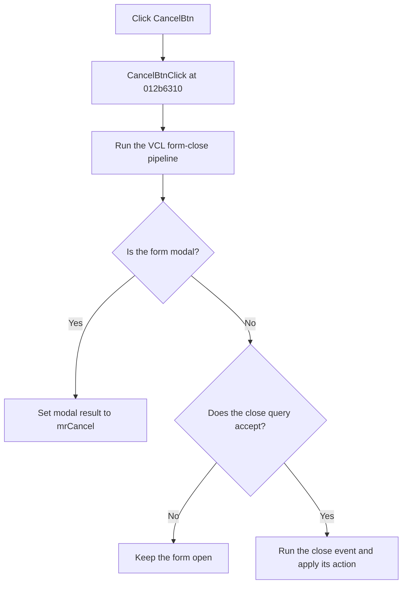

# CancelBtn

> Analysis status: Reviewed from recovered source and UI evidence.

## Control

| Property | Recovered value |
| --- | --- |
| Form | TinaAskVoltagesDlg |
| Component path | TinaAskVoltagesDlg.BtnPanel.CancelBtn |
| Control class | TBitBtn |
| Caption | Not present in the recovered resource. |
| Hint | Not present in the recovered resource. |
| Text | Not present in the recovered resource. |
| Handler name | CancelBtnClick |
| Handler address | 012b6310 |
| Graph node | `resource:dfm:TinaAskVoltagesDlg/TinaAskVoltagesDlg.BtnPanel.CancelBtn` |
| Handler node | `function:012b6310` |
| Graph layer | UI |

## What happens when clicked

The handler calls the common VCL form-close routine. This dialog is opened with the modal show path. The close routine therefore writes modal result `2`, which is Delphi `mrCancel`. The click does not change the voltage or current data.

The common close routine also has a modeless branch. On that branch, it first runs the form close query. A rejected close query causes no further action. An accepted query runs the form close event and then applies its close action. No local error handler is present.

## Click flow

## Handler evidence

- Source: [DecompiledSources/Tina16/functions/00000000012B6310__FUN_012b6310.c](../../../DecompiledSources/Tina16/functions/00000000012B6310__FUN_012b6310.c)
- Recovered role: Request cancellation through the VCL form-close pipeline.
- Current graph summary: Handles 1 Delphi UI event: TinaAskVoltagesDlg.BtnPanel.CancelBtn.OnClick.
- Current graph behavior: The handler delegates directly to `FUN_00805200`. For a modal form, that routine sets modal result `2`. For a modeless form, it runs the close-query and close-action paths.
- Current graph evidence: `FUN_012b6310` contains only the call to `FUN_00805200`. The recovered caller `FUN_012b86e0` opens this dialog with the modal show routine. The common close routine has the documented modal and modeless branches.
- Complexity: simple
- Distinct outgoing calls: 1

## Direct calls

- `function:00805200` — FUN_00805200

## Resource evidence

- Kind: bkCancel
- Modal result: Not present in the recovered resource.
- Checked state: Not present in the recovered resource.
- List items: Not present in the recovered resource.
- Image reference: Not present in the recovered resource.
- Extracted glyph: None.

## Nearby label candidates

Nearby labels are layout candidates only. They are not proof of behavior.

- No same-parent label candidate is available.

## Analysis limits

- The recovered handler does not contain a data reset or a separate cancel callback.
- The modeless branch is part of the common close routine. The recovered dialog caller uses the modal branch.
