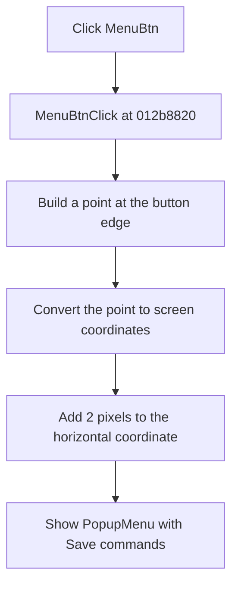

# MenuBtn

> Analysis status: Reviewed from recovered source, resource, and glyph evidence.

## Control

| Property | Recovered value |
| --- | --- |
| Form | TinaAskVoltagesDlg |
| Component path | TinaAskVoltagesDlg.BtnPanel.MenuBtn |
| Control class | TBitBtn |
| Caption | Not present in the recovered resource. |
| Hint | Not present in the recovered resource. |
| Text | Not present in the recovered resource. |
| Handler name | MenuBtnClick |
| Handler address | 012b8820 |
| Graph node | `resource:dfm:TinaAskVoltagesDlg/TinaAskVoltagesDlg.BtnPanel.MenuBtn` |
| Handler node | `function:012b8820` |
| Graph layer | UI |

## What happens when clicked

The handler gets a point from the right side of `MenuBtn`, converts that point to screen coordinates, and adds two pixels to the horizontal coordinate. It then calls the form's `PopupMenu` display method at that screen position. This opens the menu that contains **Save** and **Save As...**.

The handler has no condition and does not change the saved file path. It also has no local error branch. The extracted two-frame hand glyph supports that this is an action button, but the source and the form's popup-menu field prove the menu behavior.

## Click flow

## Handler evidence

- Source: [DecompiledSources/Tina16/functions/00000000012B8820__FUN_012b8820.c](../../../DecompiledSources/Tina16/functions/00000000012B8820__FUN_012b8820.c)
- Recovered role: Open the form popup menu beside the menu button.
- Current graph summary: Handles 1 Delphi UI event: TinaAskVoltagesDlg.BtnPanel.MenuBtn.OnClick.
- Current graph behavior: Builds a point for `MenuBtn`, converts it to screen coordinates, shifts the first coordinate by two pixels, and calls the popup menu's display method.
- Current graph evidence: `FUN_012b8820` reads the form fields at `0x6f8` and `0x6e0`. The recovered component order identifies them as `MenuBtn` and `PopupMenu`. The popup menu contains `PMISave` and `PMISaveAs`.
- Complexity: moderate
- Distinct outgoing calls: 2

## Direct calls

- `function:00498310` — FUN_00498310
- `function:0064d1f0` — FUN_0064d1f0

## Resource evidence

- Kind: Not present in the recovered resource.
- Modal result: Not present in the recovered resource.
- Checked state: Not present in the recovered resource.
- List items: Not present in the recovered resource.
- Image reference: Not present in the recovered resource.
- Extracted glyph: [`0491_TinaAskVoltagesDlg_TinaAskVoltagesDlg_BtnPanel_MenuBtn_Glyph_Data.png`](../../../glyph/0491_TinaAskVoltagesDlg_TinaAskVoltagesDlg_BtnPanel_MenuBtn_Glyph_Data.png)

## Nearby label candidates

Nearby labels are layout candidates only. They are not proof of behavior.

- No same-parent label candidate is available.

## Analysis limits

- The recovered code gives the coordinate calculation and popup call. It does not give a named VCL method for the virtual calls.
- The glyph is supporting evidence only.
