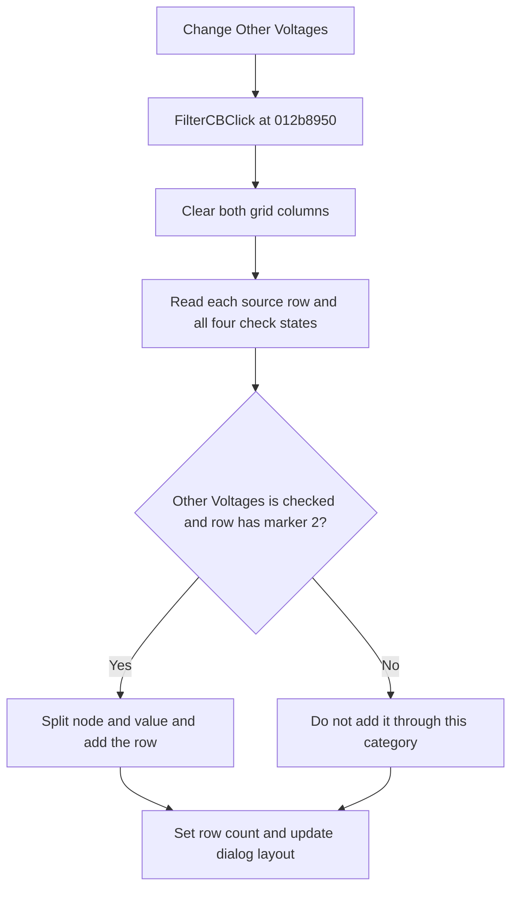

# Other Voltages

> Analysis status: Reviewed from recovered source and UI evidence.

## Control

| Property | Recovered value |
| --- | --- |
| Form | TinaAskVoltagesDlg |
| Component path | TinaAskVoltagesDlg.BtnPanel.GroupBox1.OtherVCB |
| Control class | TCheckBox |
| Caption | Other Voltages |
| Hint | Not present in the recovered resource. |
| Text | Not present in the recovered resource. |
| Handler name | FilterCBClick |
| Handler address | 012b8950 |
| Graph node | `resource:dfm:TinaAskVoltagesDlg/TinaAskVoltagesDlg.BtnPanel.GroupBox1.OtherVCB` |
| Handler node | `function:012b8950` |
| Graph layer | UI |

## What happens when clicked

The VCL changes the check state before it calls the shared `FilterCBClick` handler. The handler rebuilds the complete two-column grid from the form's source list. It clears both grid columns, reads all four filter states, and tests each source row.

The recovered form field order maps `OtherVCB` to the check box at offset `0x710`. A checked state includes rows that start with the second recovered category marker. A clear state excludes those rows. The exact marker text is not recovered, but the DFM caption and field mapping identify this filter as **Other Voltages**. Rows that pass the filter are split into node and value text and copied to the grid. The final helper sets the row count and updates the grid, panel, and form heights. It shows at most 12 row heights before the grid must handle more rows.

The handler does not use `Sender`, and it does not report an error when no row matches. All four check boxes run the same full rebuild.

## Click flow

## Handler evidence

- Source: [DecompiledSources/Tina16/functions/00000000012B8950__FUN_012b8950.c](../../../DecompiledSources/Tina16/functions/00000000012B8950__FUN_012b8950.c)
- Recovered role: Rebuild the voltage and current grid after a filter state changes.
- Current graph summary: Handles 4 Delphi UI events: TinaAskVoltagesDlg.BtnPanel.GroupBox1.VoltagesCB.OnClick, TinaAskVoltagesDlg.BtnPanel.GroupBox1.OtherVCB.OnClick, TinaAskVoltagesDlg.BtnPanel.GroupBox1.CurrentsCB.OnClick.
- Current graph behavior: Delegates to `FUN_012b6470`, which reads the category check boxes, filters the source list, fills grid columns 0 and 1, and updates the row count and dialog layout.
- Current graph evidence: The DFM maps four check boxes to `FilterCBClick`. The recovered form field order maps `OtherVCB` to offset `0x710`. `FUN_012b6470` reads this check state and accepts rows with the second category marker only when it is set.
- Complexity: simple
- Distinct outgoing calls: 1

## Direct calls

- `function:012b6470` — FUN_012b6470

## Resource evidence

- Kind: Not present in the recovered resource.
- Modal result: Not present in the recovered resource.
- Checked state: true
- List items: Not present in the recovered resource.
- Image reference: Not present in the recovered resource.
- Extracted glyph: None.

## Nearby label candidates

Nearby labels are layout candidates only. They are not proof of behavior.

- No same-parent label candidate is available.

## Analysis limits

- The exact text of the internal category marker is not recovered.
- The source proves the category test, row copy, and layout update. It does not identify an error message for an empty result.
