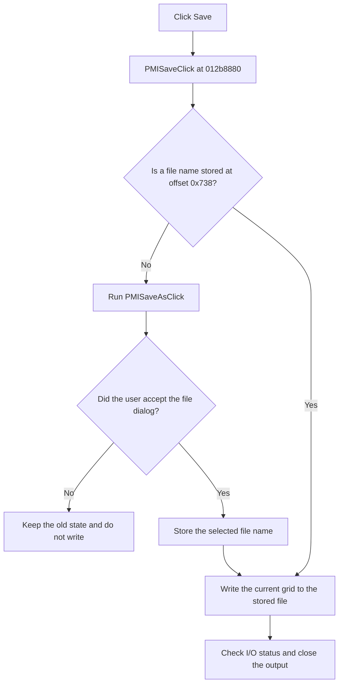

# &Save

> Analysis status: Reviewed from recovered source and UI evidence.

## Control

| Property | Recovered value |
| --- | --- |
| Form | TinaAskVoltagesDlg |
| Component path | TinaAskVoltagesDlg.PopupMenu.PMISave |
| Control class | TMenuItem |
| Caption | &Save |
| Hint | Not present in the recovered resource. |
| Text | Not present in the recovered resource. |
| Handler name | PMISaveClick |
| Handler address | 012b8880 |
| Graph node | `resource:dfm:TinaAskVoltagesDlg/TinaAskVoltagesDlg.PopupMenu.PMISave` |
| Handler node | `function:012b8880` |
| Graph layer | UI |

## What happens when clicked

The handler checks the file-name field at form offset `0x738`. If this field is empty, it runs the same Save As handler that the **Save As...** menu item uses. If the field already contains a name, it writes the current grid to that file without opening the dialog again.

The write helper creates a text output, writes the heading `Nodes` and `Values`, and then loops through all current grid rows. It reads columns 0 and 1, formats both fields, writes one line for each row, and closes the output. Runtime I/O checks follow file setup, open, header output, each row, and close. The helper does not catch an I/O error locally.

If Save forwards to Save As and the user cancels the file dialog, no file is written and the stored name stays unchanged.

## Click flow

## Handler evidence

- Source: [DecompiledSources/Tina16/functions/00000000012B8880__FUN_012b8880.c](../../../DecompiledSources/Tina16/functions/00000000012B8880__FUN_012b8880.c)
- Recovered role: Save the displayed node and value grid to the stored file, or request a file name first.
- Current graph summary: Handles 1 Delphi UI event: TinaAskVoltagesDlg.PopupMenu.PMISave.OnClick.
- Current graph behavior: Tests the stored file name at `0x738`. A missing name forwards to `FUN_012b88b0`. An existing name goes to `FUN_012b5de0`, which writes the two grid columns as text.
- Current graph evidence: `FUN_012b8880` has the two file-name branches. `FUN_012b5de0` opens the supplied name, writes the `Nodes` and `Values` header, loops through columns 0 and 1 for every grid row, and closes the output with I/O checks.
- Complexity: moderate
- Distinct outgoing calls: 2

## Direct calls

- `function:012b5de0` — FUN_012b5de0
- `function:012b88b0` — Handles 1 Delphi UI event: TinaAskVoltagesDlg.PopupMenu.PMISaveAs.OnClick.

## Resource evidence

- Kind: Not present in the recovered resource.
- Modal result: Not present in the recovered resource.
- Checked state: Not present in the recovered resource.
- List items: Not present in the recovered resource.
- Image reference: Not present in the recovered resource.
- Extracted glyph: None.

## Nearby label candidates

Nearby labels are layout candidates only. They are not proof of behavior.

- No same-parent label candidate is available.

## Analysis limits

- The recovered file-dialog resource does not expose its displayed filter text.
- The write path uses runtime I/O checks. The recovered helper does not catch or replace their errors.
