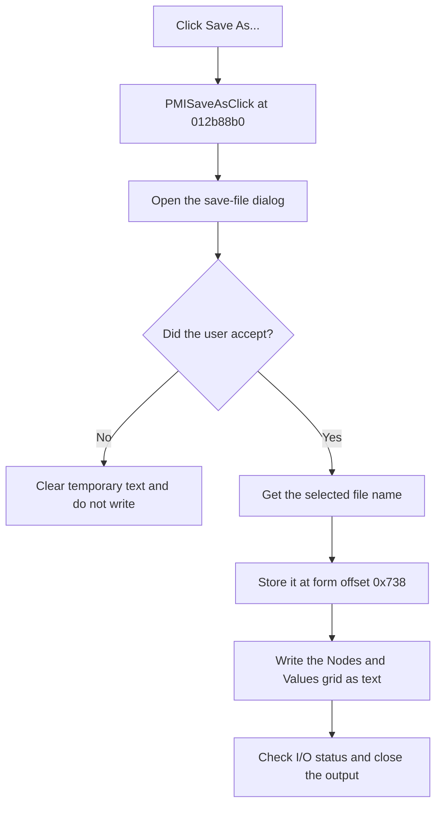

# Save &As...

> Analysis status: Reviewed from recovered source and UI evidence.

## Control

| Property | Recovered value |
| --- | --- |
| Form | TinaAskVoltagesDlg |
| Component path | TinaAskVoltagesDlg.PopupMenu.PMISaveAs |
| Control class | TMenuItem |
| Caption | Save &As... |
| Hint | Not present in the recovered resource. |
| Text | Not present in the recovered resource. |
| Handler name | PMISaveAsClick |
| Handler address | 012b88b0 |
| Graph node | `resource:dfm:TinaAskVoltagesDlg/TinaAskVoltagesDlg.PopupMenu.PMISaveAs` |
| Handler node | `function:012b88b0` |
| Graph layer | UI |

## What happens when clicked

The handler opens the form's save-file dialog. If the user cancels it, the handler clears its temporary string and returns. It does not change the stored file name and does not write a file.

If the user accepts the dialog, the handler gets the selected file name, assigns it to the form field at offset `0x738`, and writes the current grid to that file. The write helper creates a text output, writes the heading `Nodes` and `Values`, and then loops through all current grid rows. It reads columns 0 and 1, formats both fields, writes one line for each row, and closes the output.

Runtime I/O checks follow file setup, open, header output, each row, and close. The helper does not catch an I/O error locally.

## Click flow

## Handler evidence

- Source: [DecompiledSources/Tina16/functions/00000000012B88B0__FUN_012b88b0.c](../../../DecompiledSources/Tina16/functions/00000000012B88B0__FUN_012b88b0.c)
- Recovered role: Request an output file name and save the displayed node and value grid.
- Current graph summary: Handles 1 Delphi UI event: TinaAskVoltagesDlg.PopupMenu.PMISaveAs.OnClick.
- Current graph behavior: Runs the save dialog. An accepted dialog supplies a file name, updates field `0x738`, and calls `FUN_012b5de0`. A canceled dialog performs only temporary string cleanup.
- Current graph evidence: `FUN_012b88b0` guards all file-name assignment and output behind the save-dialog Boolean result. `FUN_012b5de0` opens the supplied name, writes the `Nodes` and `Values` header, loops through columns 0 and 1 for every grid row, and closes the output with I/O checks.
- Complexity: complex
- Distinct outgoing calls: 4

## Direct calls

- `function:00414480` — Delphi UnicodeString clear and finalization helper
- `function:00414ad0` — Delphi UnicodeString assignment helper
- `function:00724270` — FUN_00724270
- `function:012b5de0` — FUN_012b5de0

## Resource evidence

- Kind: Not present in the recovered resource.
- Modal result: Not present in the recovered resource.
- Checked state: Not present in the recovered resource.
- List items: Not present in the recovered resource.
- Image reference: Not present in the recovered resource.
- Extracted glyph: None.

## Nearby label candidates

Nearby labels are layout candidates only. They are not proof of behavior.

- No same-parent label candidate is available.

## Analysis limits

- The recovered file-dialog resource does not expose its displayed filter text.
- The write path uses runtime I/O checks. The recovered helper does not catch or replace their errors.
