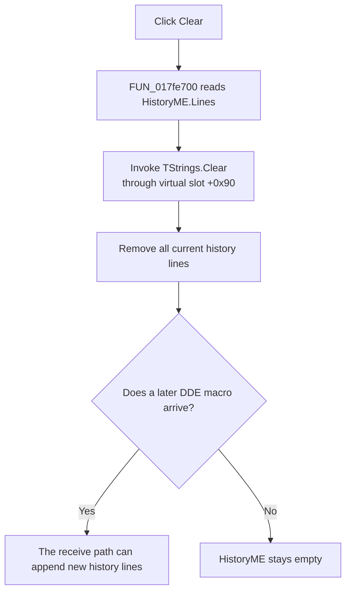

# Clear the DDE message history

> Analysis status: Complete for target identification, line removal, later log updates, repeated clicks, errors, and persistence.

## Control

| Property | Recovered value |
| --- | --- |
| Form | TinaDDEMgr |
| Component path | TinaDDEMgr.ClearBtn |
| Control class | TButton |
| Caption | Clear |
| Hint | Not present in the recovered resource. |
| Text | Not present in the recovered resource. |
| Handler name | ClearBtnClick |
| Handler address | 017fe700 |
| Graph node | `resource:dfm:TinaDDEMgr/TinaDDEMgr.ClearBtn` |
| Handler node | `function:017fe700` |
| Graph layer | UI |

## What happens when clicked

`FUN_017fe700` gets the `Lines` object from `HistoryME` and calls its virtual `Clear` method. This operation removes all text that is in the DDE history memo at click time. It does not remove one selected line and it does not keep a copy of the text.

The recovered form and the related DDE macro handler identify the target:

- `HistoryME` is the read-only memo at form field `+0x6f0`.
- Its `Lines` object is at control offset `+0x4d8`.
- Virtual slot `+0x90` is the Delphi `TStrings.Clear` operation. Other recovered memo paths use the same slot for the same operation.
- `FUN_017fc9e0` writes received DDE macro text and a separator to this same line collection. Thus, Clear affects the visible DDE history and not the `MessageEB` input edit.

The handler does not change the current target in `rgrpTarget`, disconnect Edison or PCB Viewer, clear `MessageEB`, or send a DDE command. A later received macro can add new lines to the empty history.

## Click flow

## Handler evidence

- Source: [Clear handler `FUN_017fe700`](../../../DecompiledSources/Tina16/functions/00000000017FE700__FUN_017fe700.c)
- Related writer: [DDE macro handler `FUN_017fc9e0`](../../../DecompiledSources/Tina16/functions/00000000017FC9E0__FUN_017fc9e0.c)
- Resource: [Recovered Delphi form evidence](../../../DecompiledSources/Tina16/resources/dfm/ui-evidence.json)
- Recovered role: Clear the Tina DDE Manager history memo.
- Current graph summary: Handles 1 Delphi UI event: TinaDDEMgr.ClearBtn.OnClick.
- Current graph behavior: Gets `HistoryME.Lines` and invokes its virtual `Clear` method.
- Current graph evidence: The handler reads form field `+0x6f0`, reads its line collection at `+0x4d8`, and invokes virtual slot `+0x90`. The DDE macro path appends history entries to the same collection.
- Complexity: simple
- Distinct outgoing calls: 0

## Direct calls

No direct call edge is present in the recovered graph. The source contains one indirect VCL call to `HistoryME.Lines.Clear`. The graph cannot resolve this virtual call to one recovered function node.

## Resource evidence

- Kind: Not present in the recovered resource.
- Modal result: Not present in the recovered resource.
- Checked state: Not present in the recovered resource.
- List items: Not present in the recovered resource.
- Image reference: Not present in the recovered resource.
- Extracted glyph: None.

The DFM identifies `HistoryME` as a read-only `TMemo`. It has no initial `Lines` value. `ClearBtn` is next to that memo, but the source call path, and not the layout, proves the target.

## Nearby label candidates

Nearby labels are layout candidates only. They are not proof of behavior.

- No same-parent label candidate is available.

## Repeated, error, and persistence behavior

- The handler has no empty-content test. A click on an empty history calls `Lines.Clear` again and leaves it empty.
- The handler has no confirmation, success message, alternate branch, or local exception handler. A VCL exception follows the normal Delphi exception path.
- The handler does not read or restore the caret, selection, scroll position, focus, Undo state, or native `Modified` state. Their exact values after `TStrings.Clear` are VCL behavior and are not established here.
- The clear changes only the live memo. The handler calls no file, registry, or settings API. `FormDestroy` is a no-op, so the recovered path gives no persistence mechanism for cleared or prior history.

## Analysis limits

- The source proves complete-line clearing. It does not prove the exact native memo state after the VCL operation.
- Incoming DDE processing owns later history entries. Clear does not stop that processing.
