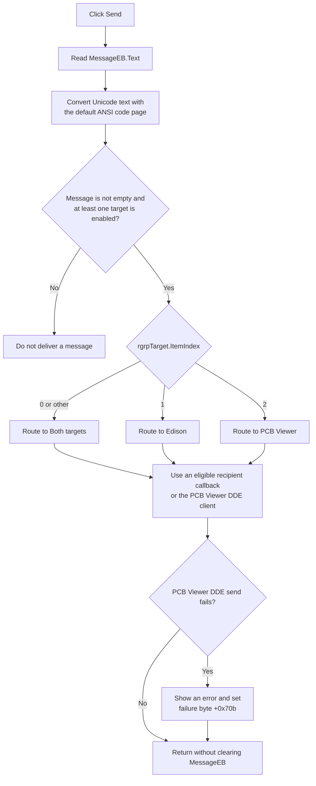

# Send a DDE message

> Analysis status: Complete for input conversion, target selection, connection guards, delivery paths, failure behavior, and live-state effects.

## Control

| Property | Recovered value |
| --- | --- |
| Form | TinaDDEMgr |
| Component path | TinaDDEMgr.SendBtn |
| Control class | TButton |
| Caption | Send |
| Hint | Not present in the recovered resource. |
| Text | Not present in the recovered resource. |
| Handler name | SendBtnClick |
| Handler address | 017fe650 |
| Graph node | `resource:dfm:TinaDDEMgr/TinaDDEMgr.SendBtn` |
| Handler node | `function:017fe650` |
| Graph layer | UI |

## What happens when clicked

`FUN_017fe650` reads the current text from `MessageEB`. It converts the Unicode text to an 8-bit Delphi string with code-page argument `0`. The Delphi runtime resolves this argument to the process default ANSI code page. The handler then reads `rgrpTarget.ItemIndex` and calls shared DDE dispatcher `FUN_017fe450` with delivery enabled.

The radio-group items are `Both`, `Edison`, and `Viewer`. The recovered dispatcher uses these index values:

| Item index | Selected item | Dispatcher path |
| --- | --- | --- |
| `0` | Both | `FUN_017fdb10` routes to the enabled Edison and PCB Viewer targets. |
| `1` | Edison | `FUN_017fdf90` handles the Edison target. |
| `2` | Viewer | `FUN_017fe120` handles the PCB Viewer target. |

Any other index also enters the Both path. The DFM does not give `rgrpTarget` an initial `ItemIndex`, so the recovered source does not prove which item is selected when a new form first opens.

The dispatcher returns without target work when the converted message is empty or when both target-enabled bytes at form offsets `+0x708` and `+0x709` are clear. `FormCreate` initializes both bytes to zero. The DDE macro connection path sets them after it connects to Edison or PCB Viewer.

For an enabled target, the route can call an active in-process recipient. The PCB Viewer route can also send through its `TDdeClientConv`. The DDE client path writes the string length and UTF-16 payload to the communication stream and waits for the recovered response. If the PCB Viewer send reports failure, the application displays `Tina SendDDEMessage failed to PCBViewer!` and sets failure byte `+0x70b`. A successful PCB Viewer send adds `Tina DDE Log - DDE Message sent: ` and the message to the application log.

The click handler ignores the dispatcher's return value. It does not clear `MessageEB`, append the sent text to `HistoryME`, change the selected target, retry a failed send, or show a local success message.

## Click flow

## Handler evidence

- Source: [Send handler `FUN_017fe650`](../../../DecompiledSources/Tina16/functions/00000000017FE650__FUN_017fe650.c)
- Dispatcher: [`FUN_017fe450`](../../../DecompiledSources/Tina16/functions/00000000017FE450__FUN_017fe450.c)
- Target helpers: [Both `FUN_017fdb10`](../../../DecompiledSources/Tina16/functions/00000000017FDB10__FUN_017fdb10.c), [Edison `FUN_017fdf90`](../../../DecompiledSources/Tina16/functions/00000000017FDF90__FUN_017fdf90.c), and [PCB Viewer `FUN_017fe120`](../../../DecompiledSources/Tina16/functions/00000000017FE120__FUN_017fe120.c)
- DDE transport: [`FUN_00c4ca50`](../../../DecompiledSources/Tina16/functions/0000000000C4CA50__FUN_00c4ca50.c), [`FUN_00c4c7b0`](../../../DecompiledSources/Tina16/functions/0000000000C4C7B0__FUN_00c4c7b0.c), and [`FUN_00c492b0`](../../../DecompiledSources/Tina16/functions/0000000000C492B0__FUN_00c492b0.c)
- Resource: [Recovered Delphi form evidence](../../../DecompiledSources/Tina16/resources/dfm/ui-evidence.json)
- Recovered role: Send the entered DDE message to the selected target set.
- Current graph summary: Handles 1 Delphi UI event: TinaDDEMgr.SendBtn.OnClick.
- Current graph behavior: Reads `MessageEB`, performs the default-code-page conversion, reads `rgrpTarget.ItemIndex`, and calls the shared DDE target dispatcher.
- Current graph evidence: The handler reads the control at form field `+0x6e0`, passes code page `0` to `FUN_00415dd0`, reads the byte at radio group field `+0x700` and control offset `+0x4a8`, then calls `FUN_017fe450` with its delivery argument set to `1`.
- Complexity: complex
- Distinct outgoing calls: 5

## Direct calls

- `function:00414480` - Delphi UnicodeString clear and finalization helper
- `function:004144d0` - 8-bit Delphi string clear and finalization helper
- `function:00415dd0` - Unicode-to-default-ANSI string assignment
- `function:0064dd90` - VCL control Unicode text reader
- `function:017fe450` - Tina DDE target dispatcher

## Resource evidence

- Kind: Not present in the recovered resource.
- Modal result: Not present in the recovered resource.
- Checked state: Not present in the recovered resource.
- List items: Not present in the recovered resource.
- Image reference: Not present in the recovered resource.
- Extracted glyph: None.

`MessageEB` is a `TEdit`. `rgrpTarget` is a `TRadioGroup` with items `Both`, `Edison`, and `Viewer`. The form also contains the two DDE client conversations and client items that the target helpers access.

## Nearby label candidates

Nearby labels are layout candidates only. They are not proof of behavior.

- No same-parent label candidate is available.

## Repeated, no-op, and error behavior

- Empty input becomes an empty 8-bit Delphi string and fails the dispatcher's non-null message guard. No message is delivered.
- When neither target-enabled byte is set, a nonempty input also produces no target action. The input remains in `MessageEB` in both no-op cases.
- Repeated clicks repeat the dispatch attempt because the click does not clear or change the input.
- Conversion uses the default ANSI code page. The handler does not detect or report characters that cannot be represented in that code page.
- The recovered path contains no local exception handler, timeout, rollback, or retry. A raised exception stops the remaining path. A delivery that an external process already accepted cannot be rolled back.

## Persistence and limits

- The click changes no project file, settings file, registry value, document-modified flag, or form-lifetime option. The target-enabled and failure bytes are live connection state, not persisted click settings.
- The recovered sources prove the target selection and the application-side delivery boundaries. They do not prove that Edison or PCB Viewer accepts, parses, or applies the message after transport success.
