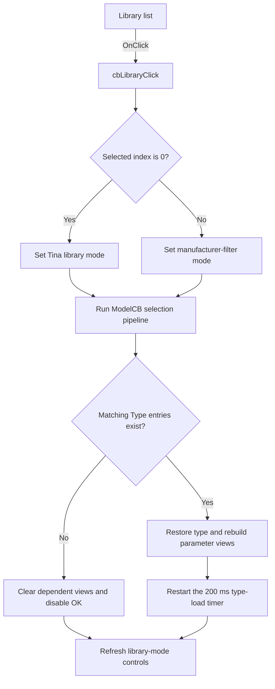

# cbLibrary

> Analysis status: Source reviewed. Library-mode selection and catalog-list rebuild are documented.

## Control

| Property | Recovered value |
| --- | --- |
| Form | TlrCatalogEditorDlg |
| Component path | TlrCatalogEditorDlg.cbLibrary |
| Control class | TComboBox |
| Caption | Not present in the recovered resource. |
| Hint | Not present in the recovered resource. |
| Text | Not present in the recovered resource. |
| Handler name | cbLibraryClick |
| Handler address | 013f3e70 |
| Graph node | `resource:dfm:TlrCatalogEditorDlg/TlrCatalogEditorDlg.cbLibrary` |
| Handler node | `function:013f3e70` |
| Graph layer | UI |

## What happens when clicked

The handler reads the Library combo selection. Index `0` selects Tina mode; any nonzero index selects the All Manufacturer or manufacturer-filter mode. It stores that mode in form byte `+0x8E2`.

It then calls the Model selection pipeline. Tina mode rebuilds Type entries for the selected model and checks whether General tolerance is available. The other mode rebuilds Type entries for `[All]` when the combo index is `1`, or for the selected manufacturer when a later dynamic item is selected.

The shared pipeline clears dependent views when no types match. Otherwise, it restores a type selection, rebuilds parameter views, and restarts the 200 ms type-detail timer. The handler finishes by refreshing which model and tolerance controls are available for the selected library mode.

## Click flow

## Handler evidence

- Source: [DecompiledSources/Tina16/functions/00000000013F3E70__FUN_013f3e70.c](../../../DecompiledSources/Tina16/functions/00000000013F3E70__FUN_013f3e70.c)
- Recovered role: Selects the catalog library mode and rebuilds the dependent model and type views.
- Current graph summary: Handles 1 Delphi UI event: TlrCatalogEditorDlg.cbLibrary.OnClick.
- Behavior: Sets the form library-mode byte from cbLibrary.ItemIndex, then runs the ModelCB pipeline. Index 0 uses the selected Tina model; index 1 filters all manufacturers; later dynamic entries filter one manufacturer. The shared path clears empty results or restores a type and schedules its detail load, then refreshes control availability.
- Evidence: The DFM supplies initial cbLibrary items Tina and All Manufacturer. FUN_013f3e70 reads ItemIndex from form field +0x6C8, stores ItemIndex != 0 at +0x8E2, calls FUN_013f3ec0, and calls FUN_013f3480. In the non-Tina branch, FUN_013f3ec0 passes [All] for index 1 or the selected combo text for later indexes to FUN_01717260 before it tests the resulting TypeLB item count.
- Complexity: moderate
- Distinct outgoing calls: 2

## Direct calls

- `function:013f3480` — FUN_013f3480
- `function:013f3ec0` — Handles 1 Delphi UI event: TlrCatalogEditorDlg.ModelCB.OnClick.

## Resource evidence

- Kind: Not present in the recovered resource.
- Modal result: Not present in the recovered resource.
- Checked state: Not present in the recovered resource.
- List items: ("Tina", "All Manufacturer")
- Image reference: Not present in the recovered resource.
- Extracted glyph: None.

## Nearby label candidates

Nearby labels are layout candidates only. They are not proof of behavior.

- Rank 1: &Library at distance 23.
- Rank 2: &Model at distance 30.
- Rank 3: &Type at distance 73.

## Analysis limits

- Manufacturer names after the two initial DFM items are added at runtime.
- The source proves filtering and dependent-view refresh; it does not expose user-facing error text for catalog-service failures.
