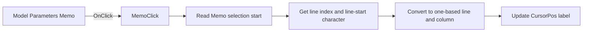

# Memo

> Analysis status: Source reviewed. The click updates the Memo caret-position label.

## Control

| Property | Recovered value |
| --- | --- |
| Form | TlrCatalogEditorDlg |
| Component path | TlrCatalogEditorDlg.PageControl.TabSheet2.Memo |
| Control class | TMemo |
| Caption | Not present in the recovered resource. |
| Hint | Not present in the recovered resource. |
| Text | Not present in the recovered resource. |
| Handler name | MemoClick |
| Handler address | 013f57a0 |
| Graph node | `resource:dfm:TlrCatalogEditorDlg/TlrCatalogEditorDlg.PageControl.TabSheet2.Memo` |
| Handler node | `function:013f57a0` |
| Graph layer | UI |

## What happens when clicked

The click calls the same caret-position helper that the Memo's `OnKeyUp` event uses. The helper reads the Memo selection start, asks the native edit control for the zero-based line and the first character index of that line, and converts both values to one-based line and column numbers.

It formats those numbers with the form's localized line-and-column template and writes the result to the `CursorPos` label. The click does not change the Memo text, selection, or catalog record.

## Click flow

## Handler evidence

- Source: [DecompiledSources/Tina16/functions/00000000013F57A0__FUN_013f57a0.c](../../../DecompiledSources/Tina16/functions/00000000013F57A0__FUN_013f57a0.c)
- Recovered role: Updates the Memo line-and-column status after a click.
- Current graph summary: Handles 1 Delphi UI event: TlrCatalogEditorDlg.PageControl.TabSheet2.Memo.OnClick.
- Behavior: Reads the Memo caret position, calculates one-based line and column values, formats them with the form's localized position template, and updates the CursorPos label. It does not edit the Memo contents.
- Evidence: FUN_013f57a0 calls FUN_013f5660. That helper reads the Memo at form +0x738, sends edit-control messages 0xC9 and 0xBB to obtain the current line and its start position, calculates line + 1 and selection-start minus line-start + 1, formats them with the string at +0x7D8, and sets label +0x748. MemoKeyUp at 013f57b0 calls the same helper.
- Complexity: simple
- Distinct outgoing calls: 1

## Direct calls

- `function:013f5660` — FUN_013f5660

## Resource evidence

- Kind: Not present in the recovered resource.
- Modal result: Not present in the recovered resource.
- Checked state: Not present in the recovered resource.
- List items: Not present in the recovered resource.
- Image reference: Not present in the recovered resource.
- Extracted glyph: None.

## Nearby label candidates

Nearby labels are layout candidates only. They are not proof of behavior.

- Rank 1: Model &Parameters at distance 24.
- Rank 2: Line: 1 Col: 1 at distance 239.

## Analysis limits

- The recovered source proves a status-label update only; catalog persistence occurs later in OKBtnClick.
- The line and column label text is localized at runtime.
