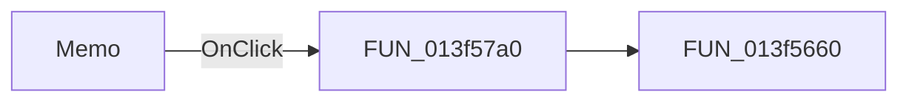

# Memo

> Analysis status: Pending individual source review.

## Control

| Property | Recovered value |
| --- | --- |
| Form | TlrCatalogEditorDlg |
| Component path | TlrCatalogEditorDlg.PageControl.TabSheet2.Memo |
| Control class | TMemo |
| Caption | Not present in the recovered resource. |
| Hint | Not present in the recovered resource. |
| Text | Not present in the recovered resource. |
| Handler name | MemoClick |
| Handler address | 013f57a0 |
| Graph node | `resource:dfm:TlrCatalogEditorDlg/TlrCatalogEditorDlg.PageControl.TabSheet2.Memo` |
| Handler node | `function:013f57a0` |
| Graph layer | UI |

## What happens when clicked

Pending individual analysis. An agent must read the recovered handler source and its relevant callees before it replaces this text.

## Click flow

## Handler evidence

- Source: [DecompiledSources/Tina16/functions/00000000013F57A0__FUN_013f57a0.c](../../../DecompiledSources/Tina16/functions/00000000013F57A0__FUN_013f57a0.c)
- Recovered role: Not present in the recovered resource.
- Current graph summary: Handles 1 Delphi UI event: TlrCatalogEditorDlg.PageControl.TabSheet2.Memo.OnClick.
- Current graph behavior: Not present in the recovered resource.
- Current graph evidence: Not present in the recovered resource.
- Complexity: simple
- Distinct outgoing calls: 1

## Direct calls

- `function:013f5660` — FUN_013f5660

## Resource evidence

- Kind: Not present in the recovered resource.
- Modal result: Not present in the recovered resource.
- Checked state: Not present in the recovered resource.
- List items: Not present in the recovered resource.
- Image reference: Not present in the recovered resource.
- Extracted glyph: None.

## Nearby label candidates

Nearby labels are layout candidates only. They are not proof of behavior.

- Rank 1: Model &Parameters at distance 24.
- Rank 2: Line: 1 Col: 1 at distance 239.

## Analysis limits

- Do not infer behavior from the control class, caption, hint, glyph, or nearby label alone.
- Do not replace the pending status until the handler source and relevant call path provide enough evidence.
