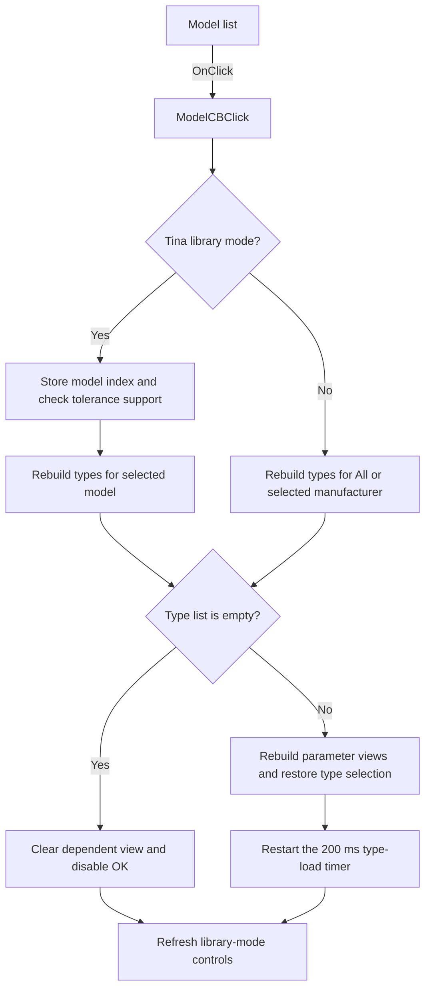

# ModelCB

> Analysis status: Source reviewed. Model selection and dependent-control refresh are documented.

## Control

| Property | Recovered value |
| --- | --- |
| Form | TlrCatalogEditorDlg |
| Component path | TlrCatalogEditorDlg.ModelCB |
| Control class | TComboBox |
| Caption | Not present in the recovered resource. |
| Hint | Not present in the recovered resource. |
| Text | Not present in the recovered resource. |
| Handler name | ModelCBClick |
| Handler address | 013f3ec0 |
| Graph node | `resource:dfm:TlrCatalogEditorDlg/TlrCatalogEditorDlg.ModelCB` |
| Handler node | `function:013f3ec0` |
| Graph layer | UI |

## What happens when clicked

The handler reads the selected model when the `Tina` library mode is active. It stores the model index, checks whether that model supports the General tolerance option, and forces the tolerance radio group to None when General is not available. It then rebuilds the Type list for the selected model and preserves the prior type by text when that item still exists.

For an All Manufacturer or manufacturer-filtered library, the handler rebuilds the Type list for `[All]` or the selected manufacturer. It resets the model and type indexes when that filtered list is empty.

A nonempty Type list causes the handler to rebuild the parameter views, restore the selected type, update the count label, and call `TypeLBClick`. That call restarts the 200 ms timer that loads the selected type details. An empty list clears the dependent view and hides the count label. The handler always refreshes the OK-button state and the controls that are available in the selected library mode.

## Click flow

## Handler evidence

- Source: [DecompiledSources/Tina16/functions/00000000013F3EC0__FUN_013f3ec0.c](../../../DecompiledSources/Tina16/functions/00000000013F3EC0__FUN_013f3ec0.c)
- Recovered role: Rebuilds the catalog Type list and dependent views for the selected model.
- Current graph summary: Handles 1 Delphi UI event: TlrCatalogEditorDlg.ModelCB.OnClick.
- Behavior: Reads the model selection in the Tina library mode, checks General-tolerance support, rebuilds the Type list, preserves or resets the selected type, updates parameter views and count state, schedules the delayed type-detail load, and refreshes the OK and library-mode controls. In manufacturer mode, it filters types by All or by the selected manufacturer.
- Evidence: FUN_013f3ec0 reads ModelCB ItemIndex through form field +0x6D0, stores it at +0x77C, queries tolerance support through FUN_0172c9d0, and updates the ToleranceModelRG at +0x718. It repopulates TypeLB.Items at +0x6D8 through FUN_0172c930 or FUN_01717260, records an empty-list flag at +0x8E3, calls the TypeLB click handler for a nonempty list, and uses FUN_013f3560 and FUN_013f3480 for final control-state refresh.
- Complexity: complex
- Distinct outgoing calls: 17

## Direct calls

- `function:00414480` — Delphi UnicodeString clear and finalization helper
- `function:004d3de0` — FUN_004d3de0
- `function:0064dbe0` — FUN_0064dbe0
- `function:0068bbb0` — FUN_0068bbb0
- `function:0074b490` — FUN_0074b490
- `function:00b0b020` — FUN_00b0b020
- `function:00b905e0` — FUN_00b905e0
- `function:013f3480` — FUN_013f3480
- `function:013f3560` — FUN_013f3560
- `function:013f35b0` — FUN_013f35b0
- `function:013f3750` — FUN_013f3750
- `function:013f3b20` — FUN_013f3b20
- `function:013f47e0` — Handles 1 Delphi UI event: TlrCatalogEditorDlg.TypeLB.OnClick.
- `function:01717260` — FUN_01717260
- `function:0172c930` — FUN_0172c930
- `function:0172c9d0` — FUN_0172c9d0
- `function:0172ca20` — FUN_0172ca20

## Resource evidence

- Kind: Not present in the recovered resource.
- Modal result: Not present in the recovered resource.
- Checked state: Not present in the recovered resource.
- List items: Not present in the recovered resource.
- Image reference: Not present in the recovered resource.
- Extracted glyph: None.

## Nearby label candidates

Nearby labels are layout candidates only. They are not proof of behavior.

- Rank 1: &Model at distance 21.
- Rank 2: &Type at distance 30.
- Rank 3: &Library at distance 66.

## Analysis limits

- The recovered catalog-service functions do not expose their original Delphi method names.
- The handler schedules detailed type loading through a timer; that later load is not synchronous with this click.
