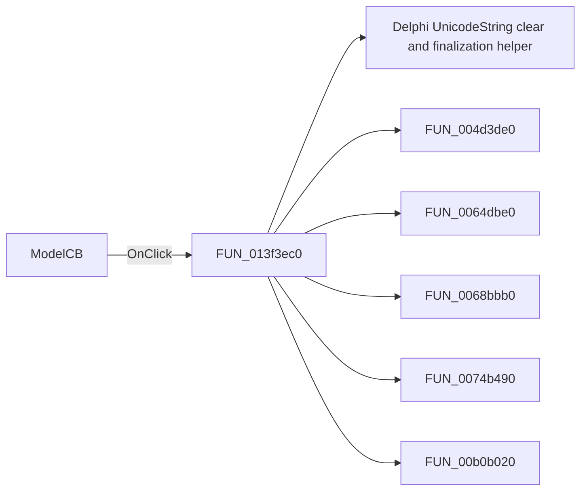

# ModelCB

> Analysis status: Pending individual source review.

## Control

| Property | Recovered value |
| --- | --- |
| Form | TlrCatalogEditorDlg |
| Component path | TlrCatalogEditorDlg.ModelCB |
| Control class | TComboBox |
| Caption | Not present in the recovered resource. |
| Hint | Not present in the recovered resource. |
| Text | Not present in the recovered resource. |
| Handler name | ModelCBClick |
| Handler address | 013f3ec0 |
| Graph node | `resource:dfm:TlrCatalogEditorDlg/TlrCatalogEditorDlg.ModelCB` |
| Handler node | `function:013f3ec0` |
| Graph layer | UI |

## What happens when clicked

Pending individual analysis. An agent must read the recovered handler source and its relevant callees before it replaces this text.

## Click flow

## Handler evidence

- Source: [DecompiledSources/Tina16/functions/00000000013F3EC0__FUN_013f3ec0.c](../../../DecompiledSources/Tina16/functions/00000000013F3EC0__FUN_013f3ec0.c)
- Recovered role: Not present in the recovered resource.
- Current graph summary: Handles 1 Delphi UI event: TlrCatalogEditorDlg.ModelCB.OnClick.
- Current graph behavior: Not present in the recovered resource.
- Current graph evidence: Not present in the recovered resource.
- Complexity: complex
- Distinct outgoing calls: 17

## Direct calls

- `function:00414480` — Delphi UnicodeString clear and finalization helper
- `function:004d3de0` — FUN_004d3de0
- `function:0064dbe0` — FUN_0064dbe0
- `function:0068bbb0` — FUN_0068bbb0
- `function:0074b490` — FUN_0074b490
- `function:00b0b020` — FUN_00b0b020
- `function:00b905e0` — FUN_00b905e0
- `function:013f3480` — FUN_013f3480
- `function:013f3560` — FUN_013f3560
- `function:013f35b0` — FUN_013f35b0
- `function:013f3750` — FUN_013f3750
- `function:013f3b20` — FUN_013f3b20
- `function:013f47e0` — Handles 1 Delphi UI event: TlrCatalogEditorDlg.TypeLB.OnClick.
- `function:01717260` — FUN_01717260
- `function:0172c930` — FUN_0172c930
- `function:0172c9d0` — FUN_0172c9d0
- `function:0172ca20` — FUN_0172ca20

## Resource evidence

- Kind: Not present in the recovered resource.
- Modal result: Not present in the recovered resource.
- Checked state: Not present in the recovered resource.
- List items: Not present in the recovered resource.
- Image reference: Not present in the recovered resource.
- Extracted glyph: None.

## Nearby label candidates

Nearby labels are layout candidates only. They are not proof of behavior.

- Rank 1: &Model at distance 21.
- Rank 2: &Type at distance 30.
- Rank 3: &Library at distance 66.

## Analysis limits

- Do not infer behavior from the control class, caption, hint, glyph, or nearby label alone.
- Do not replace the pending status until the handler source and relevant call path provide enough evidence.
