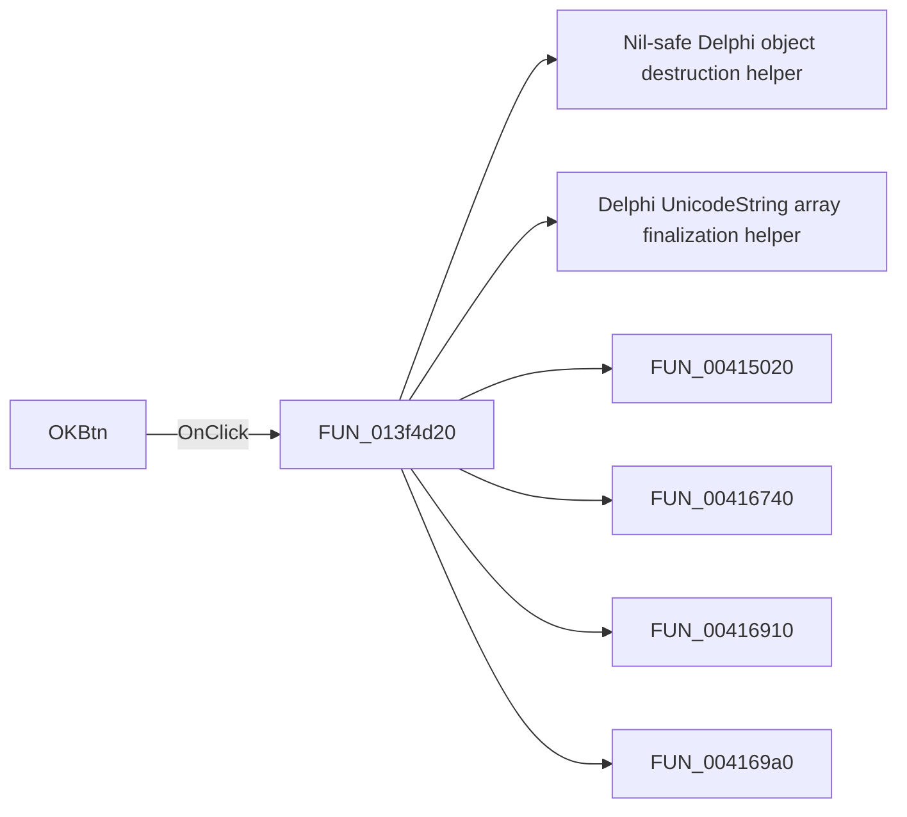

# OKBtn

> Analysis status: Pending individual source review.

## Control

| Property | Recovered value |
| --- | --- |
| Form | TlrCatalogEditorDlg |
| Component path | TlrCatalogEditorDlg.OKBtn |
| Control class | TBitBtn |
| Caption | Not present in the recovered resource. |
| Hint | Not present in the recovered resource. |
| Text | Not present in the recovered resource. |
| Handler name | OKBtnClick |
| Handler address | 013f4d20 |
| Graph node | `resource:dfm:TlrCatalogEditorDlg/TlrCatalogEditorDlg.OKBtn` |
| Handler node | `function:013f4d20` |
| Graph layer | UI |

## What happens when clicked

Pending individual analysis. An agent must read the recovered handler source and its relevant callees before it replaces this text.

## Click flow

## Handler evidence

- Source: [DecompiledSources/Tina16/functions/00000000013F4D20__FUN_013f4d20.c](../../../DecompiledSources/Tina16/functions/00000000013F4D20__FUN_013f4d20.c)
- Recovered role: Not present in the recovered resource.
- Current graph summary: Handles 1 Delphi UI event: TlrCatalogEditorDlg.OKBtn.OnClick.
- Current graph behavior: Not present in the recovered resource.
- Current graph evidence: Not present in the recovered resource.
- Complexity: complex
- Distinct outgoing calls: 16

## Direct calls

- `function:00410f20` — Nil-safe Delphi object destruction helper
- `function:00414560` — Delphi UnicodeString array finalization helper
- `function:00415020` — FUN_00415020
- `function:00416740` — FUN_00416740
- `function:00416910` — FUN_00416910
- `function:004169a0` — FUN_004169a0
- `function:00416db0` — FUN_00416db0
- `function:00442bd0` — FUN_00442bd0
- `function:004b6930` — FUN_004b6930
- `function:00b0a890` — FUN_00b0a890
- `function:00b0a960` — FUN_00b0a960
- `function:019a4600` — FUN_019a4600
- `function:01cfd560` — FUN_01cfd560
- `function:01cfd6a0` — FUN_01cfd6a0
- `function:01d07850` — FUN_01d07850
- `function:01d08870` — FUN_01d08870

## Resource evidence

- Kind: bkOK
- Modal result: Not present in the recovered resource.
- Checked state: Not present in the recovered resource.
- List items: Not present in the recovered resource.
- Image reference: Not present in the recovered resource.
- Extracted glyph: None.

## Nearby label candidates

Nearby labels are layout candidates only. They are not proof of behavior.

- Rank 1: 00000/00000 at distance 98.
- Rank 2: &Type at distance 271.
- Rank 3: &Model at distance 314.

## Analysis limits

- Do not infer behavior from the control class, caption, hint, glyph, or nearby label alone.
- Do not replace the pending status until the handler source and relevant call path provide enough evidence.
