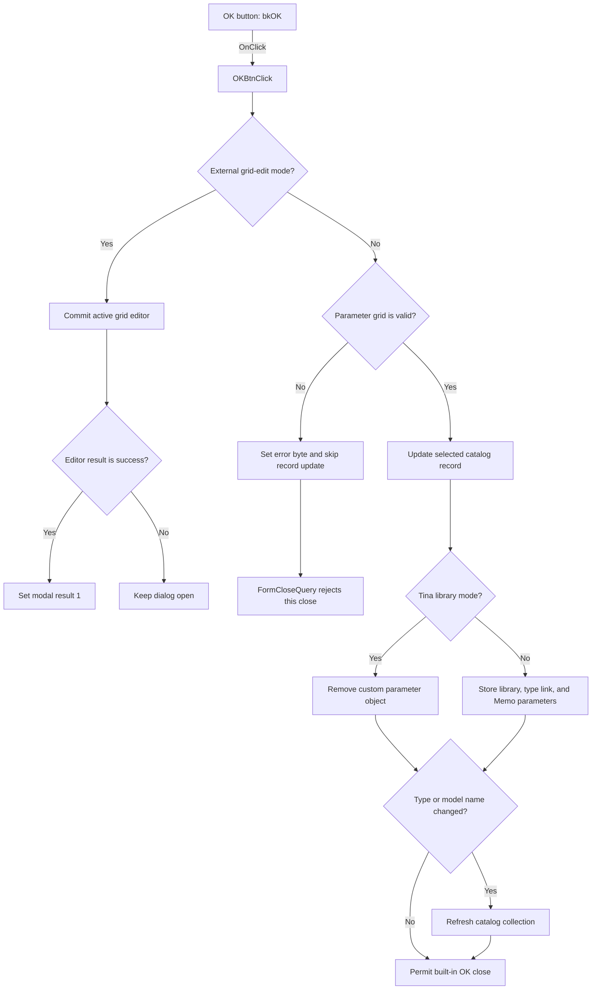

# OKBtn

> Analysis status: Source reviewed. Catalog validation, record update, and close behavior are documented.

## Control

| Property | Recovered value |
| --- | --- |
| Form | TlrCatalogEditorDlg |
| Component path | TlrCatalogEditorDlg.OKBtn |
| Control class | TBitBtn |
| Caption | Not present in the recovered resource. |
| Hint | Not present in the recovered resource. |
| Text | Not present in the recovered resource. |
| Handler name | OKBtnClick |
| Handler address | 013f4d20 |
| Graph node | `resource:dfm:TlrCatalogEditorDlg/TlrCatalogEditorDlg.OKBtn` |
| Handler node | `function:013f4d20` |
| Graph layer | UI |

## What happens when clicked

In the normal catalog-editor mode, the handler first validates the active parameter-grid cell. A validation failure sets form byte `+0x8E0`, skips the catalog-record update, and causes `FormCloseQuery` to reject this close attempt. `FormCloseQuery` then clears the byte for the next attempt.

After successful validation, the handler gets the current catalog record. It writes the selected type name, model name, library mode, and two grid option flags. In Tina mode, it removes the manufacturer-specific parameter object. In the other library modes, it stores the selected library or manufacturer filter, links the selected type object, and copies the Memo lines into the record's nested parameter list.

If the type or model name changed, the handler refreshes the owning catalog collection. The built-in `bkOK` behavior can then close the dialog. In the recovered external grid-edit mode, the handler instead commits the active grid editor and sets modal result `1` only when that editor returns success.

## Click flow

## Handler evidence

- Source: [DecompiledSources/Tina16/functions/00000000013F4D20__FUN_013f4d20.c](../../../DecompiledSources/Tina16/functions/00000000013F4D20__FUN_013f4d20.c)
- Recovered role: Validates the editor and saves the selected catalog record before modal close.
- Current graph summary: Handles 1 Delphi UI event: TlrCatalogEditorDlg.OKBtn.OnClick.
- Behavior: Validates the active parameter-grid cell and blocks closing when validation fails. On success, updates the current catalog record with type, model, library mode, option flags, and either Tina or manufacturer-specific parameter state. It refreshes the catalog collection when the type or model name changes. A separate external edit mode commits the active grid editor and sets modal result 1 only for a successful editor result.
- Evidence: FUN_013f4d20 stores FUN_00b0a890's validation result in form byte +0x8E0; FUN_013f5590 permits closing only when that byte is zero and then clears it. The handler obtains the selected record from the collection at +0x750, copies TypeLB and model strings into fixed record fields, branches on form library-mode byte +0x8E2, assigns Memo.Lines from +0x738 for manufacturer mode, and calls FUN_01d07850 plus FUN_01d08870 when the identifying strings changed.
- Complexity: complex
- Distinct outgoing calls: 16

## Direct calls

- `function:00410f20` — Nil-safe Delphi object destruction helper
- `function:00414560` — Delphi UnicodeString array finalization helper
- `function:00415020` — FUN_00415020
- `function:00416740` — FUN_00416740
- `function:00416910` — FUN_00416910
- `function:004169a0` — FUN_004169a0
- `function:00416db0` — FUN_00416db0
- `function:00442bd0` — FUN_00442bd0
- `function:004b6930` — FUN_004b6930
- `function:00b0a890` — FUN_00b0a890
- `function:00b0a960` — FUN_00b0a960
- `function:019a4600` — FUN_019a4600
- `function:01cfd560` — FUN_01cfd560
- `function:01cfd6a0` — FUN_01cfd6a0
- `function:01d07850` — FUN_01d07850
- `function:01d08870` — FUN_01d08870

## Resource evidence

- Kind: bkOK
- Modal result: Not present in the recovered resource.
- Checked state: Not present in the recovered resource.
- List items: Not present in the recovered resource.
- Image reference: Not present in the recovered resource.
- Extracted glyph: None.

## Nearby label candidates

Nearby labels are layout candidates only. They are not proof of behavior.

- Rank 1: 00000/00000 at distance 98.
- Rank 2: &Type at distance 271.
- Rank 3: &Model at distance 314.

## Analysis limits

- The grid validator owns its error text and cell-specific rules; those messages are not recovered in this click handler.
- The exact business names of the two grid option flags stored in the catalog record are not recovered.
