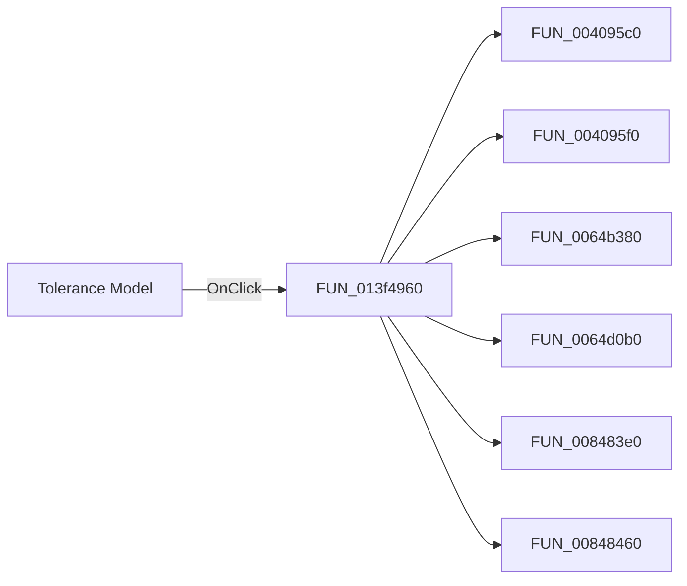

#  Tolerance Model

> Analysis status: Pending individual source review.

## Control

| Property | Recovered value |
| --- | --- |
| Form | TlrCatalogEditorDlg |
| Component path | TlrCatalogEditorDlg.PageControl.TabSheet1.ToleranceModelRG |
| Control class | TRadioGroup |
| Caption |  Tolerance Model  |
| Hint | Not present in the recovered resource. |
| Text | Not present in the recovered resource. |
| Handler name | ToleranceModelRGClick |
| Handler address | 013f4960 |
| Graph node | `resource:dfm:TlrCatalogEditorDlg/TlrCatalogEditorDlg.PageControl.TabSheet1.ToleranceModelRG` |
| Handler node | `function:013f4960` |
| Graph layer | UI |

## What happens when clicked

Pending individual analysis. An agent must read the recovered handler source and its relevant callees before it replaces this text.

## Click flow

## Handler evidence

- Source: [DecompiledSources/Tina16/functions/00000000013F4960__FUN_013f4960.c](../../../DecompiledSources/Tina16/functions/00000000013F4960__FUN_013f4960.c)
- Recovered role: Not present in the recovered resource.
- Current graph summary: Handles 1 Delphi UI event: TlrCatalogEditorDlg.PageControl.TabSheet1.ToleranceModelRG.OnClick.
- Current graph behavior: Not present in the recovered resource.
- Current graph evidence: Not present in the recovered resource.
- Complexity: complex
- Distinct outgoing calls: 12

## Direct calls

- `function:004095c0` — FUN_004095c0
- `function:004095f0` — FUN_004095f0
- `function:0064b380` — FUN_0064b380
- `function:0064d0b0` — FUN_0064d0b0
- `function:008483e0` — FUN_008483e0
- `function:00848460` — FUN_00848460
- `function:00b0b020` — FUN_00b0b020
- `function:013f3b20` — FUN_013f3b20
- `function:0172d140` — FUN_0172d140
- `function:0172d3f0` — FUN_0172d3f0
- `function:0172d5d0` — FUN_0172d5d0
- `function:01b1d750` — FUN_01b1d750

## Resource evidence

- Kind: Not present in the recovered resource.
- Modal result: Not present in the recovered resource.
- Checked state: Not present in the recovered resource.
- List items: ("&None", "&General")
- Image reference: Not present in the recovered resource.
- Extracted glyph: None.

## Nearby label candidates

Nearby labels are layout candidates only. They are not proof of behavior.

- Rank 1: Model &Parameters at distance 41.

## Analysis limits

- Do not infer behavior from the control class, caption, hint, glyph, or nearby label alone.
- Do not replace the pending status until the handler source and relevant call path provide enough evidence.
