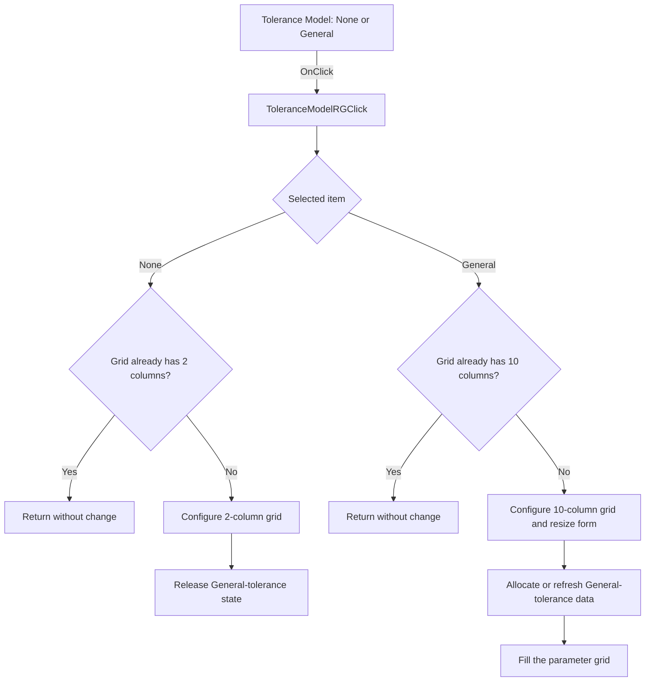

#  Tolerance Model

> Analysis status: Source reviewed. None and General tolerance-layout behavior is documented.

## Control

| Property | Recovered value |
| --- | --- |
| Form | TlrCatalogEditorDlg |
| Component path | TlrCatalogEditorDlg.PageControl.TabSheet1.ToleranceModelRG |
| Control class | TRadioGroup |
| Caption |  Tolerance Model  |
| Hint | Not present in the recovered resource. |
| Text | Not present in the recovered resource. |
| Handler name | ToleranceModelRGClick |
| Handler address | 013f4960 |
| Graph node | `resource:dfm:TlrCatalogEditorDlg/TlrCatalogEditorDlg.PageControl.TabSheet1.ToleranceModelRG` |
| Handler node | `function:013f4960` |
| Graph layer | UI |

## What happens when clicked

The radio group has the recovered items None and General. The handler reads the selected item and changes the model-parameter grid to the matching layout.

None uses a two-column grid. When the grid is not already in that layout, the handler configures two columns, resets the saved column and form dimensions, and releases the allocated General-tolerance state.

General uses a ten-column grid. When the grid is not already in that layout, the handler configures ten columns and their widths, resizes the grid and form, allocates or refreshes the General-tolerance state, loads its model data, and fills the parameter grid. If the grid already has the required column count for the selected item, the click is a no-op.

## Click flow

## Handler evidence

- Source: [DecompiledSources/Tina16/functions/00000000013F4960__FUN_013f4960.c](../../../DecompiledSources/Tina16/functions/00000000013F4960__FUN_013f4960.c)
- Recovered role: Switches the tolerance parameter editor between None and General layouts.
- Current graph summary: Handles 1 Delphi UI event: TlrCatalogEditorDlg.PageControl.TabSheet1.ToleranceModelRG.OnClick.
- Behavior: Uses the radio-group ItemIndex to select a two-column None layout or a ten-column General layout. It frees General-tolerance state when switching to None, and allocates or refreshes that state and fills the grid when switching to General. It returns without change when the grid already has the required column count.
- Evidence: The DFM supplies ToleranceModelRG items None and General. FUN_013f4960 reads ItemIndex at control +0x4A8 through form field +0x718. Item 0 targets grid column count 2, resets dimensions, and frees the state referenced through form +0x790. The other item targets column count 10, applies nine recovered column widths, resizes the form, calls FUN_0172d140 or FUN_0172d3f0 to load state, and calls FUN_013f3b20 to populate the grid.
- Complexity: complex
- Distinct outgoing calls: 12

## Direct calls

- `function:004095c0` — FUN_004095c0
- `function:004095f0` — FUN_004095f0
- `function:0064b380` — FUN_0064b380
- `function:0064d0b0` — FUN_0064d0b0
- `function:008483e0` — FUN_008483e0
- `function:00848460` — FUN_00848460
- `function:00b0b020` — FUN_00b0b020
- `function:013f3b20` — FUN_013f3b20
- `function:0172d140` — FUN_0172d140
- `function:0172d3f0` — FUN_0172d3f0
- `function:0172d5d0` — FUN_0172d5d0
- `function:01b1d750` — FUN_01b1d750

## Resource evidence

- Kind: Not present in the recovered resource.
- Modal result: Not present in the recovered resource.
- Checked state: Not present in the recovered resource.
- List items: ("&None", "&General")
- Image reference: Not present in the recovered resource.
- Extracted glyph: None.

## Nearby label candidates

Nearby labels are layout candidates only. They are not proof of behavior.

- Rank 1: Model &Parameters at distance 41.

## Analysis limits

- The nine General-tolerance column headings are loaded at runtime and are not present in the DFM evidence.
- Catalog-service and model-state types are recovered only by addresses and field offsets.
