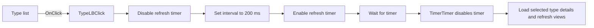

# TypeLB

> Analysis status: Source reviewed. The click schedules a delayed selected-type refresh.

## Control

| Property | Recovered value |
| --- | --- |
| Form | TlrCatalogEditorDlg |
| Component path | TlrCatalogEditorDlg.TypeLB |
| Control class | TListBox |
| Caption | Not present in the recovered resource. |
| Hint | Not present in the recovered resource. |
| Text | Not present in the recovered resource. |
| Handler name | TypeLBClick |
| Handler address | 013f47e0 |
| Graph node | `resource:dfm:TlrCatalogEditorDlg/TlrCatalogEditorDlg.TypeLB` |
| Handler node | `function:013f47e0` |
| Graph layer | UI |

## What happens when clicked

The click does not load the selected type immediately. It disables the form timer, sets its interval to 200 ms, and enables it again. A repeated click restarts this delay.

When the timer expires, `TimerTimer` disables it and calls `FUN_013f4330`. That later path reads the selected Type index, loads the matching catalog type and manufacturer data, updates the model-parameter view and Memo object, and refreshes the item-count label. The delay therefore combines rapid list clicks into one detail refresh.

## Click flow

## Handler evidence

- Source: [DecompiledSources/Tina16/functions/00000000013F47E0__FUN_013f47e0.c](../../../DecompiledSources/Tina16/functions/00000000013F47E0__FUN_013f47e0.c)
- Recovered role: Restarts the 200 ms timer that loads the selected catalog type.
- Current graph summary: Handles 1 Delphi UI event: TlrCatalogEditorDlg.TypeLB.OnClick.
- Behavior: Disables the form timer, sets its interval to 200 ms, and enables it. The timer later reads the selected Type item and refreshes catalog details, parameter data, Memo state, manufacturer text, and the count label. Rapid clicks restart the delay.
- Evidence: FUN_013f47e0 calls FUN_00742eb0 on form field +0x700 with 0, calls FUN_00742ed0 with 200, and calls FUN_00742eb0 with 1. FUN_00742eb0 writes Timer.Enabled at +0x98 and FUN_00742ed0 writes Timer.Interval at +0x78. TimerTimer at 013f5770 disables the same timer and calls FUN_013f4330, which reads TypeLB.ItemIndex at form +0x6D8 and refreshes the dependent catalog views.
- Complexity: moderate
- Distinct outgoing calls: 2

## Direct calls

- `function:00742eb0` — FUN_00742eb0
- `function:00742ed0` — FUN_00742ed0

## Resource evidence

- Kind: Not present in the recovered resource.
- Modal result: Not present in the recovered resource.
- Checked state: Not present in the recovered resource.
- List items: Not present in the recovered resource.
- Image reference: Not present in the recovered resource.
- Extracted glyph: None.

## Nearby label candidates

Nearby labels are layout candidates only. They are not proof of behavior.

- Rank 1: &Type at distance 20.
- Rank 2: &Model at distance 63.
- Rank 3: &Library at distance 108.

## Analysis limits

- The click handler only schedules work; catalog loading occurs in the timer event.
- The recovered catalog-service methods do not expose their original Delphi names.
