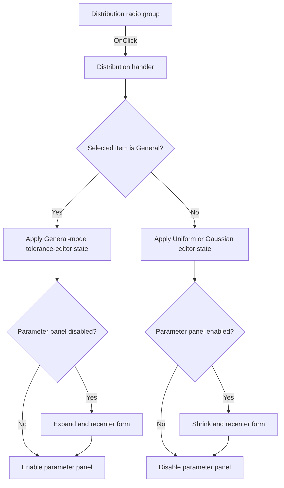

#  Distribution

> Analysis status: Individually reviewed from recovered source.

## Control

| Property | Recovered value |
| --- | --- |
| Form | TlrRealEditorDlg |
| Component path | TlrRealEditorDlg.DistributionRG |
| Control class | TRadioGroup |
| Caption |  Distribution  |
| Hint | Not present in the recovered resource. |
| Text | Not present in the recovered resource. |
| Handler name | DistributionRGClick |
| Handler address | 013f6620 |
| Graph node | `resource:dfm:TlrRealEditorDlg/TlrRealEditorDlg.DistributionRG` |
| Handler node | `function:013f6620` |
| Graph layer | UI |

## What happens when clicked

The handler reads the radio-group item index. Index 2 is the recovered **General** item. For General, it sends Boolean 0 to an unresolved setter on the tolerance editor, expands and recenters the form by the parameter-panel height when that panel is disabled, and enables the panel. For Uniform or Gaussian, it sends Boolean 1 to the same tolerance-editor setter, shrinks and recenters the form when the panel is enabled, and disables the panel.

The enabled-state checks prevent repeated clicks from changing the form height more than once. The handler does not change the tolerance value, the staged general-distribution values, or the target record. The exact property controlled by the tolerance editor's virtual slot `+0x128` is not recovered, so this article does not name it as Visible, ReadOnly, or another property.

## Click flow

## Handler evidence

- Source: [DecompiledSources/Tina16/functions/00000000013F6620__FUN_013f6620.c](../../../DecompiledSources/Tina16/functions/00000000013F6620__FUN_013f6620.c)
- Recovered role: Switches the dialog layout between general and simple distribution modes.
- Current graph summary: Handles 1 Delphi UI event: TlrRealEditorDlg.DistributionRG.OnClick.
- Current graph behavior: Enables and reveals the general-parameter area for item index 2, or disables and removes that area for the other distribution choices.
- Current graph evidence: FUN_013f6620 tests `DistributionRG.ItemIndex` at `+0x4a8`, calls the tolerance-editor virtual slot `+0x128` with 0 or 1, tests panel Enabled at `+0xa9`, adjusts the form height by panel height `+0x9c` through 01b1d750, and calls 0064dbe0 with the target panel state.
- Complexity: moderate
- Distinct outgoing calls: 2

## Direct calls

- `function:0064dbe0` — sets the general-parameter panel's enabled state.
- `function:01b1d750` — resizes the form and keeps it centered in the available monitor area.

## Resource evidence

- Kind: Not present in the recovered resource.
- Modal result: Not present in the recovered resource.
- Checked state: Not present in the recovered resource.
- List items: ("&Uniform", "&Gaussian", "G&eneral")
- Image reference: Not present in the recovered resource.
- Extracted glyph: None.

## Nearby label candidates

Nearby labels are layout candidates only. They are not proof of behavior.

- Rank 1: &Tolerance at distance 30.
- Rank 2: [%] at distance 142.

## Analysis limits

- The resource item order proves that item index 2 is General; indices 0 and 1 are Uniform and Gaussian.
- The nearby Tolerance and percent labels identify the adjacent input, but they do not resolve virtual slot `+0x128`.
- No direct target-record mutation occurs until the OK handler runs.
