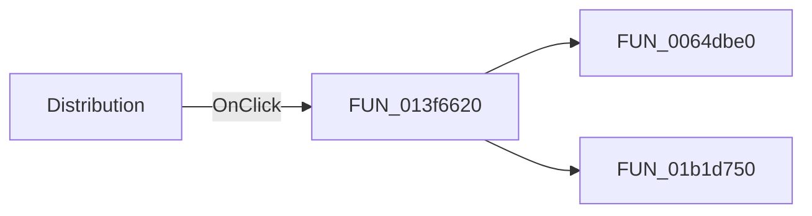

#  Distribution

> Analysis status: Pending individual source review.

## Control

| Property | Recovered value |
| --- | --- |
| Form | TlrRealEditorDlg |
| Component path | TlrRealEditorDlg.DistributionRG |
| Control class | TRadioGroup |
| Caption |  Distribution  |
| Hint | Not present in the recovered resource. |
| Text | Not present in the recovered resource. |
| Handler name | DistributionRGClick |
| Handler address | 013f6620 |
| Graph node | `resource:dfm:TlrRealEditorDlg/TlrRealEditorDlg.DistributionRG` |
| Handler node | `function:013f6620` |
| Graph layer | UI |

## What happens when clicked

Pending individual analysis. An agent must read the recovered handler source and its relevant callees before it replaces this text.

## Click flow

## Handler evidence

- Source: [DecompiledSources/Tina16/functions/00000000013F6620__FUN_013f6620.c](../../../DecompiledSources/Tina16/functions/00000000013F6620__FUN_013f6620.c)
- Recovered role: Not present in the recovered resource.
- Current graph summary: Handles 1 Delphi UI event: TlrRealEditorDlg.DistributionRG.OnClick.
- Current graph behavior: Not present in the recovered resource.
- Current graph evidence: Not present in the recovered resource.
- Complexity: moderate
- Distinct outgoing calls: 2

## Direct calls

- `function:0064dbe0` — FUN_0064dbe0
- `function:01b1d750` — FUN_01b1d750

## Resource evidence

- Kind: Not present in the recovered resource.
- Modal result: Not present in the recovered resource.
- Checked state: Not present in the recovered resource.
- List items: ("&Uniform", "&Gaussian", "G&eneral")
- Image reference: Not present in the recovered resource.
- Extracted glyph: None.

## Nearby label candidates

Nearby labels are layout candidates only. They are not proof of behavior.

- Rank 1: &Tolerance at distance 30.
- Rank 2: [%] at distance 142.

## Analysis limits

- Do not infer behavior from the control class, caption, hint, glyph, or nearby label alone.
- Do not replace the pending status until the handler source and relevant call path provide enough evidence.
