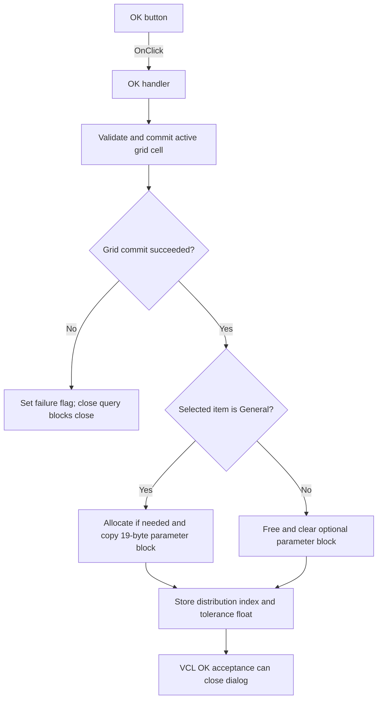

# OKBtn

> Analysis status: Individually reviewed from recovered source.

## Control

| Property | Recovered value |
| --- | --- |
| Form | TlrRealEditorDlg |
| Component path | TlrRealEditorDlg.OKBtn |
| Control class | TBitBtn |
| Caption | Not present in the recovered resource. |
| Hint | Not present in the recovered resource. |
| Text | Not present in the recovered resource. |
| Handler name | OKBtnClick |
| Handler address | 013f66e0 |
| Graph node | `resource:dfm:TlrRealEditorDlg/TlrRealEditorDlg.OKBtn` |
| Handler node | `function:013f66e0` |
| Graph layer | UI |

## What happens when clicked

The handler first asks the AttributeGrid to validate and commit its active cell editor. It stores that result in form flag `+0x723`. A nonzero result stops all target-record updates. The form close-query handler then blocks the close and resets the flag, so the user can correct the grid value.

When the grid commit succeeds, the handler updates the target tolerance record at `+0x708`. If **General** is selected, it allocates a 19-byte optional parameter block when needed and copies the seven staged grid fields into it. For Uniform or Gaussian, it frees any existing optional block and sets its pointer to null. It then stores the selected distribution index and reads the tolerance editor value, converts the recovered double to a single-precision float, and stores it in the record. The button kind is `bkOK`, so the normal VCL modal-accept path runs after the handler. The handler has no visible rollback if a later tolerance-value error interrupts the sequence after earlier record writes.

## Click flow

## Handler evidence

- Source: [DecompiledSources/Tina16/functions/00000000013F66E0__FUN_013f66e0.c](../../../DecompiledSources/Tina16/functions/00000000013F66E0__FUN_013f66e0.c)
- Recovered role: Validates and commits tolerance-distribution settings to the target record.
- Current graph summary: Handles 1 Delphi UI event: TlrRealEditorDlg.OKBtn.OnClick.
- Current graph behavior: Gates record mutation on an AttributeGrid cell commit, maintains the optional General parameter block, and stores the selected distribution and tolerance.
- Current graph evidence: FUN_013f66e0 stores 00b0a890's result in `+0x723` and branches only on zero. It allocates 0x13 bytes through 00409570 or frees through 004095f0, copies staged bytes `+0x710` through `+0x722`, stores ItemIndex at target `+0x18`, reads the tolerance through 00b90090, converts it to float, and stores target `+0x10`. FUN_013f67a0 permits close only when `+0x723` is zero and then clears the flag.
- Complexity: complex
- Distinct outgoing calls: 4

## Direct calls

- `function:00409570` — allocates the 19-byte General parameter block.
- `function:004095f0` — frees the optional parameter block for Uniform or Gaussian.
- `function:00b0a890` — validates and commits the active AttributeGrid cell editor.
- `function:00b90090` — parses and validates the tolerance editor value before returning it as a double.

## Resource evidence

- Kind: bkOK
- Modal result: Not present in the recovered resource.
- Checked state: Not present in the recovered resource.
- List items: Not present in the recovered resource.
- Image reference: Not present in the recovered resource.
- Extracted glyph: None.

## Nearby label candidates

Nearby labels are layout candidates only. They are not proof of behavior.

- Rank 1: [%] at distance 27.
- Rank 2: &Tolerance at distance 153.

## Analysis limits

- The resource item order establishes the saved distribution codes: Uniform is 0, Gaussian is 1, and General is 2.
- The seven staged General fields are copied byte-for-byte, but their individual business names are not recovered from the exported source.
- The nearby percent label supports the tolerance unit. The source, not proximity alone, proves that the handler reads the tolerance editor.
