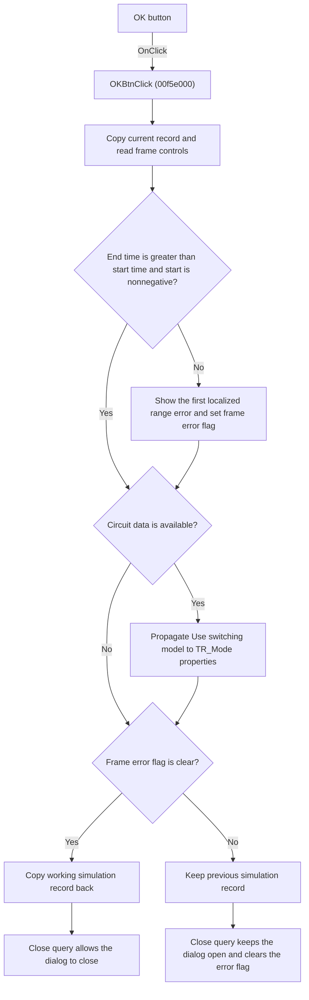

# OKBtn

> Analysis status: Individually reviewed.

## Control

| Property | Recovered value |
| --- | --- |
| Form | TranAnalDlg |
| Component path | TranAnalDlg.OKBtn |
| Control class | TBitBtn |
| Caption | Not present in the recovered resource. |
| Hint | Not present in the recovered resource. |
| Text | Not present in the recovered resource. |
| Handler name | OKBtnClick |
| Handler address | 00f5e000 |
| Graph node | `resource:dfm:TranAnalDlg/TranAnalDlg.OKBtn` |
| Handler node | `function:00f5e000` |
| Graph layer | UI |

## What happens when clicked

The click handler passes the embedded transient-analysis frame to `FUN_00f5d4a0`. That function copies the current simulation record to working storage. It then reads the start display time, end display time, transient control selection, Draw excitation state, and Use switching model state.

The function rejects the values when the end time is not greater than the start time or when the start time is negative. It loads localized message `0x134` and reports the first error for the frame. The error helper sets a frame flag. The dialog's `FormCloseQuery` handler reads this flag, blocks the close request when the flag is set, and then clears the flag for the next attempt.

When circuit data is available, the function propagates the Use switching model value to recovered `TR_Mode` properties. This propagation occurs before the final error-flag test, so it can occur even when the time range is invalid. The function copies the working simulation record back to the global or owner record only when the error flag is clear. The handler does not start a transient simulation.

## Click flow

## Handler evidence

- Source: [DecompiledSources/Tina16/functions/0000000000F5E000__FUN_00f5e000.c](../../../DecompiledSources/Tina16/functions/0000000000F5E000__FUN_00f5e000.c)
- Recovered role: Validate and commit transient-analysis settings.
- Current graph summary: Handles 1 Delphi UI event: TranAnalDlg.OKBtn.OnClick.
- Current graph behavior: Passes the embedded transient-analysis frame to the settings collector and validator. Valid settings are committed. An invalid time range sets the frame error flag, which prevents the dialog from closing.
- Current graph evidence: `FUN_00f5e000` passes the frame at form offset `0x6b0` to `FUN_00f5d4a0`. The callee reads the two float edits, the radio group, and two check boxes. It tests `end <= start` and `start < 0`, calls `FUN_00f5d220` on failure, propagates the switching-model state through `FUN_00f5cdb0`, and gates the final record copy on frame flag `0x508`. `FUN_00f5df90` uses the same flag as the dialog close condition.
- Complexity: simple
- Distinct outgoing calls: 1

## Direct calls

- `function:00f5d4a0` — FUN_00f5d4a0

## Resource evidence

- Kind: bkOK
- Modal result: Not present in the recovered resource.
- Checked state: Not present in the recovered resource.
- List items: Not present in the recovered resource.
- Image reference: Not present in the recovered resource.
- Extracted glyph: None.

## Nearby label candidates

Nearby labels are layout candidates only. They are not proof of behavior.

- No same-parent label candidate is available.

## Analysis limits

- The localized error text is identified only by resource message ID `0x134`; the recovered source does not contain its text.
- The exact Delphi type and field names for the working simulation record are not recovered.
- The handler does not set a modal result directly. The resource identifies the control as `bkOK`, and the separate close-query handler supplies the proven close guard.
