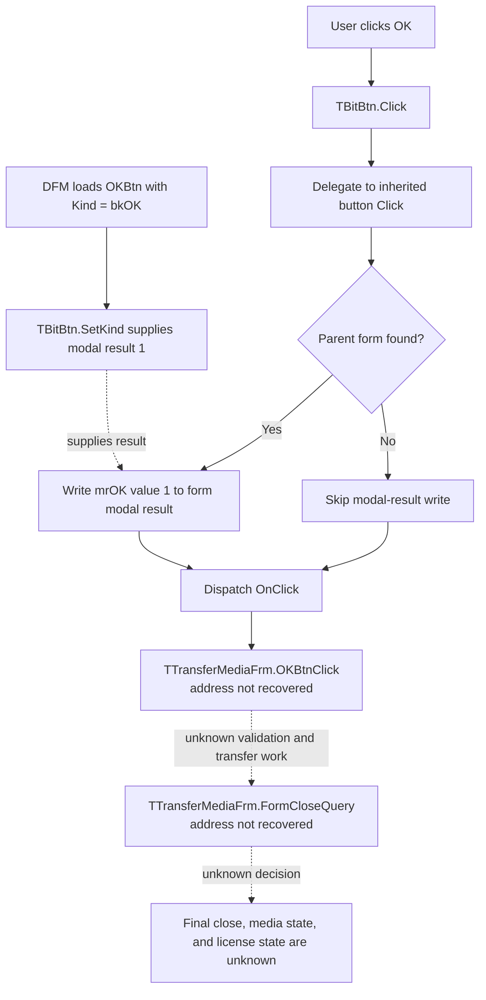

# Accept the selected transfer medium

> Analysis status: The standard VCL OK request is recovered. The custom handler and final close decision remain unresolved.

## Control

| Property | Recovered value |
| --- | --- |
| Form | TransferMediaFrm |
| Form caption | Transfer license |
| Component path | TransferMediaFrm.OKBtn |
| Control class | TBitBtn |
| Button kind | bkOK |
| Handler name | OKBtnClick |
| Handler address | Not recovered |
| Graph node | `resource:dfm:TransferMediaFrm/TransferMediaFrm.OKBtn` |
| Handler node | `concept:dfm-handler:TTransferMediaFrm/OKBtnClick` |
| Graph layer | tina.exe |

## What happens when clicked

The recovered VCL path proves that this button requests an OK result before it dispatches the custom click handler:

1. The DFM loader applies `Kind = bkOK` to the `TBitBtn`. The recovered kind-setting path supplies the standard OK presentation, modal result 1, and default-button state.
2. `TBitBtn.Click` delegates `bkOK` to the inherited button-click path. Only `bkHelp` and `bkClose` use special branches in this override.
3. The inherited path finds the parent form. When it finds one, it copies modal result 1, the Delphi `mrOK` value, to the form.
4. The path then dispatches `TTransferMediaFrm.OKBtnClick`.

The modal-result write happens before the custom event dispatch. The custom handler can still validate the selected drive, read or write transfer media, switch the displayed instruction, change the modal result, report an error, or return without another state change. Its code address and body are not recovered, so none of these application actions can be assigned.

The form also has an unresolved `FormCloseQuery` handler. It can allow or reject the OK request. Therefore, this evidence proves an OK request. It does not prove a successful license transfer, a media write, or final dialog closure.

## Transfer-media context

The form resource supplies these direct facts:

- The form caption is **Transfer license**.
- `DriveCB` is a `TDriveComboBox` under the label **Choose transfer media:**.
- Three initially hidden status controls contain these instructions:
  - **Insert a disk in your target (unauthorised) computer.**
  - **Insert the disk into your source (authorized) computer.**
  - **Reinsert your disk into your target computer.**
- The sibling buttons use `bkCancel` and `bkHelp`.
- `FormShow`, `FormHelp`, `FormCloseQuery`, `OKBtnClick`, and `CancelBtnClick` all have null code addresses.

These resources establish the displayed transfer-media workflow. They do not prove which instruction is active, how `DriveCB` is read, what file or license data is transferred, or which step follows an OK click.

## Acceptance flow

## Recovered evidence

- [TBitBtn kind setter](../../../DecompiledSources/Tina16/functions/000000000082BC30__FUN_0082bc30.c) selects the standard caption, modal result, glyph, and default or cancel state from the button kind. Its recovered `bkOK` entry supplies modal result 1.
- [TBitBtn click override](../../../DecompiledSources/Tina16/functions/000000000082B0E0__FUN_0082b0e0.c) sends `bkOK` to the inherited button path.
- [Inherited button click](../../../DecompiledSources/Tina16/functions/0000000000687F30__FUN_00687f30.c) copies the button modal result to the parent form before it calls the common click dispatcher.
- [Common click dispatcher](../../../DecompiledSources/Tina16/functions/0000000000650840__FUN_00650840.c) invokes the assigned event with the control as `Sender`, or uses the action-link fallback.
- [Recovered DFM evidence](../../../DecompiledSources/Tina16/resources/dfm/ui-evidence.json) supplies the form caption, drive selector, instructions, button kind, and unresolved event names.
- [UI evidence extractor](../../../analysis/undelphi/TiaraUiEvidence.rs) is the checked-in address-resolution path used for these bindings.
- The graph contains one `triggers` edge from `OKBtn` to the unresolved handler concept. It contains no function node, source file, or outgoing call edge for `OKBtnClick`.
- The glyph manifest has no extracted image for this button. Its standard image is supplied at run time by `bkOK`.

## Handler-address gap

Manual recovery confirms why the handler remains unresolved. The captured runtime has one ASCII `TTransferMediaFrm` occurrence. Its ShortString length byte is at virtual address `0393D7D4`, and its text starts at `0393D7D5`. It is in the serialized form payload beside this form's event names. A scan of all 1,513 captured memory ranges found no 64-bit pointer to that ShortString. Therefore, this occurrence does not identify a Delphi `vmtClassName` slot.

A self-pointer scan of the complete mapped `tina.exe` image found 5,123 VMT candidates and parsed 4,910 class-name and published-method-table combinations. None has the class name `TTransferMediaFrm`. The executable image has 53 structurally valid published-method records named `OKBtnClick`, but the parsed VMTs assign same-name records to other form classes. The handler name alone cannot select one of those code addresses.

A later recovery needs a loaded module or another address-bearing record that identifies the `TTransferMediaFrm` VMT. That VMT must map its `OKBtnClick` entry to executable code before a call tree or function annotation can be created.

## Inputs, outputs, and limits

| Question | Proven result |
| --- | --- |
| Immediate input | A click on the `bkOK` button. |
| Framework state change | The parent form receives modal result 1 when a parent form is found. |
| Custom handler input | The VCL dispatcher passes `OKBtn` as `Sender`. |
| Selected drive read | Unknown because `OKBtnClick` is unresolved. |
| Media or license operation | Unknown; no custom source or call path is recovered. |
| Final close result | Unknown because the custom handler and `FormCloseQuery` are unresolved. |
| Error behavior | No handler-level message, exception path, or recovery rule is recovered. |

## Analysis limits

- The standard `bkOK` path proves an OK request only.
- The transfer instructions and drive selector do not prove the custom handler's data flow.
- No function annotation JSON is justified without a recovered function address.
