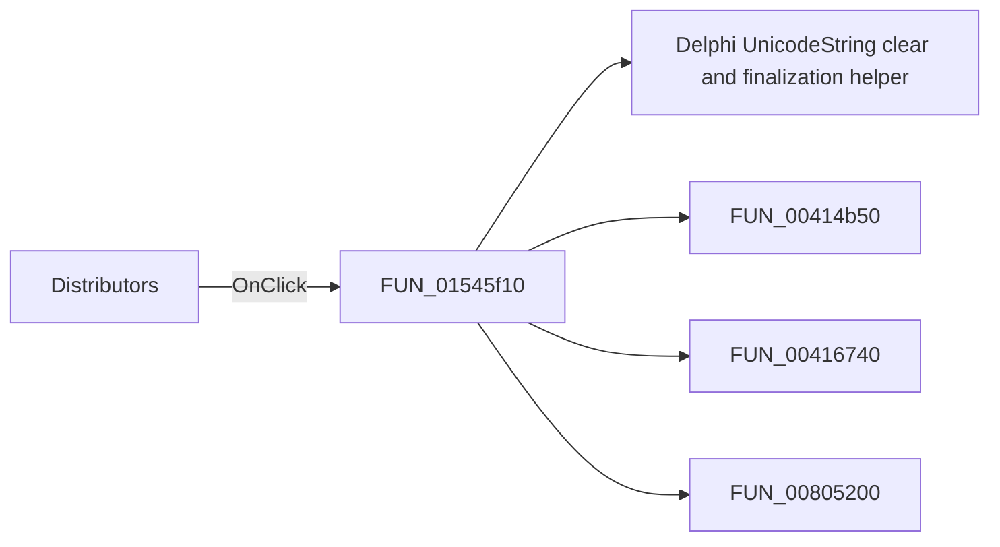

# Distributors

> Analysis status: Pending individual source review.

## Control

| Property | Recovered value |
| --- | --- |
| Form | TrialForm |
| Component path | TrialForm.lDistributors |
| Control class | TLabel |
| Caption | Distributors |
| Hint | Not present in the recovered resource. |
| Text | Not present in the recovered resource. |
| Handler name | lDistributorsClick |
| Handler address | 01545f10 |
| Graph node | `resource:dfm:TrialForm/TrialForm.lDistributors` |
| Handler node | `function:01545f10` |
| Graph layer | UI |

## What happens when clicked

Pending individual analysis. An agent must read the recovered handler source and its relevant callees before it replaces this text.

## Click flow

## Handler evidence

- Source: [DecompiledSources/Tina16/functions/0000000001545F10__FUN_01545f10.c](../../../DecompiledSources/Tina16/functions/0000000001545F10__FUN_01545f10.c)
- Recovered role: Not present in the recovered resource.
- Current graph summary: Handles 1 Delphi UI event: TrialForm.lDistributors.OnClick.
- Current graph behavior: Not present in the recovered resource.
- Current graph evidence: Not present in the recovered resource.
- Complexity: complex
- Distinct outgoing calls: 4

## Direct calls

- `function:00414480` — Delphi UnicodeString clear and finalization helper
- `function:00414b50` — FUN_00414b50
- `function:00416740` — FUN_00416740
- `function:00805200` — FUN_00805200

## Resource evidence

- Kind: Not present in the recovered resource.
- Modal result: Not present in the recovered resource.
- Checked state: Not present in the recovered resource.
- List items: Not present in the recovered resource.
- Image reference: Not present in the recovered resource.
- Extracted glyph: None.

## Nearby label candidates

Nearby labels are layout candidates only. They are not proof of behavior.

- Rank 1: Distributors at distance 0.
- Rank 2: 0 at distance 81.
- Rank 3: Click Buy Now or contact our Distributors for localized versions at distance 98.

## Analysis limits

- Do not infer behavior from the control class, caption, hint, glyph, or nearby label alone.
- Do not replace the pending status until the handler source and relevant call path provide enough evidence.
