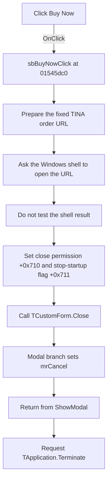

# Buy Now

> Analysis status: Individually reviewed.

## Control

| Property | Recovered value |
| --- | --- |
| Form | TrialForm |
| Component path | TrialForm.sbBuyNow |
| Control class | TSpeedButton |
| Caption | Buy Now |
| Hint | Not present in the recovered resource. |
| Text | Not present in the recovered resource. |
| Handler name | sbBuyNowClick |
| Handler address | 01545dc0 |
| Graph node | `resource:dfm:TrialForm/TrialForm.sbBuyNow` |
| Handler node | `function:01545dc0` |
| Graph layer | UI |

## What happens when clicked

The handler prepares the fixed URL `https://www.designsoftware.com/orders/order01.php?id=tina`. It passes the URL to an indirect external routine with the operation text `open`. The recovered arguments match a Windows shell open request. The handler does not read the routine's return value. Thus, it continues even if Windows cannot open the URL.

The handler then sets form bytes `+0x710` and `+0x711` to one. Byte `+0x710` is the form's close permission: its `OnCloseQuery` handler copies this byte to `CanClose`. The click handler calls the shared `TCustomForm.Close` routine. On the recovered modal-form branch, that routine sets modal result `2` (`mrCancel`) and returns from the modal notice.

After `ShowModal` returns, the startup helper tests byte `+0x711`. Because this click sets the byte, the helper requests `TApplication.Terminate` and destroys the form. Therefore, **Buy Now** opens the order page, closes the trial notice, and stops normal application startup. There is no confirmation, input validation, branch, local error message, or retry.

## Click flow

## Handler evidence

- Source: [DecompiledSources/Tina16/functions/0000000001545DC0__FUN_01545dc0.c](../../../DecompiledSources/Tina16/functions/0000000001545DC0__FUN_01545dc0.c)
- Recovered role: Open the TINA order page and stop normal startup.
- Current graph summary: Handles 1 Delphi UI event: TrialForm.sbBuyNow.OnClick.
- Current graph behavior: Opens a fixed TINA order URL, permits the trial notice to close, sets the form's stop-startup flag, and closes the form. The modal caller then requests application termination.
- Current graph evidence: `FUN_01545dc0` passes operation `open` and the fixed order URL to the indirect external thunk, writes one to form bytes `0x710` and `0x711`, and calls `FUN_00805200`. `FUN_015461b0` returns byte `0x710` as `CanClose`. `FUN_01546460` tests byte `0x711` after `ShowModal` and calls the annotated `TApplication.Terminate` routine when it is nonzero.
- Complexity: complex
- Distinct outgoing calls: 4

## Direct calls

- `function:00414480` — Delphi UnicodeString clear and finalization helper
- `function:00414b50` — Assigns the fixed URL to a temporary Delphi UnicodeString.
- `function:00416740` — Supplies the string pointer used by the external open request, with a nil-safe fallback.
- `function:00805200` — Runs the VCL form close-query and close-action pipeline.

The recovered source also calls [the indirect external thunk](../../../DecompiledSources/Tina16/functions/0000000000636960__thunk_FUN_0419adcc.c). The graph does not record this indirect call as a direct function edge.

## Resource evidence

- Kind: Not present in the recovered resource.
- Modal result: Not present in the recovered resource.
- Checked state: Not present in the recovered resource.
- List items: Not present in the recovered resource.
- Image reference: Not present in the recovered resource.
- Extracted glyph: None.

## Nearby label candidates

Nearby labels are layout candidates only. They are not proof of behavior.

- Rank 1: Distributors at distance 95.
- Rank 2: 0 at distance 136.
- Rank 3: 30 days left at distance 147.

## Related source evidence

- [FormCloseQuery](../../../DecompiledSources/Tina16/functions/00000000015461B0__FUN_015461b0.c) copies form byte `+0x710` to the close-permission output.
- [Trial notice startup helper](../../../DecompiledSources/Tina16/functions/0000000001546460__FUN_01546460.c) shows the form modally, tests byte `+0x711`, conditionally requests termination, and destroys the form.
- [TApplication termination requester](../../../DecompiledSources/Tina16/functions/000000000080D170__FUN_0080d170.c) uses the recovered VCL quit-message path.

## Analysis limits

- The recovered thunk does not identify its imported API by name. Its six arguments, the `open` operation, and the URL establish a Windows shell open request, but not the exact import symbol.
- The original Delphi field names for bytes `+0x710` and `+0x711` are not recovered. Their readers establish the close-permission and stop-startup roles.
