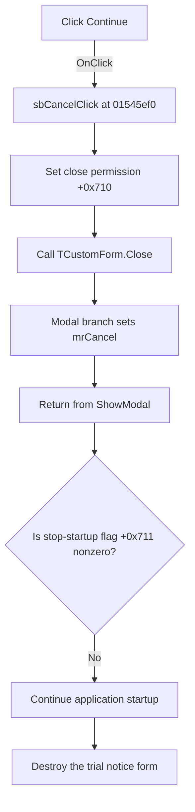

# Continue

> Analysis status: Individually reviewed.

## Control

| Property | Recovered value |
| --- | --- |
| Form | TrialForm |
| Component path | TrialForm.sbCancel |
| Control class | TSpeedButton |
| Caption | Continue |
| Hint | Not present in the recovered resource. |
| Text | Not present in the recovered resource. |
| Handler name | sbCancelClick |
| Handler address | 01545ef0 |
| Graph node | `resource:dfm:TrialForm/TrialForm.sbCancel` |
| Handler node | `function:01545ef0` |
| Graph layer | UI |

## What happens when clicked

The handler sets form byte `+0x710` to one and calls the shared `TCustomForm.Close` routine. The form's `OnCloseQuery` handler copies byte `+0x710` to `CanClose`. On the recovered modal-form branch, `TCustomForm.Close` sets modal result `2` (`mrCancel`) and returns from the modal notice.

The handler does not set byte `+0x711`. The startup helper tests that separate byte after `ShowModal` and requests `TApplication.Terminate` only when it is nonzero. The normal zero-initialized state remains unchanged on this click path, so **Continue** closes the notice and lets application startup continue. The helper then destroys the form.

The handler does not read another control or value. It has no decision, validation, confirmation, external action, error report, or explicit modal-result write. A direct attempt to close the notice before one of its click handlers sets `+0x710` is rejected by `FormCloseQuery`.

## Click flow

## Handler evidence

- Source: [DecompiledSources/Tina16/functions/0000000001545EF0__FUN_01545ef0.c](../../../DecompiledSources/Tina16/functions/0000000001545EF0__FUN_01545ef0.c)
- Recovered role: Close the trial notice and continue application startup.
- Current graph summary: Handles 1 Delphi UI event: TrialForm.sbCancel.OnClick.
- Current graph behavior: Permits the trial notice to close and invokes the VCL close pipeline without setting the separate stop-startup flag. The modal caller continues normal startup.
- Current graph evidence: `FUN_01545ef0` writes one to form byte `0x710` and calls `FUN_00805200`. `FUN_015461b0` copies byte `0x710` to `CanClose`. `FUN_01546460` tests separate byte `0x711` after `ShowModal` and requests application termination only when that byte is nonzero; this click handler does not write it.
- Complexity: simple
- Distinct outgoing calls: 1

## Direct calls

- `function:00805200` — Runs the VCL form close-query and close-action pipeline.

## Resource evidence

- Kind: Not present in the recovered resource.
- Modal result: Not present in the recovered resource.
- Checked state: Not present in the recovered resource.
- List items: Not present in the recovered resource.
- Image reference: Not present in the recovered resource.
- Extracted glyph: None.

## Nearby label candidates

Nearby labels are layout candidates only. They are not proof of behavior.

- Rank 1: 30 days left at distance 114.
- Rank 2: 30 at distance 215.
- Rank 3: Distributors at distance 234.

## Related source evidence

- [FormCloseQuery](../../../DecompiledSources/Tina16/functions/00000000015461B0__FUN_015461b0.c) copies form byte `+0x710` to the close-permission output.
- [Trial notice startup helper](../../../DecompiledSources/Tina16/functions/0000000001546460__FUN_01546460.c) shows the form modally, tests byte `+0x711`, conditionally requests termination, and destroys the form.

## Analysis limits

- The original Delphi field names for bytes `+0x710` and `+0x711` are not recovered. Their readers establish the close-permission and stop-startup roles.
- The recovered source does not show a direct initialization write for byte `+0x711`. The Continue path depends on the normal zero-initialized Delphi instance state and does not change that byte.
