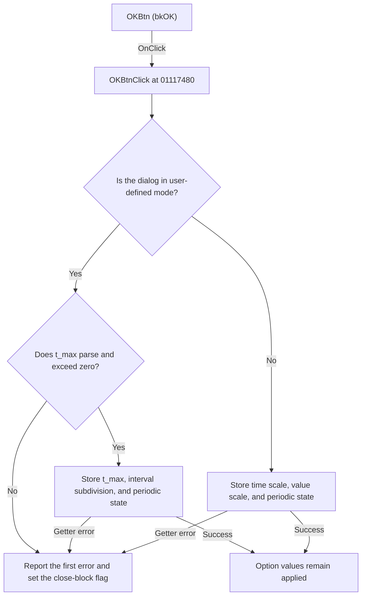

# OKBtn

> Analysis status: Reviewed from recovered source and graph evidence.

## Control

| Property | Recovered value |
| --- | --- |
| Form | UOpsDlg |
| Component path | UOpsDlg.OKBtn |
| Control class | TBitBtn |
| Caption | Not present in the recovered resource. |
| Hint | Not present in the recovered resource. |
| Text | Not present in the recovered resource. |
| Handler name | OKBtnClick |
| Handler address | 01117480 |
| Graph node | `resource:dfm:UOpsDlg/UOpsDlg.OKBtn` |
| Handler node | `function:01117480` |
| Graph layer | UI |

## What happens when clicked

The handler applies one of two option sets according to the dialog's mode value. `FUN_011173b0`, which loads the form, proves that mode value `8` selects the `tsUserDefined` page. Other values select the `tsPWL` page.

In user-defined mode, the handler reads `t_max` first. If the value is not greater than zero, it loads message resource `0x3ee`, reports the error, sets the form's error flag, and does not copy any user-defined values. If the flag remains clear, it stores `t_max`, Interval subdivision, and the selected Periodic value in the target object at offsets `0x640`, `0x648`, and `0x64c`.

In PWL mode, it reads Time scale factor and Value scale factor and stores them in shared values `DAT_02030140` and `DAT_02030148`. It stores the selected Periodic value in `DAT_02030150`. The floating-point and integer getters perform their own parsing and validation. Their `OnError` handlers report the first error and set the same form flag. `FormCloseQuery` rejects a close while the flag is set and then clears it.

The handler writes fields in order and has no recovered rollback. A getter failure after an earlier write can therefore leave a partial update. It does not show a separate success message.

## Click flow

## Handler evidence

- Source: [DecompiledSources/Tina16/functions/0000000001117480__FUN_01117480.c](../../../DecompiledSources/Tina16/functions/0000000001117480__FUN_01117480.c)
- Recovered role: Validates and applies user-defined or PWL waveform options.
- Current graph summary: Handles 1 Delphi UI event: UOpsDlg.OKBtn.OnClick.
- Current graph behavior: The handler selects a mode-specific option set, validates its numeric edits, stores the values and periodic state, and prevents the dialog from closing after a reported error.
- Current graph evidence: `OKBtnClick` branches on form offset `0x73c`. Mode `8` reads controls at `0x700` and `0x6f0` and writes target-object offsets `0x640`, `0x648`, and `0x64c`. The other path reads controls at `0x718` and `0x728` and writes `DAT_02030140`, `DAT_02030148`, and `DAT_02030150`. `FUN_011173b0` loads the same fields into the labeled controls and selects `tsUserDefined` for mode `8` or `tsPWL` otherwise.
- Complexity: complex
- Distinct outgoing calls: 6

## Direct calls

- `function:00414480` — Delphi UnicodeString clear and finalization helper
- `function:00b89270` — Gets the application resource context used for the error message.
- `function:00b8e520` — Loads message resource `0x3ee` for a non-positive `t_max` value.
- `function:00b90090` — Reads and validates a `TFloatEdit` value and raises an error for invalid input.
- `function:00f04d50` — Reads a `TIntEdit` value, checks its configured limits, and raises an error for invalid input.
- `function:01117330` — Reports the first edit error and sets the flag that blocks the next close query.

## Resource evidence

- Kind: bkOK
- Modal result: Not present in the recovered resource.
- Checked state: Not present in the recovered resource.
- List items: Not present in the recovered resource.
- Image reference: Not present in the recovered resource.
- Extracted glyph: None.

## Nearby label candidates

Nearby labels are layout candidates only. They are not proof of behavior.

- No same-parent label candidate is available.

## Analysis limits

- The original Delphi name for the mode value at form offset `0x73c` is not recovered. Its page and field mapping are established by `FUN_011173b0`.
- The localized text for message resource `0x3ee` is not present in the recovered source.
- The configured integer limits and any extra floating-point validation callback constraints are not recovered.
- The handler has no explicit close call. The resource identifies the button as `bkOK`, but it does not contain a separate modal-result value.
