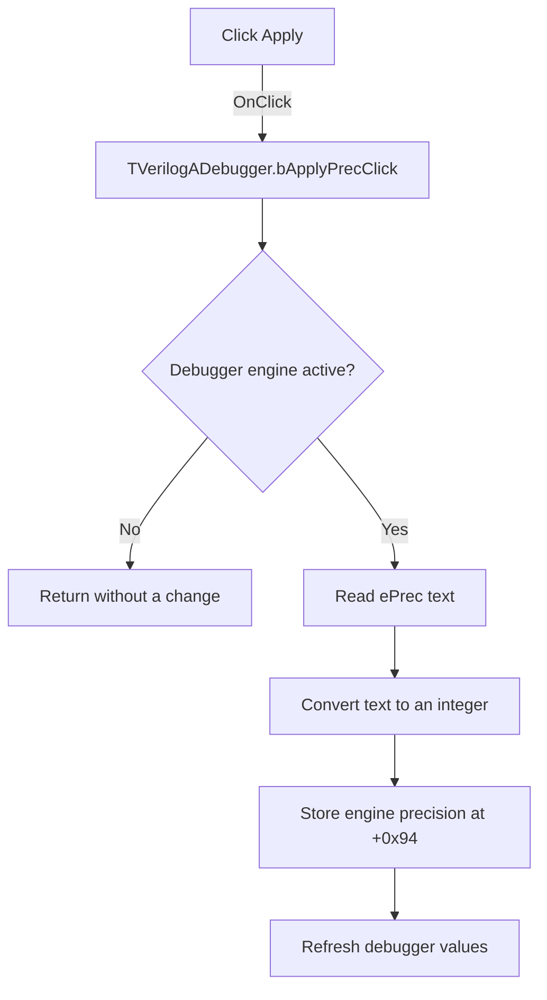

# Apply

> Analysis status: Evidence-backed source review complete.

## Control

| Property | Recovered value |
| --- | --- |
| Form | VerilogADebugger |
| Component path | VerilogADebugger.pnToolbar.bApplyPrec |
| Control class | TButton |
| Caption | Apply |
| Hint | Apply Precision |
| Text | Not present in the recovered resource. |
| Handler name | bApplyPrecClick |
| Handler address | 010a4cb0 |
| Graph node | `resource:dfm:VerilogADebugger/VerilogADebugger.pnToolbar.bApplyPrec` |
| Handler node | `function:010a4cb0` |
| Graph layer | UI |

## What happens when clicked

The handler first checks for an active debugger engine at form offset `+0x1a70`. If no engine is active, the click returns without reading or changing the precision value.

With an active engine, the handler reads the text from `ePrec`, converts it to an integer, writes it to engine field `+0x94`, and calls the shared debugger refresh routine. That precision field controls the numeric formatting used for the current simulation time and debugger values. Invalid integer text follows the Delphi conversion-exception path. The handler has no local error message, recovery, or range check.

## Click flow

## Handler evidence

- Source: [DecompiledSources/Tina16/functions/00000000010A4CB0__FUN_010a4cb0.c](../../../DecompiledSources/Tina16/functions/00000000010A4CB0__FUN_010a4cb0.c)
- Recovered role: Applies the entered numeric display precision to the active debugger engine.
- Current graph summary: Handles 1 Delphi UI event: VerilogADebugger.pnToolbar.bApplyPrec.OnClick.
- Current graph behavior: Reads `ePrec`, converts the text to an integer, stores it in engine precision field `+0x94`, and refreshes the debugger.
- Current graph evidence: The handler gates the path on form field `+0x1a70`, reads control field `+0x878`, calls the integer conversion helper, writes engine field `+0x94`, and calls [`FUN_010a3d40`](../../../DecompiledSources/Tina16/functions/00000000010A3D40__FUN_010a3d40.c). That refresh routine uses `+0x94` when it formats simulation time.
- Complexity: complex
- Distinct outgoing calls: 4

## Direct calls

- `function:00414480` — Delphi UnicodeString clear and finalization helper
- `function:0043fc00` — FUN_0043fc00
- `function:0064dd90` — VCL control Unicode text reader
- `function:010a3d40` — FUN_010a3d40

## Resource evidence

- Kind: Not present in the recovered resource.
- Modal result: Not present in the recovered resource.
- Checked state: Not present in the recovered resource.
- List items: Not present in the recovered resource.
- Image reference: Not present in the recovered resource.
- Extracted glyph: None.

## Nearby label candidates

Nearby labels are layout candidates only. They are not proof of behavior.

- Rank 1: IterCnt:  at distance 179.
- Rank 2: time:  at distance 309.

## Analysis limits

- The nearby `IterCnt:` and `time:` labels do not identify this control. The handler and `ePrec` field establish the precision operation.
- The recovered code has no explicit minimum or maximum precision check.
- An invalid integer can raise through the Delphi conversion path. No local exception handler is present.
