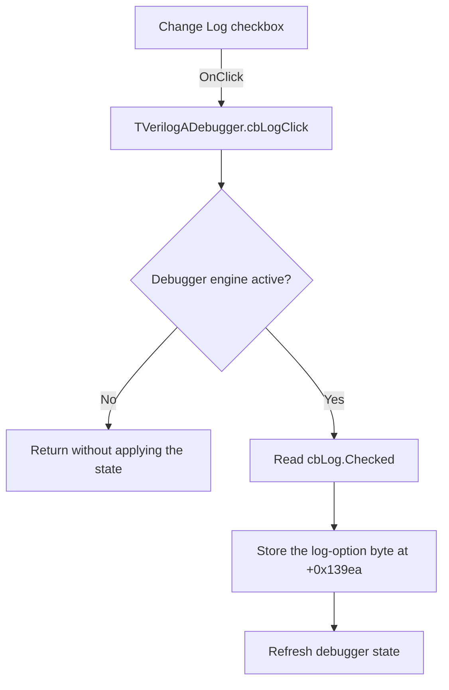

# Log

> Analysis status: Evidence-backed source review complete.

## Control

| Property | Recovered value |
| --- | --- |
| Form | VerilogADebugger |
| Component path | VerilogADebugger.pnToolbar.cbLog |
| Control class | TCheckBox |
| Caption | Log |
| Hint | Not present in the recovered resource. |
| Text | Not present in the recovered resource. |
| Handler name | cbLogClick |
| Handler address | 010a4d40 |
| Graph node | `resource:dfm:VerilogADebugger/VerilogADebugger.pnToolbar.cbLog` |
| Handler node | `function:010a4d40` |
| Graph layer | UI |

## What happens when clicked

The VCL changes `cbLog.Checked` before it dispatches this click. If no debugger engine is active at form offset `+0x1a70`, the handler returns and does not apply the checked state.

With an active engine, the handler reads `cbLog.Checked`, writes that Boolean value to engine byte `+0x139ea`, and calls the common debugger refresh routine. Form initialization restores the checkbox from the same engine byte. The recovered source does not show the downstream consumer that turns this staged flag into emitted log records.

## Click flow

## Handler evidence

- Source: [DecompiledSources/Tina16/functions/00000000010A4D40__FUN_010a4d40.c](../../../DecompiledSources/Tina16/functions/00000000010A4D40__FUN_010a4d40.c)
- Recovered role: Applies the Log checkbox state to the active debugger engine.
- Current graph summary: Handles 1 Delphi UI event: VerilogADebugger.pnToolbar.cbLog.OnClick.
- Current graph behavior: Copies `cbLog.Checked` to engine byte `+0x139ea` and refreshes the debugger when an engine is active.
- Current graph evidence: The handler tests form field `+0x1a70`, gets the Boolean state from checkbox field `+0x930` through VMT slot `+0x260`, writes engine byte `+0x139ea`, and calls [`FUN_010a3d40`](../../../DecompiledSources/Tina16/functions/00000000010A3D40__FUN_010a3d40.c). [`FUN_010a58b0`](../../../DecompiledSources/Tina16/functions/00000000010A58B0__FUN_010a58b0.c) restores the checkbox from that byte when it attaches the engine.
- Complexity: simple
- Distinct outgoing calls: 1

## Direct calls

- `function:010a3d40` — FUN_010a3d40

## Resource evidence

- Kind: Not present in the recovered resource.
- Modal result: Not present in the recovered resource.
- Checked state: Not present in the recovered resource.
- List items: Not present in the recovered resource.
- Image reference: Not present in the recovered resource.
- Extracted glyph: None.

## Nearby label candidates

Nearby labels are layout candidates only. They are not proof of behavior.

- Rank 1: IterCnt:  at distance 100.
- Rank 2: time:  at distance 578.

## Analysis limits

- The nearby `IterCnt:` and `time:` labels are layout candidates only and do not explain the checkbox.
- The recovered sources prove the state transfer to engine byte `+0x139ea`. They do not expose the consumer that emits or stores log records.
- The handler has no local error path or rollback.
