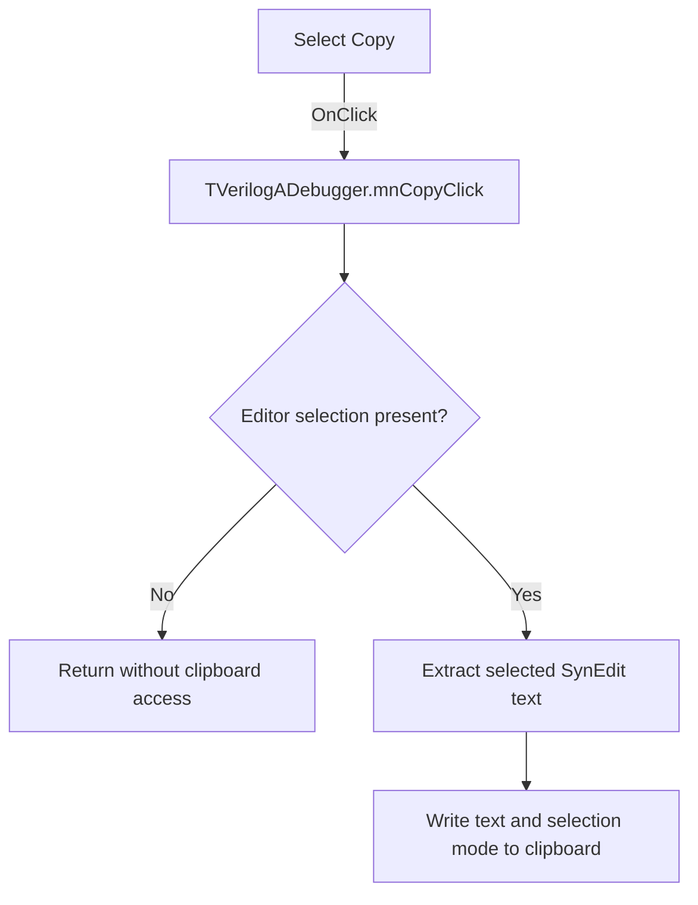

# Copy

> Analysis status: Evidence-backed source review complete.

## Control

| Property | Recovered value |
| --- | --- |
| Form | VerilogADebugger |
| Component path | VerilogADebugger.MainMenu1.mEdit.mnCopy |
| Control class | TMenuItem |
| Caption | Copy |
| Hint | Not present in the recovered resource. |
| Text | Not present in the recovered resource. |
| Handler name | mnCopyClick |
| Handler address | 010a5ab0 |
| Graph node | `resource:dfm:VerilogADebugger/VerilogADebugger.MainMenu1.mEdit.mnCopy` |
| Handler node | `function:010a5ab0` |
| Graph layer | UI |

## What happens when clicked

The handler sends the Copy command to the debugger's `TSynEdit` editor at form field `+0x960`. The shared SynEdit helper first checks whether the editor has a selection. An empty selection is a no-op.

For a nonempty selection, the helper extracts the selected text and writes standard text plus the SynEdit selection-mode payload to the clipboard. It temporarily clears and restores the block-selection flag when that format needs special handling. The handler does not change the editor text or selection.

## Click flow

## Handler evidence

- Source: [DecompiledSources/Tina16/functions/00000000010A5AB0__FUN_010a5ab0.c](../../../DecompiledSources/Tina16/functions/00000000010A5AB0__FUN_010a5ab0.c)
- Recovered role: Copies the current SynEdit selection to the clipboard.
- Current graph summary: Handles 1 Delphi UI event: VerilogADebugger.MainMenu1.mEdit.mnCopy.OnClick.
- Current graph behavior: Delegates to the shared SynEdit Copy implementation; an empty selection is a no-op.
- Current graph evidence: The handler passes form field `+0x960`, the recovered `eEditor` component, to [`FUN_00bf1d60`](../../../DecompiledSources/Tina16/functions/0000000000BF1D60__FUN_00bf1d60.c). That helper gates the path on selection state, extracts selected text, and writes the clipboard formats.
- Complexity: simple
- Distinct outgoing calls: 1

## Direct calls

- `function:00bf1d60` — FUN_00bf1d60

## Resource evidence

- Kind: Not present in the recovered resource.
- Modal result: Not present in the recovered resource.
- Checked state: Not present in the recovered resource.
- List items: Not present in the recovered resource.
- Image reference: Not present in the recovered resource.
- Extracted glyph: None.

## Nearby label candidates

Nearby labels are layout candidates only. They are not proof of behavior.

- No same-parent label candidate is available.

## Analysis limits

- The recovered source does not expose clipboard ownership after the helper returns.
- The helper has no user-visible error message. Its local no-op path is an empty selection.
