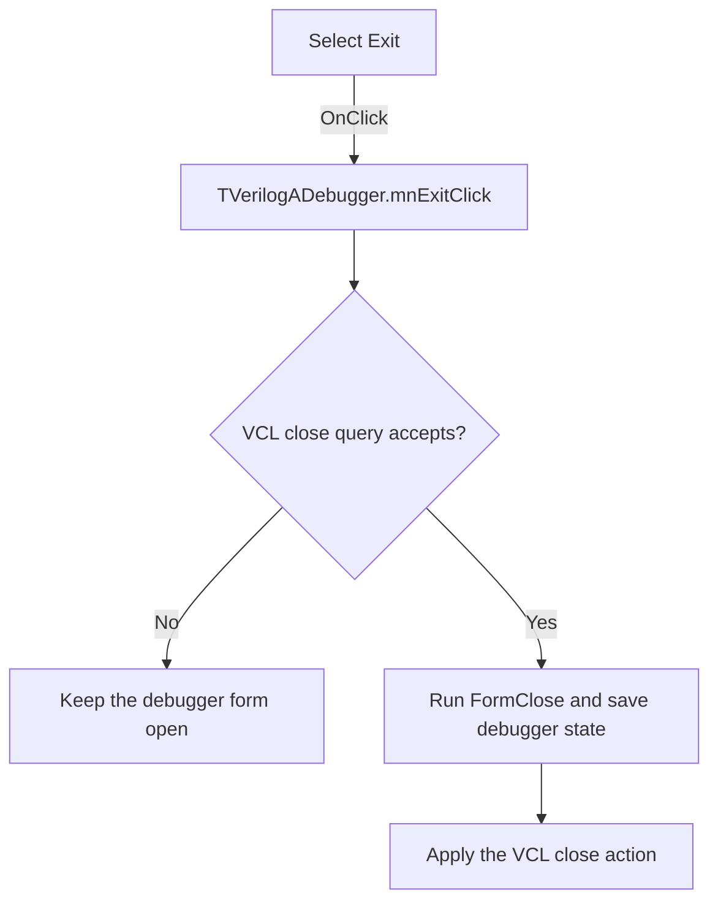

# Exit

> Analysis status: Evidence-backed source review complete.

## Control

| Property | Recovered value |
| --- | --- |
| Form | VerilogADebugger |
| Component path | VerilogADebugger.MainMenu1.mFile.mnExit |
| Control class | TMenuItem |
| Caption | Exit |
| Hint | Not present in the recovered resource. |
| Text | Not present in the recovered resource. |
| Handler name | mnExitClick |
| Handler address | 010a5ad0 |
| Graph node | `resource:dfm:VerilogADebugger/VerilogADebugger.MainMenu1.mFile.mnExit` |
| Handler node | `function:010a5ad0` |
| Graph layer | UI |

## What happens when clicked

The handler requests the standard VCL close operation for `TVerilogADebugger`. The shared close routine runs the form close-query and close-action pipeline. A rejected close query stops the operation. Otherwise, VCL selects the applicable hide, minimize, release, or main-form termination action from the form state.

Before the close action completes, `TVerilogADebugger.FormClose` saves the window placement and debugger configuration. The saved configuration includes precision, animation, and log-option state. The click handler does not force process termination and has no separate confirmation dialog.

## Click flow

## Handler evidence

- Source: [DecompiledSources/Tina16/functions/00000000010A5AD0__FUN_010a5ad0.c](../../../DecompiledSources/Tina16/functions/00000000010A5AD0__FUN_010a5ad0.c)
- Recovered role: Requests closure of the Verilog-AMS debugger form.
- Current graph summary: Handles 1 Delphi UI event: VerilogADebugger.MainMenu1.mFile.mnExit.OnClick.
- Current graph behavior: Calls the VCL form-close pipeline; the form close event saves window and debugger settings before VCL applies its selected close action.
- Current graph evidence: The handler calls [`FUN_00805200`](../../../DecompiledSources/Tina16/functions/0000000000805200__FUN_00805200.c), the recovered `TCustomForm.Close` path. The DFM binds `FormClose` to [`FUN_010a4790`](../../../DecompiledSources/Tina16/functions/00000000010A4790__FUN_010a4790.c), which saves placement data and calls the debugger configuration writers, including `FUN_010a6220` for `va_debugger_config.txt`.
- Complexity: simple
- Distinct outgoing calls: 1

## Direct calls

- `function:00805200` — FUN_00805200

## Resource evidence

- Kind: Not present in the recovered resource.
- Modal result: Not present in the recovered resource.
- Checked state: Not present in the recovered resource.
- List items: Not present in the recovered resource.
- Image reference: Not present in the recovered resource.
- Extracted glyph: None.

## Nearby label candidates

Nearby labels are layout candidates only. They are not proof of behavior.

- No same-parent label candidate is available.

## Analysis limits

- The final VCL close action depends on runtime form state. The recovered handler does not prove that selecting Exit terminates the complete application.
- The handler has no local exception or save-failure recovery path.
