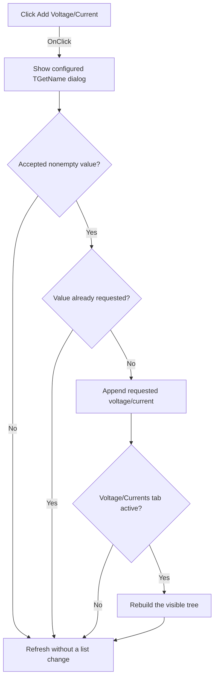

# Add Voltage/Current

> Analysis status: Evidence-backed source review complete.

## Control

| Property | Recovered value |
| --- | --- |
| Form | VerilogADebugger |
| Component path | VerilogADebugger.pnClient.pnMessages.pnDebug.pcDebug.tsDebug.pcDebugPages.tsVoltageCurrents.Panel1.Panel2.Panel4.sbAddNature |
| Control class | TSpeedButton |
| Caption | Add Voltage/Current |
| Hint | Not present in the recovered resource. |
| Text | Not present in the recovered resource. |
| Handler name | sbAddVoltageClick |
| Handler address | 010a5240 |
| Graph node | `resource:dfm:VerilogADebugger/VerilogADebugger.pnClient.pnMessages.pnDebug.pcDebug.tsDebug.pcDebugPages.tsVoltageCurrents.Panel1.Panel2.Panel4.sbAddNature` |
| Handler node | `function:010a5240` |
| Graph layer | UI |

## What happens when clicked

The handler creates the shared `TGetName` form. It changes the dialog caption to `Add Voltage/Current`, the prompt to `Voltage/Current:`, and the hint label to `Hint: V(p,n)`, then shows the dialog modally. Cancel destroys the dialog and keeps the requested-name list unchanged.

For an accepted nonempty value, the handler adds the string to the requested voltage/current list only if the list does not already contain it. If the Debug main tab and Voltage/Currents subtab are active, it rebuilds the visible voltage/current tree. The shared debugger refresh runs after accepted, duplicate, empty, and cancelled paths.

## Click flow

## Handler evidence

- Source: [DecompiledSources/Tina16/functions/00000000010A5240__FUN_010a5240.c](../../../DecompiledSources/Tina16/functions/00000000010A5240__FUN_010a5240.c)
- Recovered role: Prompts for and adds a unique requested voltage or current expression.
- Current graph summary: Creates and runs the Add Voltage/Current dialog, adds its prompt and hint label, and processes an accepted value. Handles 1 Delphi UI event: VerilogADebugger.pnClient.pnMessages.pnDebug.pcDebug.tsDebug.pcDebugPages.tsVoltageCurrents.Panel1.Panel2.Panel4.sbAddNature.OnClick.
- Current graph behavior: Configures and shows `TGetName`, appends an accepted nonduplicate string to the requested voltage/current list, conditionally rebuilds the active tree, and refreshes the debugger.
- Current graph evidence: The handler passes `Add Voltage/Current`, `Voltage/Current:`, and `Hint: V(p,n)` to the dialog helpers. It copies the accepted text through [`FUN_010a06c0`](../../../DecompiledSources/Tina16/functions/00000000010A06C0__FUN_010a06c0.c), calls [`FUN_010a5040`](../../../DecompiledSources/Tina16/functions/00000000010A5040__FUN_010a5040.c), and uses page indexes Debug `1` and Voltage/Currents `3` before it calls `FUN_010a4ab0`.
- Complexity: complex
- Distinct outgoing calls: 11

## Direct calls

- `function:00410f20` — Nil-safe Delphi object destruction helper
- `function:00414560` — Delphi UnicodeString array finalization helper
- `function:006d8150` — FUN_006d8150
- `function:007fc180` — FUN_007fc180
- `function:010a0460` — FUN_010a0460
- `function:010a04c0` — FUN_010a04c0
- `function:010a0560` — FUN_010a0560
- `function:010a06c0` — FUN_010a06c0
- `function:010a3d40` — FUN_010a3d40
- `function:010a4ab0` — FUN_010a4ab0
- `function:010a5040` — FUN_010a5040

## Resource evidence

- Kind: Not present in the recovered resource.
- Modal result: Not present in the recovered resource.
- Checked state: Not present in the recovered resource.
- List items: Not present in the recovered resource.
- Image reference: Not present in the recovered resource.
- Extracted glyph: [`0494_VerilogADebugger_VerilogADebugger_pnClient_pnMessages_pnDebug_pcDebug_tsDebug_pcDebugPages_tsVoltageCurrents_Pane_Glyph_Data.png`](../../../glyph/0494_VerilogADebugger_VerilogADebugger_pnClient_pnMessages_pnDebug_pcDebug_tsDebug_pcDebugPages_tsVoltageCurrents_Pane_Glyph_Data.png)
- The 20 by 18 glyph is a green plus. It supports the add operation; the handler strings and list update establish the voltage/current target.

## Nearby label candidates

Nearby labels are layout candidates only. They are not proof of behavior.

- No same-parent label candidate is available.

## Analysis limits

- The handler itself checks only for a nonempty and nonduplicate string. It does not parse or validate the voltage/current expression on this path.
- The visible-tree rebuild reads the current resolved list, which can differ from the requested list. The recovery does not prove when the debugger engine resolves a new request.
- No local exception handler or user-visible add failure is present.
