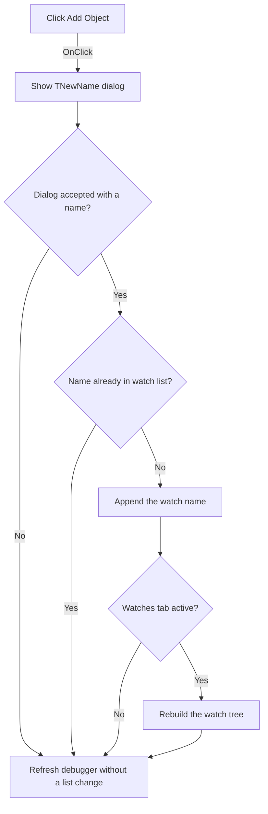

# Add Object

> Analysis status: Evidence-backed source review complete.

## Control

| Property | Recovered value |
| --- | --- |
| Form | VerilogADebugger |
| Component path | VerilogADebugger.pnClient.pnMessages.pnDebug.pcDebug.tsDebug.pcDebugPages.tsWatches.pnWatchClient.pnWatchButtons.pnWatchButtonsRight.sbAddObjectWatch |
| Control class | TSpeedButton |
| Caption | Add Object |
| Hint | Not present in the recovered resource. |
| Text | Not present in the recovered resource. |
| Handler name | sbAddObjectWatchClick |
| Handler address | 010a4d90 |
| Graph node | `resource:dfm:VerilogADebugger/VerilogADebugger.pnClient.pnMessages.pnDebug.pcDebug.tsDebug.pcDebugPages.tsWatches.pnWatchClient.pnWatchButtons.pnWatchButtonsRight.sbAddObjectWatch` |
| Handler node | `function:010a4d90` |
| Graph layer | UI |

## What happens when clicked

The handler creates the shared `TNewName` dialog and shows it modally. Cancel destroys the dialog and leaves the watch-name list unchanged. The dialog's OK path rejects an empty or invalid name before the form can close.

After an accepted result, the handler reads `eNewName`. It adds the name to the watch list only when the same string is not already present. If the Debug main tab and Watches subtab are active, it immediately rebuilds the watch tree from the current list. The common debugger refresh runs after both accepted and cancelled dialog results.

## Click flow

## Handler evidence

- Source: [DecompiledSources/Tina16/functions/00000000010A4D90__FUN_010a4d90.c](../../../DecompiledSources/Tina16/functions/00000000010A4D90__FUN_010a4d90.c)
- Recovered role: Adds a unique object name to the debugger watch list.
- Current graph summary: Handles 1 Delphi UI event: VerilogADebugger.pnClient.pnMessages.pnDebug.pcDebug.tsDebug.pcDebugPages.tsWatches.pnWatchClient.pnWatchButtons.pnWatchButtonsRight.sbAddObjectWatch.OnClick.
- Current graph behavior: Prompts for a name, appends a nonduplicate accepted value to the watch list, conditionally rebuilds the visible Watches tree, and refreshes the debugger.
- Current graph evidence: The handler constructs the DFM-backed `TNewName` form, tests `ShowModal == 1`, reads the edit through [`FUN_0106c180`](../../../DecompiledSources/Tina16/functions/000000000106C180__FUN_0106c180.c), and passes the result to [`FUN_010a4c20`](../../../DecompiledSources/Tina16/functions/00000000010A4C20__FUN_010a4c20.c). That helper searches list `+0x9e8` and appends only on a `-1` result. `FUN_010a49e0` rebuilds the watch tree when the active page indexes are Debug `1` and Watches `2`.
- Complexity: complex
- Distinct outgoing calls: 8

## Direct calls

- `function:00410f20` — Nil-safe Delphi object destruction helper
- `function:00414480` — Delphi UnicodeString clear and finalization helper
- `function:006d8150` — FUN_006d8150
- `function:007fc180` — FUN_007fc180
- `function:0106c180` — FUN_0106c180
- `function:010a3d40` — FUN_010a3d40
- `function:010a49e0` — FUN_010a49e0
- `function:010a4c20` — FUN_010a4c20

## Resource evidence

- Kind: Not present in the recovered resource.
- Modal result: Not present in the recovered resource.
- Checked state: Not present in the recovered resource.
- List items: Not present in the recovered resource.
- Image reference: Not present in the recovered resource.
- Extracted glyph: [`0492_VerilogADebugger_VerilogADebugger_pnClient_pnMessages_pnDebug_pcDebug_tsDebug_pcDebugPages_tsWatches_pnWatchClien_Glyph_Data.png`](../../../glyph/0492_VerilogADebugger_VerilogADebugger_pnClient_pnMessages_pnDebug_pcDebug_tsDebug_pcDebugPages_tsWatches_pnWatchClien_Glyph_Data.png)
- The 20 by 18 glyph is a green plus. It supports the add operation; the handler and list calls establish the target watch list.

## Nearby label candidates

Nearby labels are layout candidates only. They are not proof of behavior.

- No same-parent label candidate is available.

## Analysis limits

- The name-dialog validation helper has no recovered Delphi symbol. The source proves that it blocks empty or rejected names, but it does not expose every accepted character rule.
- The handler does not evaluate the watch expression. It only updates the requested watch-name list and its visible tree.
- No local exception handler or user-visible add failure is present.
