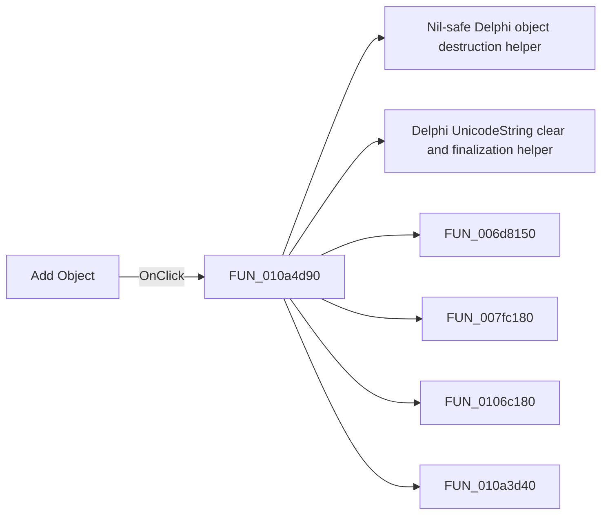

# Add Object

> Analysis status: Pending individual source review.

## Control

| Property | Recovered value |
| --- | --- |
| Form | VerilogADebugger |
| Component path | VerilogADebugger.pnClient.pnMessages.pnDebug.pcDebug.tsDebug.pcDebugPages.tsWatches.pnWatchClient.pnWatchButtons.pnWatchButtonsRight.sbAddObjectWatch |
| Control class | TSpeedButton |
| Caption | Add Object |
| Hint | Not present in the recovered resource. |
| Text | Not present in the recovered resource. |
| Handler name | sbAddObjectWatchClick |
| Handler address | 010a4d90 |
| Graph node | `resource:dfm:VerilogADebugger/VerilogADebugger.pnClient.pnMessages.pnDebug.pcDebug.tsDebug.pcDebugPages.tsWatches.pnWatchClient.pnWatchButtons.pnWatchButtonsRight.sbAddObjectWatch` |
| Handler node | `function:010a4d90` |
| Graph layer | UI |

## What happens when clicked

Pending individual analysis. An agent must read the recovered handler source and its relevant callees before it replaces this text.

## Click flow

## Handler evidence

- Source: [DecompiledSources/Tina16/functions/00000000010A4D90__FUN_010a4d90.c](../../../DecompiledSources/Tina16/functions/00000000010A4D90__FUN_010a4d90.c)
- Recovered role: Not present in the recovered resource.
- Current graph summary: Handles 1 Delphi UI event: VerilogADebugger.pnClient.pnMessages.pnDebug.pcDebug.tsDebug.pcDebugPages.tsWatches.pnWatchClient.pnWatchButtons.pnWatchButtonsRight.sbAddObjectWatch.OnClick.
- Current graph behavior: Not present in the recovered resource.
- Current graph evidence: Not present in the recovered resource.
- Complexity: complex
- Distinct outgoing calls: 8

## Direct calls

- `function:00410f20` — Nil-safe Delphi object destruction helper
- `function:00414480` — Delphi UnicodeString clear and finalization helper
- `function:006d8150` — FUN_006d8150
- `function:007fc180` — FUN_007fc180
- `function:0106c180` — FUN_0106c180
- `function:010a3d40` — FUN_010a3d40
- `function:010a49e0` — FUN_010a49e0
- `function:010a4c20` — FUN_010a4c20

## Resource evidence

- Kind: Not present in the recovered resource.
- Modal result: Not present in the recovered resource.
- Checked state: Not present in the recovered resource.
- List items: Not present in the recovered resource.
- Image reference: Not present in the recovered resource.
- Extracted glyph: [`0492_VerilogADebugger_VerilogADebugger_pnClient_pnMessages_pnDebug_pcDebug_tsDebug_pcDebugPages_tsWatches_pnWatchClien_Glyph_Data.png`](../../../glyph/0492_VerilogADebugger_VerilogADebugger_pnClient_pnMessages_pnDebug_pcDebug_tsDebug_pcDebugPages_tsWatches_pnWatchClien_Glyph_Data.png)

## Nearby label candidates

Nearby labels are layout candidates only. They are not proof of behavior.

- No same-parent label candidate is available.

## Analysis limits

- Do not infer behavior from the control class, caption, hint, glyph, or nearby label alone.
- Do not replace the pending status until the handler source and relevant call path provide enough evidence.
