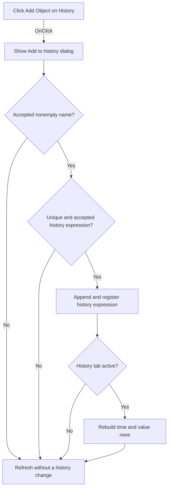

# Add Object

> Analysis status: Evidence-backed source review complete.

## Control

| Property | Recovered value |
| --- | --- |
| Form | VerilogADebugger |
| Component path | VerilogADebugger.pnClient.pnMessages.pnDebug.pcDebug.tsDebug.pcDebugPages.tsHistory.Panel7.Panel8.Panel9.sbAddToHistory |
| Control class | TSpeedButton |
| Caption | Add Object |
| Hint | Not present in the recovered resource. |
| Text | Not present in the recovered resource. |
| Handler name | sbAddToHistoryClick |
| Handler address | 010a6770 |
| Graph node | `resource:dfm:VerilogADebugger/VerilogADebugger.pnClient.pnMessages.pnDebug.pcDebug.tsDebug.pcDebugPages.tsHistory.Panel7.Panel8.Panel9.sbAddToHistory` |
| Handler node | `function:010a6770` |
| Graph layer | UI |

## What happens when clicked

The handler configures the shared `TGetName` form with caption `Add to history` and prompt `Name:`, then shows it modally. Cancel destroys the dialog and keeps the history request list unchanged.

For an accepted nonempty string, `FUN_010a68b0` first rejects a duplicate. It then accepts the name only when it is present in the debugger's available-name collection or it matches a second recovered expression-pattern test. An accepted name is appended to the history list and registered with the active engine. If the History subtab is active, the handler rebuilds its tree with `time=` and `value=` child rows. It always runs the common debugger refresh before returning.

## Click flow

## Handler evidence

- Source: [DecompiledSources/Tina16/functions/00000000010A6770__FUN_010a6770.c](../../../DecompiledSources/Tina16/functions/00000000010A6770__FUN_010a6770.c)
- Recovered role: Adds an accepted debugger expression to the simulation history list.
- Current graph summary: Handles 1 Delphi UI event: VerilogADebugger.pnClient.pnMessages.pnDebug.pcDebug.tsDebug.pcDebugPages.tsHistory.Panel7.Panel8.Panel9.sbAddToHistory.OnClick.
- Current graph behavior: Prompts for a history name, rejects duplicates or unaccepted expressions, registers an accepted expression with the engine, conditionally rebuilds the History tree, and refreshes the debugger.
- Current graph evidence: The handler configures `TGetName`, copies accepted text through [`FUN_010a06c0`](../../../DecompiledSources/Tina16/functions/00000000010A06C0__FUN_010a06c0.c), and calls [`FUN_010a68b0`](../../../DecompiledSources/Tina16/functions/00000000010A68B0__FUN_010a68b0.c). That helper checks list `+0xa00`, tests the available-name collection or a second string-pattern helper, appends only accepted values, and calls `FUN_016496b0` to register them. `FUN_010a6a00` builds History rows that contain `time=` and `value=`.
- Complexity: complex
- Distinct outgoing calls: 10

## Direct calls

- `function:00410f20` — Nil-safe Delphi object destruction helper
- `function:00414480` — Delphi UnicodeString clear and finalization helper
- `function:006d8150` — FUN_006d8150
- `function:007fc180` — FUN_007fc180
- `function:010a0460` — FUN_010a0460
- `function:010a0560` — FUN_010a0560
- `function:010a06c0` — FUN_010a06c0
- `function:010a3d40` — FUN_010a3d40
- `function:010a68b0` — FUN_010a68b0
- `function:010a6a00` — FUN_010a6a00

## Resource evidence

- Kind: Not present in the recovered resource.
- Modal result: Not present in the recovered resource.
- Checked state: Not present in the recovered resource.
- List items: Not present in the recovered resource.
- Image reference: Not present in the recovered resource.
- Extracted glyph: [`0495_VerilogADebugger_VerilogADebugger_pnClient_pnMessages_pnDebug_pcDebug_tsDebug_pcDebugPages_tsHistory_Panel7_Panel_Glyph_Data.png`](../../../glyph/0495_VerilogADebugger_VerilogADebugger_pnClient_pnMessages_pnDebug_pcDebug_tsDebug_pcDebugPages_tsHistory_Panel7_Panel_Glyph_Data.png)
- The 20 by 18 glyph is a green plus. It supports an add operation; the dialog strings and history registration establish the target.

## Nearby label candidates

Nearby labels are layout candidates only. They are not proof of behavior.

- No same-parent label candidate is available.

## Analysis limits

- The two constants used by the secondary expression-pattern test are not recovered as readable strings. This article does not assign a syntax name to that test.
- Rejected duplicates and expressions return without a local message on this path.
- The history tree depends on engine-owned samples. The handler does not create a sample immediately.
