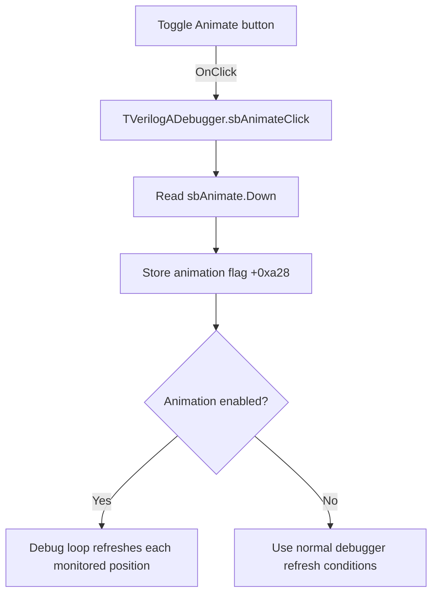

# A

> Analysis status: Evidence-backed source review complete.

## Control

| Property | Recovered value |
| --- | --- |
| Form | VerilogADebugger |
| Component path | VerilogADebugger.pnToolbar.sbAnimate |
| Control class | TSpeedButton |
| Caption | A |
| Hint | Animate |
| Text | Not present in the recovered resource. |
| Handler name | sbAnimateClick |
| Handler address | 010a48f0 |
| Graph node | `resource:dfm:VerilogADebugger/VerilogADebugger.pnToolbar.sbAnimate` |
| Handler node | `function:010a48f0` |
| Graph layer | UI |

## What happens when clicked

`sbAnimate` is an `AllowAllUp` speed button. The VCL changes its `Down` state before it calls this handler. The handler copies `sbAnimate.Down` to debugger flag `+0xa28` and returns.

The recovered simulation loop reads this flag through `FUN_010a6750`. When animation is enabled, the loop updates the debugger model and visible values at each monitored source position without entering the stopped wait loop. Releasing the button clears the flag and stops these per-position animation updates. The click does not start, stop, or step simulation by itself.

## Click flow

## Handler evidence

- Source: [DecompiledSources/Tina16/functions/00000000010A48F0__FUN_010a48f0.c](../../../DecompiledSources/Tina16/functions/00000000010A48F0__FUN_010a48f0.c)
- Recovered role: Enables or disables per-position debugger animation updates.
- Current graph summary: Handles 1 Delphi UI event: VerilogADebugger.pnToolbar.sbAnimate.OnClick.
- Current graph behavior: Copies the speed button's `Down` state to form flag `+0xa28`; the simulation loop uses that flag to request repeated debugger updates.
- Current graph evidence: The DFM sets `AllowAllUp=true` and `GroupIndex=1`. The handler reads control byte `+0x328`, the recovered `TSpeedButton.Down` field, through form field `+0x858`. Simulation loop [`FUN_01631c60`](../../../DecompiledSources/Tina16/functions/0000000001631C60__FUN_01631c60.c) calls `FUN_010a6750`, updates the debugger when the flag is set, and enters the stopped wait loop only for the separate engine stop flag.
- Complexity: simple
- Distinct outgoing calls: 0

## Direct and state-based paths

- No direct call edge is present in the recovered graph.
- The handler communicates through form byte `+0xa28`. The simulation loop reads that byte through `FUN_010a6750`.

## Resource evidence

- Kind: Not present in the recovered resource.
- Modal result: Not present in the recovered resource.
- Checked state: Not present in the recovered resource.
- List items: Not present in the recovered resource.
- Image reference: Not present in the recovered resource.
- Extracted glyph: None.

## Nearby label candidates

Nearby labels are layout candidates only. They are not proof of behavior.

- Rank 1: time:  at distance 197.
- Rank 2: IterCnt:  at distance 291.

## Analysis limits

- The nearby `time:` and `IterCnt:` labels are not direct labels for this button.
- The handler does not control the refresh rate. The recovered loop only proves updates at monitored source positions.
- The handler has no failure branch or local error message.
