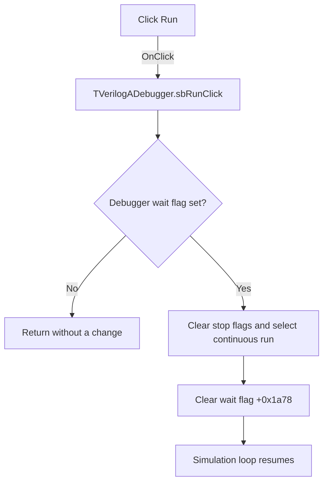

# Run

> Analysis status: Evidence-backed source review complete.

## Control

| Property | Recovered value |
| --- | --- |
| Form | VerilogADebugger |
| Component path | VerilogADebugger.pnToolbar.sbRun |
| Control class | TSpeedButton |
| Caption | Not present in the recovered resource. |
| Hint | Run |
| Text | Not present in the recovered resource. |
| Handler name | sbRunClick |
| Handler address | 010a5680 |
| Graph node | `resource:dfm:VerilogADebugger/VerilogADebugger.pnToolbar.sbRun` |
| Handler node | `function:010a5680` |
| Graph layer | UI |

## What happens when clicked

The handler first reads debugger wait flag `+0x1a78`. A zero value means the simulation loop is not in its stopped wait state, so the click is a no-op.

When the loop is stopped, the handler clears local stop-request byte `+0xa2b`, sets continuous-run byte `+0xa29`, clears engine stop byte `+0x13a19`, and writes zero to the wait flag. The shared simulation loop is pumping VCL messages while that flag is one; clearing it releases the loop and changes the status from `Stopped` to `Running`.

## Click flow

## Handler evidence

- Source: [DecompiledSources/Tina16/functions/00000000010A5680__FUN_010a5680.c](../../../DecompiledSources/Tina16/functions/00000000010A5680__FUN_010a5680.c)
- Recovered role: Resumes continuous execution from the debugger's stopped wait state.
- Current graph summary: Handles 1 Delphi UI event: VerilogADebugger.pnToolbar.sbRun.OnClick.
- Current graph behavior: When stopped, clears stop state, selects continuous run, and releases the simulation loop; otherwise it is a no-op.
- Current graph evidence: The handler calls `FUN_010a66b0` to read wait flag `+0x1a78`, changes bytes `+0xa2b`, `+0xa29`, and engine `+0x13a19`, then calls `FUN_010a66c0(form, 0)`. Simulation loop [`FUN_01631c60`](../../../DecompiledSources/Tina16/functions/0000000001631C60__FUN_01631c60.c) waits while the same flag is one and resumes after it becomes zero.
- Complexity: moderate
- Distinct outgoing calls: 2

## Direct calls

- `function:010a66b0` — FUN_010a66b0
- `function:010a66c0` — FUN_010a66c0

## Resource evidence

- Kind: Not present in the recovered resource.
- Modal result: Not present in the recovered resource.
- Checked state: Not present in the recovered resource.
- List items: Not present in the recovered resource.
- Image reference: Not present in the recovered resource.
- Extracted glyph: [`0496_VerilogADebugger_VerilogADebugger_pnToolbar_sbRun_Glyph_Data.png`](../../../glyph/0496_VerilogADebugger_VerilogADebugger_pnToolbar_sbRun_Glyph_Data.png)
- The 32 by 16 resource contains the normal and disabled right-pointing Run glyphs. The handler state changes establish the execution behavior.

## Nearby label candidates

Nearby labels are layout candidates only. They are not proof of behavior.

- Rank 1: time:  at distance 268.
- Rank 2: IterCnt:  at distance 746.

## Analysis limits

- The nearby `time:` and `IterCnt:` labels are status displays, not labels for this button.
- The handler only releases the existing simulation loop. It does not create an engine or wait for the next stop.
- No local failure or timeout path is present.
