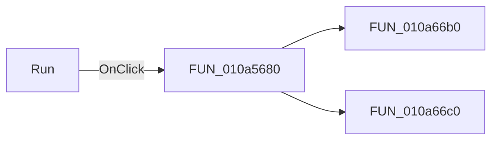

# Run

> Analysis status: Pending individual source review.

## Control

| Property | Recovered value |
| --- | --- |
| Form | VerilogADebugger |
| Component path | VerilogADebugger.pnToolbar.sbRun |
| Control class | TSpeedButton |
| Caption | Not present in the recovered resource. |
| Hint | Run |
| Text | Not present in the recovered resource. |
| Handler name | sbRunClick |
| Handler address | 010a5680 |
| Graph node | `resource:dfm:VerilogADebugger/VerilogADebugger.pnToolbar.sbRun` |
| Handler node | `function:010a5680` |
| Graph layer | UI |

## What happens when clicked

Pending individual analysis. An agent must read the recovered handler source and its relevant callees before it replaces this text.

## Click flow

## Handler evidence

- Source: [DecompiledSources/Tina16/functions/00000000010A5680__FUN_010a5680.c](../../../DecompiledSources/Tina16/functions/00000000010A5680__FUN_010a5680.c)
- Recovered role: Not present in the recovered resource.
- Current graph summary: Handles 1 Delphi UI event: VerilogADebugger.pnToolbar.sbRun.OnClick.
- Current graph behavior: Not present in the recovered resource.
- Current graph evidence: Not present in the recovered resource.
- Complexity: moderate
- Distinct outgoing calls: 2

## Direct calls

- `function:010a66b0` — FUN_010a66b0
- `function:010a66c0` — FUN_010a66c0

## Resource evidence

- Kind: Not present in the recovered resource.
- Modal result: Not present in the recovered resource.
- Checked state: Not present in the recovered resource.
- List items: Not present in the recovered resource.
- Image reference: Not present in the recovered resource.
- Extracted glyph: [`0496_VerilogADebugger_VerilogADebugger_pnToolbar_sbRun_Glyph_Data.png`](../../../glyph/0496_VerilogADebugger_VerilogADebugger_pnToolbar_sbRun_Glyph_Data.png)

## Nearby label candidates

Nearby labels are layout candidates only. They are not proof of behavior.

- Rank 1: time:  at distance 268.
- Rank 2: IterCnt:  at distance 746.

## Analysis limits

- Do not infer behavior from the control class, caption, hint, glyph, or nearby label alone.
- Do not replace the pending status until the handler source and relevant call path provide enough evidence.
