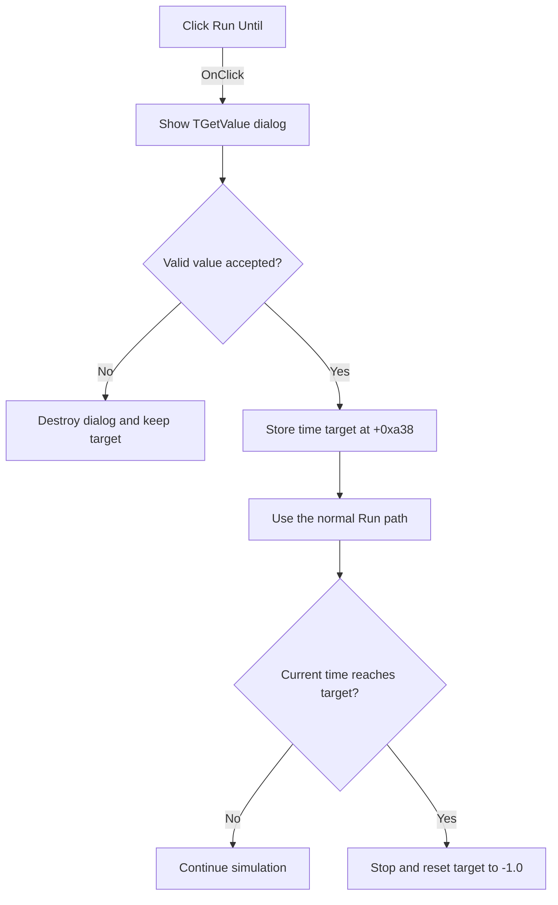

# Run Until

> Analysis status: Evidence-backed source review complete.

## Control

| Property | Recovered value |
| --- | --- |
| Form | VerilogADebugger |
| Component path | VerilogADebugger.pnToolbar.sbRunUntil |
| Control class | TSpeedButton |
| Caption | Not present in the recovered resource. |
| Hint | Run Until |
| Text | Not present in the recovered resource. |
| Handler name | sbRunUntilClick |
| Handler address | 010a5730 |
| Graph node | `resource:dfm:VerilogADebugger/VerilogADebugger.pnToolbar.sbRunUntil` |
| Handler node | `function:010a5730` |
| Graph layer | UI |

## What happens when clicked

The handler creates the DFM-backed `TGetValue` dialog and shows it modally. The dialog contains a `TFloatEdit`; its OK handler stores the entered floating-point value at dialog field `+0x6d8`, and its error and close-query handlers prevent an invalid edit state from closing normally.

Cancel destroys the dialog and does not change the debugger target. On OK, the handler copies the value to form field `+0xa38` and calls the normal Run handler. The simulation loop compares current simulation time with this target. When time reaches or exceeds it, the loop enters the standard stopped wait and resets the target to `-1.0`. If Run cannot resume because the loop is not stopped, the new target remains stored but this click does not start execution.

## Click flow

## Handler evidence

- Source: [DecompiledSources/Tina16/functions/00000000010A5730__FUN_010a5730.c](../../../DecompiledSources/Tina16/functions/00000000010A5730__FUN_010a5730.c)
- Recovered role: Runs the stopped debugger until a user-entered simulation time.
- Current graph summary: Handles 1 Delphi UI event: VerilogADebugger.pnToolbar.sbRunUntil.OnClick.
- Current graph behavior: Gets a floating-point target time, stores it at `+0xa38`, resumes through the Run handler, and lets the simulation loop stop when current time reaches the target.
- Current graph evidence: The handler constructs the class whose DFM resource is `GetValue`, tests `ShowModal == 1`, copies dialog field `+0x6d8`, and calls [`FUN_010a5680`](../../../DecompiledSources/Tina16/functions/00000000010A5680__FUN_010a5680.c). `GetValue.BitBtn1Click` [`FUN_010a0e20`](../../../DecompiledSources/Tina16/functions/00000000010A0E20__FUN_010a0e20.c) stores `TFloatEdit` output at `+0x6d8`. [`FUN_010a56d0`](../../../DecompiledSources/Tina16/functions/00000000010A56D0__FUN_010a56d0.c) returns true when current engine time is at least target `+0xa38`, and `FUN_010a5710` resets that field to `-1.0` on stop.
- Complexity: complex
- Distinct outgoing calls: 3

## Direct calls

- `function:00410f20` — Nil-safe Delphi object destruction helper
- `function:007fc180` — FUN_007fc180
- `function:010a5680` — Handles 1 Delphi UI event: VerilogADebugger.pnToolbar.sbRun.OnClick.

## Resource evidence

- Kind: Not present in the recovered resource.
- Modal result: Not present in the recovered resource.
- Checked state: Not present in the recovered resource.
- List items: Not present in the recovered resource.
- Image reference: Not present in the recovered resource.
- Extracted glyph: [`0499_VerilogADebugger_VerilogADebugger_pnToolbar_sbRunUntil_Glyph_Data.png`](../../../glyph/0499_VerilogADebugger_VerilogADebugger_pnToolbar_sbRunUntil_Glyph_Data.png)
- The 32 by 16 resource contains normal and disabled Run Until glyphs. The target-time comparison establishes the exact operation.

## Nearby label candidates

Nearby labels are layout candidates only. They are not proof of behavior.

- Rank 1: time:  at distance 243.
- Rank 2: IterCnt:  at distance 721.

## Analysis limits

- The dialog DFM keeps its generic caption `Get Value`; this handler does not change it to `Run Until`.
- The handler does not reject a target that is earlier than the current time. The simulation loop will treat an already reached target as a stop condition.
- The Run subpath is a no-op when the debugger wait flag is clear; in that case this handler leaves the target stored.
