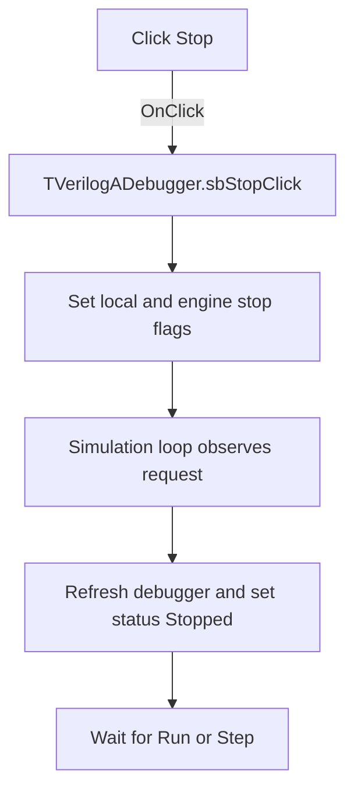

# Stop

> Analysis status: Evidence-backed source review complete.

## Control

| Property | Recovered value |
| --- | --- |
| Form | VerilogADebugger |
| Component path | VerilogADebugger.pnToolbar.sbStop |
| Control class | TSpeedButton |
| Caption | Not present in the recovered resource. |
| Hint | Stop |
| Text | Not present in the recovered resource. |
| Handler name | sbStopClick |
| Handler address | 010a5650 |
| Graph node | `resource:dfm:VerilogADebugger/VerilogADebugger.pnToolbar.sbStop` |
| Handler node | `function:010a5650` |
| Graph layer | UI |

## What happens when clicked

The handler sets local stop-request byte `+0xa2b`, clears continuous-run byte `+0xa29`, and sets engine stop byte `+0x13a19`. It makes no direct function call and does not wait for an acknowledgement.

The simulation loop checks the engine stop byte at monitored source positions. When it sees the request, it updates debugger state, resets any Run Until target, changes the status to `Stopped`, sets wait flag `+0x1a78`, and pumps VCL messages until Run or Step clears that flag. Thus, Stop is an asynchronous request that takes effect at the next recovered debugger stop point.

## Click flow

## Handler evidence

- Source: [DecompiledSources/Tina16/functions/00000000010A5650__FUN_010a5650.c](../../../DecompiledSources/Tina16/functions/00000000010A5650__FUN_010a5650.c)
- Recovered role: Requests that the running debugger stop at its next monitored source position.
- Current graph summary: Handles 1 Delphi UI event: VerilogADebugger.pnToolbar.sbStop.OnClick.
- Current graph behavior: Sets the debugger and engine stop flags and clears continuous-run state; the simulation loop later enters its stopped wait.
- Current graph evidence: The handler writes form bytes `+0xa2b=1` and `+0xa29=0`, then writes engine byte `+0x13a19=1`. Simulation loop [`FUN_01631c60`](../../../DecompiledSources/Tina16/functions/0000000001631C60__FUN_01631c60.c) tests that engine byte, updates the debugger, sets wait flag `+0x1a78`, writes status `Stopped`, and pumps messages while it waits.
- Complexity: simple
- Distinct outgoing calls: 0

## Direct and state-based paths

- No direct call edge is present in the recovered graph.
- The handler communicates with the simulation loop through the stop bytes and wait state.

## Resource evidence

- Kind: Not present in the recovered resource.
- Modal result: Not present in the recovered resource.
- Checked state: Not present in the recovered resource.
- List items: Not present in the recovered resource.
- Image reference: Not present in the recovered resource.
- Extracted glyph: [`0502_VerilogADebugger_VerilogADebugger_pnToolbar_sbStop_Glyph_Data.png`](../../../glyph/0502_VerilogADebugger_VerilogADebugger_pnToolbar_sbStop_Glyph_Data.png)
- The 32 by 16 resource contains normal and disabled square Stop glyphs. The state writes and simulation-loop reader establish the stop operation.

## Nearby label candidates

Nearby labels are layout candidates only. They are not proof of behavior.

- Rank 1: time:  at distance 193.
- Rank 2: IterCnt:  at distance 671.

## Analysis limits

- The click does not stop synchronously. The exact delay depends on when the simulation loop reaches its next monitored position.
- The handler does not check for a nil engine pointer. UI enabled-state management is outside this handler.
- No local error message or acknowledgement is present.
