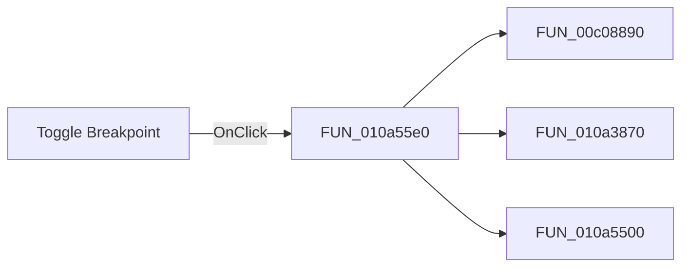

# Toggle Breakpoint

> Analysis status: Pending individual source review.

## Control

| Property | Recovered value |
| --- | --- |
| Form | VerilogADebugger |
| Component path | VerilogADebugger.pnToolbar.sbToggleBreakPoint |
| Control class | TSpeedButton |
| Caption | Not present in the recovered resource. |
| Hint | Toggle Breakpoint |
| Text | Not present in the recovered resource. |
| Handler name | sbToggleBreakPointClick |
| Handler address | 010a55e0 |
| Graph node | `resource:dfm:VerilogADebugger/VerilogADebugger.pnToolbar.sbToggleBreakPoint` |
| Handler node | `function:010a55e0` |
| Graph layer | UI |

## What happens when clicked

Pending individual analysis. An agent must read the recovered handler source and its relevant callees before it replaces this text.

## Click flow

## Handler evidence

- Source: [DecompiledSources/Tina16/functions/00000000010A55E0__FUN_010a55e0.c](../../../DecompiledSources/Tina16/functions/00000000010A55E0__FUN_010a55e0.c)
- Recovered role: Not present in the recovered resource.
- Current graph summary: Handles 1 Delphi UI event: VerilogADebugger.pnToolbar.sbToggleBreakPoint.OnClick.
- Current graph behavior: Not present in the recovered resource.
- Current graph evidence: Not present in the recovered resource.
- Complexity: complex
- Distinct outgoing calls: 3

## Direct calls

- `function:00c08890` — FUN_00c08890
- `function:010a3870` — FUN_010a3870
- `function:010a5500` — FUN_010a5500

## Resource evidence

- Kind: Not present in the recovered resource.
- Modal result: Not present in the recovered resource.
- Checked state: Not present in the recovered resource.
- List items: Not present in the recovered resource.
- Image reference: Not present in the recovered resource.
- Extracted glyph: [`0497_VerilogADebugger_VerilogADebugger_pnToolbar_sbToggleBreakPoint_Glyph_Data.png`](../../../glyph/0497_VerilogADebugger_VerilogADebugger_pnToolbar_sbToggleBreakPoint_Glyph_Data.png)

## Nearby label candidates

Nearby labels are layout candidates only. They are not proof of behavior.

- Rank 1: time:  at distance 73.
- Rank 2: IterCnt:  at distance 551.

## Analysis limits

- Do not infer behavior from the control class, caption, hint, glyph, or nearby label alone.
- Do not replace the pending status until the handler source and relevant call path provide enough evidence.
