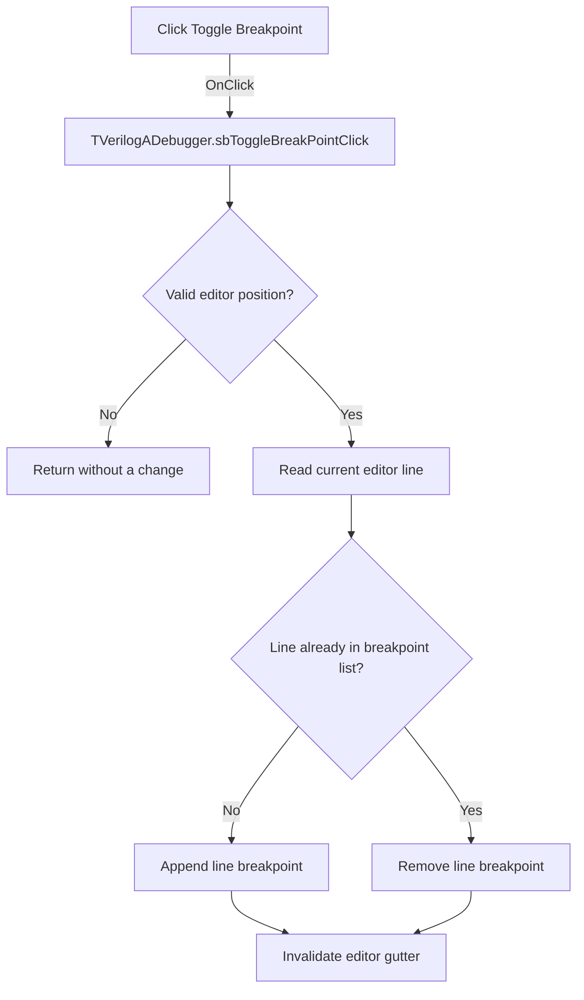

# Toggle Breakpoint

> Analysis status: Evidence-backed source review complete.

## Control

| Property | Recovered value |
| --- | --- |
| Form | VerilogADebugger |
| Component path | VerilogADebugger.pnToolbar.sbToggleBreakPoint |
| Control class | TSpeedButton |
| Caption | Not present in the recovered resource. |
| Hint | Toggle Breakpoint |
| Text | Not present in the recovered resource. |
| Handler name | sbToggleBreakPointClick |
| Handler address | 010a55e0 |
| Graph node | `resource:dfm:VerilogADebugger/VerilogADebugger.pnToolbar.sbToggleBreakPoint` |
| Handler node | `function:010a55e0` |
| Graph layer | UI |

## What happens when clicked

The handler first asks the active `TSynEdit` for a valid current text position. If that helper returns zero, the click is a no-op.

For a valid position, the handler reads the current editor line and column, converts the line number to text, and searches the debugger breakpoint list at form field `+0x9e0`. If the line is absent, it appends it. If the line is already present, it removes that entry. It then invalidates the editor so the breakpoint gutter can redraw. The column value is recovered but is not used for the breakpoint key.

## Click flow

## Handler evidence

- Source: [DecompiledSources/Tina16/functions/00000000010A55E0__FUN_010a55e0.c](../../../DecompiledSources/Tina16/functions/00000000010A55E0__FUN_010a55e0.c)
- Recovered role: Adds or removes a breakpoint on the current editor line.
- Current graph summary: Handles 1 Delphi UI event: VerilogADebugger.pnToolbar.sbToggleBreakPoint.OnClick.
- Current graph behavior: Requires a valid editor position, toggles the current line string in the breakpoint list, and invalidates the editor for redraw.
- Current graph evidence: The handler calls `FUN_00c08890` on editor field `+0x960`, gets line and column through [`FUN_010a3870`](../../../DecompiledSources/Tina16/functions/00000000010A3870__FUN_010a3870.c), and passes the line to [`FUN_010a5500`](../../../DecompiledSources/Tina16/functions/00000000010A5500__FUN_010a5500.c). That helper formats the line, searches list `+0x9e0`, appends on `-1`, or removes the existing index. The final editor VMT call at `+0x180` requests redraw.
- Complexity: complex
- Distinct outgoing calls: 3

## Direct calls

- `function:00c08890` — FUN_00c08890
- `function:010a3870` — FUN_010a3870
- `function:010a5500` — FUN_010a5500

## Resource evidence

- Kind: Not present in the recovered resource.
- Modal result: Not present in the recovered resource.
- Checked state: Not present in the recovered resource.
- List items: Not present in the recovered resource.
- Image reference: Not present in the recovered resource.
- Extracted glyph: [`0497_VerilogADebugger_VerilogADebugger_pnToolbar_sbToggleBreakPoint_Glyph_Data.png`](../../../glyph/0497_VerilogADebugger_VerilogADebugger_pnToolbar_sbToggleBreakPoint_Glyph_Data.png)
- The 32 by 16 resource contains normal and disabled red breakpoint-marker glyphs. The list toggle establishes the breakpoint behavior.

## Nearby label candidates

Nearby labels are layout candidates only. They are not proof of behavior.

- Rank 1: time:  at distance 73.
- Rank 2: IterCnt:  at distance 551.

## Analysis limits

- The position helper's recovered return type is inconsistent in its decompiled declaration. Its caller and final integer-returning callee prove the zero/nonzero guard, but not a readable Delphi method name.
- Breakpoints are keyed by the current line number in this handler. File identity and engine binding occur in other debugger routines.
- The handler has no local error message when the position is invalid.
