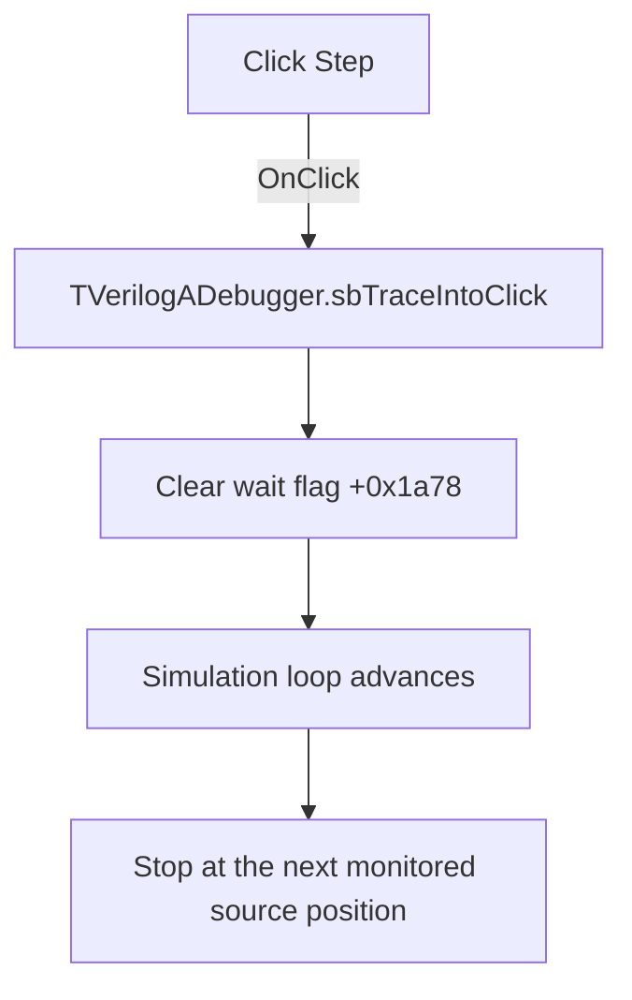

# Step

> Analysis status: Evidence-backed source review complete.

## Control

| Property | Recovered value |
| --- | --- |
| Form | VerilogADebugger |
| Component path | VerilogADebugger.pnToolbar.sbTraceInto |
| Control class | TSpeedButton |
| Caption | Not present in the recovered resource. |
| Hint | Step |
| Text | Not present in the recovered resource. |
| Handler name | sbTraceIntoClick |
| Handler address | 010a5640 |
| Graph node | `resource:dfm:VerilogADebugger/VerilogADebugger.pnToolbar.sbTraceInto` |
| Handler node | `function:010a5640` |
| Graph layer | UI |

## What happens when clicked

The handler writes zero to debugger wait flag `+0x1a78`. It does not clear the engine stop byte or select continuous-run mode.

The shared simulation loop sets this flag to one when it reaches a debugger stop and pumps VCL messages while the flag remains set. Clearing it releases that wait. Because the separate stop state remains active, the loop reaches the next monitored source position, updates the debugger, and stops again. If the loop is not waiting, the write has no additional effect.

## Click flow

## Handler evidence

- Source: [DecompiledSources/Tina16/functions/00000000010A5640__FUN_010a5640.c](../../../DecompiledSources/Tina16/functions/00000000010A5640__FUN_010a5640.c)
- Recovered role: Releases one stopped debugger wait without selecting continuous run.
- Current graph summary: Handles 1 Delphi UI event: VerilogADebugger.pnToolbar.sbTraceInto.OnClick.
- Current graph behavior: Clears the shared stopped-wait flag so the debug loop can advance while its separate stop state remains set.
- Current graph evidence: The handler contains only `FUN_010a66c0(form, 0)`, which writes form byte `+0x1a78`. Simulation loop [`FUN_01631c60`](../../../DecompiledSources/Tina16/functions/0000000001631C60__FUN_01631c60.c) sets the byte to one before its stopped message loop and waits until a UI command clears it. The Run handler clears additional continuous-stop state; this Step handler does not.
- Complexity: simple
- Distinct outgoing calls: 1

## Direct calls

- `function:010a66c0` — FUN_010a66c0

## Resource evidence

- Kind: Not present in the recovered resource.
- Modal result: Not present in the recovered resource.
- Checked state: Not present in the recovered resource.
- List items: Not present in the recovered resource.
- Image reference: Not present in the recovered resource.
- Extracted glyph: [`0498_VerilogADebugger_VerilogADebugger_pnToolbar_sbTraceInto_Glyph_Data.png`](../../../glyph/0498_VerilogADebugger_VerilogADebugger_pnToolbar_sbTraceInto_Glyph_Data.png)
- The 32 by 16 resource contains normal and disabled step glyphs. The wait-flag path establishes the step behavior.

## Nearby label candidates

Nearby labels are layout candidates only. They are not proof of behavior.

- Rank 1: time:  at distance 123.
- Rank 2: IterCnt:  at distance 601.

## Analysis limits

- The recovered loop proves advancement to the next monitored source position. It does not expose a higher-level Verilog statement type for that position.
- If the debugger is not waiting, this handler only repeats the zero flag value.
- The handler has no failure or timeout path.
