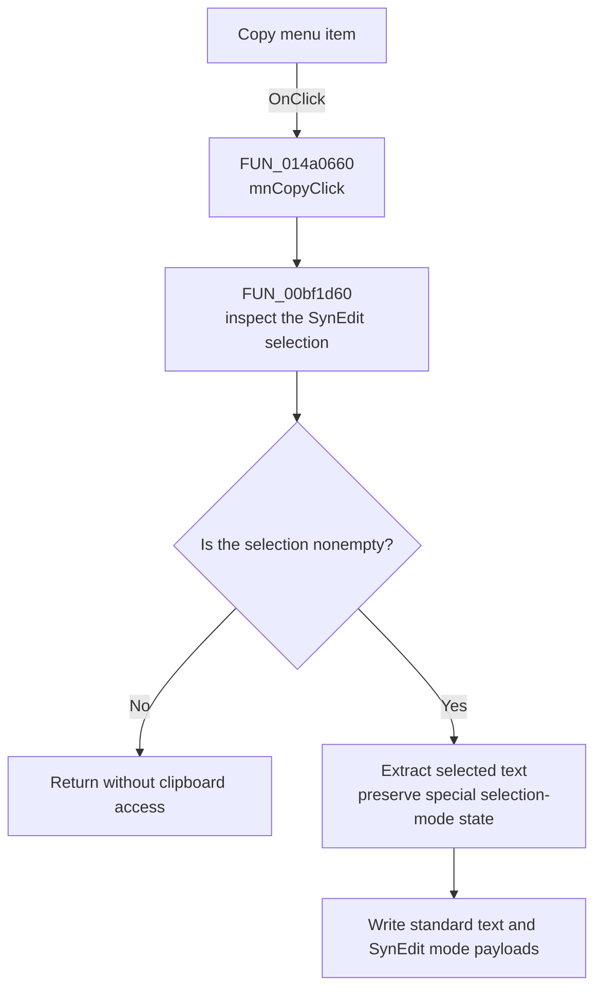

# Copy

> Analysis status: Recovered SynEdit clipboard path and empty-selection no-op reviewed.

## Control

| Property | Recovered value |
| --- | --- |
| Form | VhdlEditor |
| Component path | VhdlEditor.mnMainMenu.mnEdit.mnCopy |
| Control class | TMenuItem |
| Caption | Copy |
| Hint | Not present in the recovered resource. |
| Text | Not present in the recovered resource. |
| Handler name | mnCopyClick |
| Handler address | 014a0660 |
| Graph node | `resource:dfm:VhdlEditor/VhdlEditor.mnMainMenu.mnEdit.mnCopy` |
| Handler node | `function:014a0660` |
| Graph layer | UI |

## What happens when clicked

`mnCopyClick` passes the form's `TSynEdit` control at offset `+0x740` to the
shared SynEdit copy helper. The helper first tests whether the editor has a
selection. If the selection is empty, it returns without opening or changing
the clipboard and without showing a message.

For a nonempty selection, the helper extracts the selected text and writes it
to the standard text clipboard. It also adds a SynEdit-specific clipboard
payload that contains the selection mode. For the recovered special selection
mode value 2, it temporarily clears editor option bit `0x04000000` while it
extracts the text, then restores the bit before it writes the clipboard data.
The live document and selection endpoints do not change.

## Click flow

## Handler evidence

- Source: [DecompiledSources/Tina16/functions/00000000014A0660__FUN_014a0660.c](../../../DecompiledSources/Tina16/functions/00000000014A0660__FUN_014a0660.c)
- Recovered role: Copies the current VhdlEditor selection to the clipboard.
- Current graph summary: Handles 1 Delphi UI event: VhdlEditor.mnMainMenu.mnEdit.mnCopy.OnClick.
- Current graph behavior: Delegates to SynEdit's guarded copy path for the
  editor at form offset `+0x740`.
- Current graph evidence: `FUN_014a0660` calls `FUN_00bf1d60` with the editor.
  The callee tests the selection, extracts selected text, preserves the special
  selection-mode flag, and calls the recovered clipboard writer.
- Complexity: simple
- Distinct outgoing calls: 1

## Direct calls

- `function:00bf1d60` — copies a nonempty SynEdit selection to standard and
  SynEdit-specific clipboard formats.

## Resource evidence

- Kind: Not present in the recovered resource.
- Modal result: Not present in the recovered resource.
- Checked state: Not present in the recovered resource.
- List items: Not present in the recovered resource.
- Image reference: Not present in the recovered resource.
- Extracted glyph: None.

## Nearby label candidates

Nearby labels are layout candidates only. They are not proof of behavior.

- No same-parent label candidate is available.

## Analysis limits

- Clipboard allocation or operating-system failures have no local recovery in
  this handler path.
- The menu shortcut value is recovered as `16451`; this article does not infer
  a key name from the numeric value.
