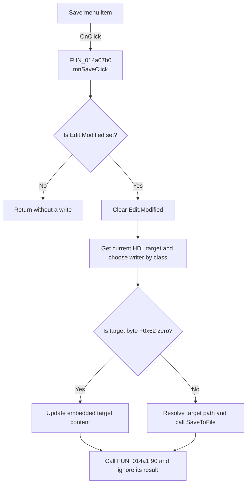

# Save

> Analysis status: Recovered modified-document save path reviewed.

## Control

| Property | Recovered value |
| --- | --- |
| Form | VhdlEditor |
| Component path | VhdlEditor.mnMainMenu.mnFile.mnSave |
| Control class | TMenuItem |
| Caption | Save |
| Hint | Not present in the recovered resource. |
| Text | Not present in the recovered resource. |
| Handler name | mnSaveClick |
| Handler address | 014a07b0 |
| Graph node | `resource:dfm:VhdlEditor/VhdlEditor.mnMainMenu.mnFile.mnSave` |
| Handler node | `function:014a07b0` |
| Graph layer | UI |

## What happens when clicked

`mnSaveClick` first tests the `TSynEdit.Modified` byte at editor offset `+0x5e0`.
If the byte is clear, the command returns without finding a target, writing
content, changing editor state, or showing a message.

For a modified document, the handler clears Modified before it writes. It gets
the current HDL target from application state at offset `+0x2768` and selects
one of two writers by a recovered class test. The two writer bodies are
identical:

- If target byte `+0x62` is zero, they pass `Edit.Lines` to a virtual method of
  the embedded-content object at target field `+0xb0`.
- If target byte `+0x62` is nonzero, they resolve a path from target string
  `+0x48` and call the one-argument `Edit.Lines.SaveToFile` virtual method.

After the write call returns, the handler calls `FUN_014a1f90` with zero-valued
arguments and ignores its result. The handler has no success message, local
exception handler, temporary-file replacement, or rollback. Because it clears
Modified before the writer runs, an exception can leave the editor marked
clean even when the target update does not finish.

## Click flow

## Handler evidence

- Source: [DecompiledSources/Tina16/functions/00000000014A07B0__FUN_014a07b0.c](../../../DecompiledSources/Tina16/functions/00000000014A07B0__FUN_014a07b0.c)
- Recovered role: Saves modified editor text to the current embedded or
  external HDL target.
- Current graph summary: Handles 1 Delphi UI event: VhdlEditor.mnMainMenu.mnFile.mnSave.OnClick.
- Current graph behavior: Does nothing for a clean editor. For a modified
  editor, clears Modified, writes the live lines through the current HDL target,
  and runs a recovered follow-up helper.
- Current graph evidence: `FUN_014a07b0` tests `Edit + 0x5e0`, calls
  `FUN_00c0dad0(Edit, 0)`, reads application field `+0x2768`, selects
  `FUN_014a0090` or `FUN_014a0130`, and calls `FUN_014a1f90`.
- Complexity: complex
- Distinct outgoing calls: 5

## Direct calls

- `function:004113d0` — performs the recovered HDL target class test.
- `function:00c0dad0` — sets SynEdit's Modified state and refreshes dependent
  editor state.
- `function:014a0090` — writes editor lines to one recovered HDL target class.
- `function:014a0130` — writes editor lines to the alternate recovered HDL
  target class; its recovered body is identical to `FUN_014a0090`.
- `function:014a1f90` — performs managed-record housekeeping and returns zero
  in the recovered body; this handler ignores that result.

## Resource evidence

- Kind: Not present in the recovered resource.
- Modal result: Not present in the recovered resource.
- Checked state: Not present in the recovered resource.
- List items: Not present in the recovered resource.
- Image reference: Not present in the recovered resource.
- Extracted glyph: None.

## Nearby label candidates

Nearby labels are layout candidates only. They are not proof of behavior.

- No same-parent label candidate is available.

## Analysis limits

- The DFM marks this menu item `Visible = false`. The handler remains callable
  through its binding or another recovered route, but the resource does not
  show it in the normal menu.
- The original names of the two HDL target classes and target byte `+0x62` are
  not recovered.
- The external-file path supplies no explicit encoding. Exact encoding,
  preamble, and line endings depend on the line collection.
- The handler clears Modified before persistence and has no recovered rollback.
  A failed write can therefore leave state inconsistent.
